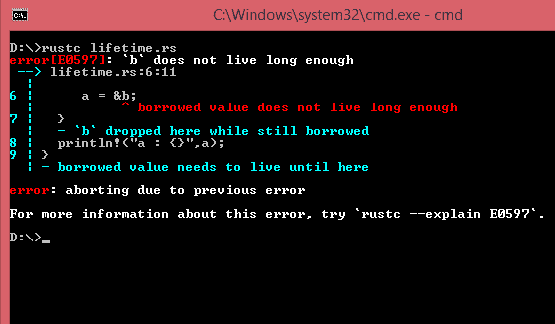
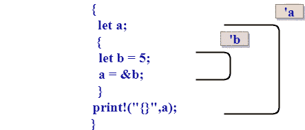
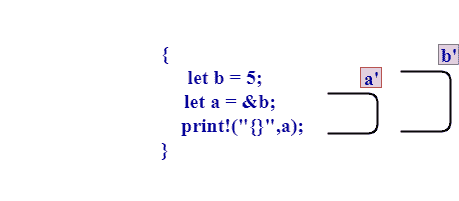

# Rust寿命

> 原文：<https://www.javatpoint.com/rust-lifetime>

*   生存期定义引用有效的范围。
*   生存期是隐式和推断的。
*   Rust 使用通用寿命参数来确保使用有效的实际引用。

## 防止具有生存期的悬空引用

当一个程序试图访问无效引用时，被称为**悬空引用**。指向无效资源的指针称为**悬空指针**。

**我们来看一个简单的例子:**

```
 fn main()
{
  let a;
  {
    let b = 10;
     a = &b;
  }
  println!("a : {}",a);
}

```

**输出:**



在上面的示例中，外部范围包含名为“a”的变量，它不包含任何值。内部范围包含变量“b ”,它存储值 10。“b”变量的引用存储在变量“a”中。当内部作用域结束时，我们试图访问“a”的值。Rust 编译器会抛出一个编译错误，因为“a”变量指的是超出范围的变量的位置。Rust 将通过使用**借用检查器**来确定代码无效。

## 借用检查器

借用检查器用于解决悬空引用的问题。借用检查器用于比较范围，以确定它们是否有效。



在上面的例子中，我们用“a”注释了“a”变量的生存期，用“b”注释了“b”变量的生存期。在编译时，由于“a”变量的生存期大于“b”变量的生存期，Rust 将拒绝这个程序。上面的代码可以修复，这样就不会出现编译器错误。



在上面的示例中，“a”变量的生存期短于“b”变量的生存期。因此，上述代码运行时没有任何编译错误。

## 生存期注释语法

*   生存期注释不会改变任何引用的生存期。
*   通过使用泛型生存期参数，函数还可以接受任何生存期的引用。
*   生存期注释描述了多个参数生存期之间的关系。

**生存期注释语法应遵循的步骤:**

*   生存期参数的名称应以撇号(')开头。
*   它们主要是小写和短。例如:a。
*   Lifetime 参数注释放在引用的“&”之后，然后用空格将注释与引用类型分开。

**下面给出了一些生存期注释语法的示例:**

*   &i32 //参考
*   & '一个具有给定生存期的 i32 //引用。
*   & '具有给定生存期的 mut i32 //可变引用。

## 函数签名中的生存期注释

“a”表示引用的生存期。每个引用都有一个关联的生存期。我们也可以在函数签名中使用**生存期注释**。通用寿命参数用在角括号< >之间，角括号放在函数名和参数列表之间。让我们看看:

```
 fn fun<'a>(...);

```

在上面的情况下，fun 是有一个生存期的函数名，即 **'a，如果一个函数包含两个引用参数，两个引用参数有两个不同的生存期，那么可以表示为:**

```
 fn fun<'a,'b>(...);

```

**如果一个函数包含一个名为‘y’的变量。**

如果“y”是不可变的引用，那么参数列表将是:

```
fn fun<'a>(y : & 'a i32);

```

如果“y”是可变引用，那么参数列表将是:

```
 fn fun<'a>(y : & 'a mut i32);

```

& a i32 和& a mut i32 都相似。唯一的区别是 a 位于&和 mut 之间。

& mut i32 表示“对 i32 的可变引用”。

&“mut i32”意味着“对 i32 的可变引用，其生存期为‘a’。

## 结构中的生存期注释

我们也可以像在函数中一样，在结构中使用显式生存期。

**我们来看看:**

```
       struct Example
      {
          x : & 'a i32,  //  x is a variable of type i32 that has the lifetime 'a.
      }      

```

**我们来看一个简单的例子:**

```
   struct Example<'a> {
    x: &'a i32,
}
fn main() {
    let y = &9; 
    let b = Example{ x: y };
    println!("{}", b.x);
}

```

**输出:**

```
9

```

## impl 块

我们可以使用 impl 块实现具有生存期 a 的结构类型。

**我们来看一个简单的例子:**

```
 struct Example<'a> {
    x: &'a i32,
}
impl<'a> Example<'a>
{
fn display(&self)
{
  print!("Value of x is : {}",self.x);
}
}
fn main() {
    let y = &90; 
    let b = Example{ x: y };
    b.display();
}

```

**输出:**

```
Value of x is : 90

```

## 多重生命周期

我们有两种可能:

*   多个引用具有相同的生存期。
*   多个引用具有不同的生存期。

**当参照物具有相同的寿命时。**

```
 fn fun <'a>(x: & 'a i32 , y: & 'a i32) -> & 'a i32
{
    //block of code.
}

```

在上述情况下，参考 x 和 y 具有相同的寿命，即‘a’。

**当引用具有不同的生存期时。**

```
 fn fun<'a , 'b>(x: & 'a i32 , y: & 'b i32) 
{
    // block of code.
}  

```

在上述情况下，参考 x 和 y 具有不同的寿命，即分别为“a”和“b”。

## 静电

名为“静态”的生存期是一个特殊的生存期。它表示具有生命周期的东西在整个程序中是静态的。“静态生存期”主要用于字符串。具有“静态生存期”的引用对整个程序有效。

**我们来看看:**

```
let s : & 'static str = "javaTpoint tutorial" ; 

```

## 终身监禁

Lifetime Ellision 是一种推理算法，它使常见的模式更加符合人体工程学。终生欺骗使程序被欺骗。

**终身湿化可以在任何地方使用**:

*   & '一个 T
*   敬我
*   T

**寿命衰减有两种表现方式:**

*   **输入寿命**:输入寿命是与函数参数相关联的寿命。
*   **输出生存期**:输出生存期是与函数的返回类型相关联的生存期。

**我们来看看:**

```
 fn fun<'a>( x : & 'a i32);                       // input lifetime
 fn fun<'a>() -> & 'a i32;                      // output lifetime
fn fun<'a>(x : & 'a i32)-> & 'a i32;      // Both input and output lifetime.

```

### 终身寿险规则:

*   引用传递的每个参数都有一个不同的生存期注释。

| 

```
fn fun( x : &i32, y : &i32)
	{ 
	} 
```

 |
| →中 | 

```
fn fun<'a , 'b>( x :& 'a i32, y : & 'b i32)
	{
	}
```

 |

*   如果单个参数通过引用传递，则该参数的生存期将分配给所有省略的输出生存期。

| 

```
fn fun(x : i32, y : &i32) -> &i32
	{
	}
```

 |
| →中 | 

```
fn fun<'a>(x : i32, y : & 'a i32) -> & 'a i3
	{
	}
```

 |

*   如果通过引用传递了多个参数，并且其中一个是&self 或&mut self，则 self 的生存期将分配给所有省略的输出生存期。

| 

```
fn fun(&self, x : &str)
	{
	}
```

 |
| →中 | 

```
fn fun<'a,'b>(& 'a self, x : & 'b str) -> & 'a str
	{
	}
```

 |

**例如:**

fn fun(x:& str)；//省略形式。

fn fun(x:& ' a str)-> & ' a str；//扩展形式。

* * *