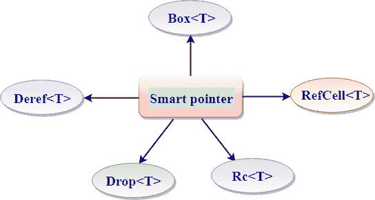

# rust 智能指针

> 原文：<https://www.javatpoint.com/rust-smart-pointers>

*   智能指针是一种数据结构，其行为类似于指针，同时提供额外的功能，如内存管理或绑定检查。
*   智能指针跟踪它所指向的内存，也用于管理其他资源，如 Fils 句柄和网络连接。
*   智能指针最初是在 C++ 语言中使用的。
*   引用也是一种指针，但是除了引用数据之外，它没有其他功能。引用由' & '运算符表示。
*   智能指针提供了引用所提供的功能之外的附加功能。智能指针最常见的功能是提供“引用计数智能指针类型”。这个特性使我们能够通过跟踪所有者来拥有多个数据所有者，如果没有剩余的所有者，它就会清理数据。
*   引用是仅借用数据的指针，而智能指针是拥有它们所指向的数据的指针。

### 智能指针的类型:

*   **框< T >** :框< T >是一个智能指针，指向分配在 T 类型堆上的数据，其中“T”是数据的类型。它用于将数据存储在堆上，而不是堆栈上。
*   **Deref<T>**:Deref<T>是一个智能指针，用于自定义取消引用运算符(*)的行为。
*   **Drop<T>**:Drop<T>是一个智能指针，用于在变量超出范围时释放堆内存中的空间。
*   **Rc<T>**:Rc<T>代表参考计数指针。这是一个智能指针，它记录了对存储在堆中的值的引用次数。
*   **RefCell<T>**:RefCell<T>是一个智能指针，即使数据是不可变的，也可以借用可变数据。这个过程被称为内部可变性。

* * *