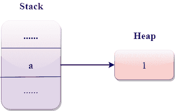
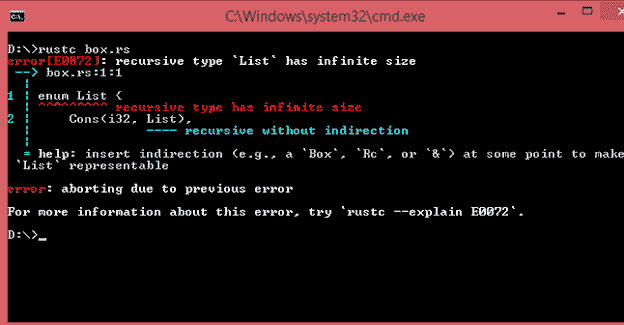
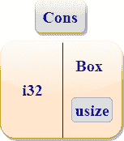

# 方框

> 原文：<https://www.javatpoint.com/rust-box-t>

*   框<t>是一个智能指针，指向分配在类型为 T 的堆上的数据。框<t>允许您将数据存储在堆上，而不是堆栈上。</t></t>
*   方框<t>是一个自有指针。</t>
*   除了将数据存储在堆上之外，盒子没有性能开销。
*   当盒子超出范围时，就调用析构函数来销毁所有内部对象并释放内存。

## 使用框<t>将数据存储在堆上。</t>

主要是 Box <t>用来存储堆上的数据。**让我们通过一个简单的例子来理解这一点:**</t>

```

 fn main()
{
  let a = Box :: new(1);
  print!("value of a is : {}",a);
} 

```

**输出:**

```
value of a is : 1

```

在上面的示例中，包含指向数据 1 的 Box 值。如果我们访问 Box 的值，那么程序将打印“1”。当程序结束时，盒子被解除分配。盒子存储在堆栈上，它指向的数据存储在堆上。

**让我们看看上面例子的图示:**



## 缺点列表

*   Cons 代表**“构造函数”**。
*   Cons list 是一种数据结构，用于从两个参数中构造一个新的对，这个对被称为 list。
*   假设我们有两个元素 x 和 y，那么 cons 函数 cons“x 到 y”意味着我们通过首先放置元素 x，然后放置元素 y 来构建新的容器。
*   Cons 列表包含两个元素，即当前项目和最后一个项目。缺点清单的最后一项是“无”，因为“无”不包含下一项。

现在，我们创建包含 cons 列表的枚举。

```

 enum List
{
   cons(i32, List),
   Nil,
} 

```

在上面的代码中，我们创建了 List 类型的枚举，它包含 i32 值的 cons list 数据结构。

**现在，我们在下面的示例中使用上面的列表类型:**

```

 enum List {
    Cons(i32, List),
    Nil,
}
use List::{Cons, Nil};
fn main()
{
  let list = List::Cons(1,Cons(2,Cons(3,Nil)));
  for i in list.iter()
  {
    print!("{}",i);
  }
}

```

**输出:**



在上面的例子中，Rust 编译器抛出了一个错误“有无限的大小”，因为 List 类型包含递归的变量。因此，Rust 无法找出需要多少空间来存储列表值。无限大小的问题可以通过使用<t>框来克服。</t>

## 使用框<t>获取递归类型的大小</t>

Rust 无法计算出存储递归数据类型需要多少空间。Rust 编译器显示了前一种情况下的错误:

```

= help: insert indirection (e.g., a 'Box', 'Rc', or '&') at some point to make 'List' representable

```

在上面的情况下，我们可以使用 Box <t>指针，因为编译器知道 Box <t>指针需要多少空间。盒子<t>指针的大小在程序执行过程中不会改变。框<t>指针指向将存储在堆中而不是 cons 变量中的列表值。盒子<t>指针可以直接放在 cons 变量中。</t></t></t></t></t>



**我们来看一个简单的例子:**

```

 #[derive(Debug)] 
enum List {
    Cons(i32, Box<List>),
    Nil,
}
use List::{Cons, Nil};
fn main()
{
  let list = Cons(1,Box::new(Cons(2,Box::new(Cons(3,Box::new(Nil))))));

    print!("{:?}",list);

}

```

**输出:**

```
Cons(1, Cons(2, Cons(3, Nil)))

```

#### 注意:如果我们在递归数据类型中使用 Box <t>指针，那么 List 值的大小将等于 i32 值的大小加上 Box 指针的大小？s 数据。</t>

* * *