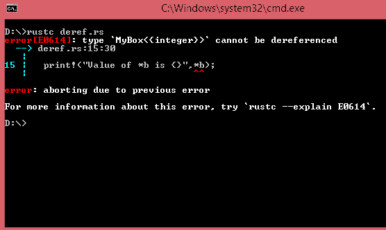

# deref〔t0〕

> 原文：<https://www.javatpoint.com/rust-deref-trait>

*   取消引用<t>特性用于自定义取消引用运算符(*)的行为。</t>
*   如果我们实现了 Deref <t>特性，那么智能指针可以被视为一个引用。因此，在引用上工作的代码也可以用在智能指针上。</t>

## 常规参考

常规引用是一种指向存储在其他地方的某个值的指针。让我们看一个简单的例子来创建 i32 类型值的引用，然后对这个引用使用取消引用操作符。

```

fn main()
{
  let a = 20;
  let b = &a;
  if a==*b
  {
    println!("a and *b are equal");
  }

  else
  {
    println!("they are not equal");
  }
}

```

**输出:**

```
a and *b are equal

```

在上面的例子中，a 保存 i32 类型值 20，而 b 包含对“a”变量的引用。如果我们使用*b，那么它代表值 20。因此，我们可以比较变量 a 和*b，它将返回真值。如果我们用&b 代替*b，那么编译器会抛出一个错误**“无法将{integer}与{&integer }“**进行比较”。

## 框<t>作为参考</t>

方框<t>指针可以作为参考。</t>

**我们来看一个简单的例子:**

```

fn main()
{
  let a = 11;
  let b = Box::new(a);
  print!("Value of *b is {}",*b);
}

```

**输出:**

```
Value of *b is 11

```

在上面的例子中，框<t>的行为类似于常规引用。它们之间唯一的区别是 b 包含指向数据的框，而不是使用' & '运算符来引用值。</t>

## 作为引用的智能指针

现在，我们创建类似于 Box <t>类型的智能指针，我们将看到它们与常规引用的不同行为。</t>

*   框<t>可以定义为包含一个元素的元组结构，例如，我的框<t>。</t></t>
*   创建元组结构后，我们在类型 MyBox <t>上定义函数。</t>

**我们来看一个简单的例子:**

```

struct MyBox<T>(T);
impl<T> MyBox<T>
{
  fn example(y : T)->MyBox<T>
  {
    MyBox(y)
  }
}
fn main()
{
  let a = 8;
  let b = MyBox::example(a);
  print!("Value of *b is {}",*b);
}

```

**输出:**



在上面的例子中，我们创建了智能指针 b，但是它不能被取消引用。因此，我们得出结论，类似于 Box <t>类型的定制指针不能被取消引用。</t>

## 实现一种道德特征

*   deref 特性是在标准库中定义的，标准库用于实现名为 Deref 的方法。
*   deref 方法借用 self 并返回对内部数据的引用。

**我们来看一个简单的例子:**

```

 struct MyBox<T>
{
  a : T,
}
use :: std::ops::Deref;
impl<T> Deref for MyBox<T>
{
  type Target = T;
  fn deref(&self) ->&T
  {
    &self.a
  }
}
fn main()
{
  let b = MyBox{a : 10};
  print!("{}",*(b.deref()));
}

```

**输出:**

```
10

```

### 程序说明

*   Deref 特性在 MyBox 类型上实现。
*   deref 特性实现了 deref()方法，Deref()方法返回“a”变量的引用。
*   目标类型= T；是 Deref 特征的关联类型。关联类型用于声明泛型类型参数。
*   我们创建了 MyBox 类型的实例 b。
*   通过使用 MyBox 类型的实例 b.deref()调用 deref()方法，然后从 deref()方法返回的引用被取消引用。

## 胁迫

*   Deref 强制是将实现 Deref 特性的引用转换为 Deref 可以将原始类型转换为的引用的过程。
*   对函数和方法的参数执行 Deref 强制。
*   当我们将特定类型的引用传递给与函数定义中的参数类型不匹配的函数时，Deref 强制会自动发生。

**我们来看一个简单的例子:**

```

 struct MyBox<T>(T);
use :: std::ops::Deref;
impl<T> MyBox<T>
{
  fn hello(x:T)->MyBox<T>
  {
    MyBox(x)
  }
}
impl<T> Deref for MyBox<T>
{
  type Target = T;
  fn deref(&self) ->&T
  {
    &self.0
  }
}
fn print(m : &i32)
{
  print!("{}",m);
}
fn main()
{
  let b = MyBox::hello(5);

  print(&b);
}

```

**输出:**

```
5

```

在上面的例子中，我们用参数&b 调用 print(&b)函数，它是&Box <i32>的引用。在这种情况下，我们实现了 Deref 特性，它通过 Deref 强制的过程将&Box <i32>转换为&i32。</i32></i32>

## Derif 强制与可变性的相互作用

到目前为止，我们使用 Deref Trait 来覆盖不可变引用上的*运算符，并且可以使用 DerefMut trait 来覆盖可变引用上的*运算符。

**Rust 在以下三种情况下执行 Deref 强制:**

*   当 T: Deref <target u="">其中 T 和 U 为不可变引用时，则&T 转换为&U 类型。</target>
*   当 T: DerefMut <target u="">其中 T 和 U 为可变引用时，则&mut T 转换为&mut U</target>
*   当 T: Deref <target u="">其中 T 是可变引用，U 是不可变引用时，则&mut T 转换为&U</target>

#### 注意:Rust 可以将可变引用强制转换为不可变引用，但是由于借用规则，它不能将不可变引用强制转换为可变引用。

* * *