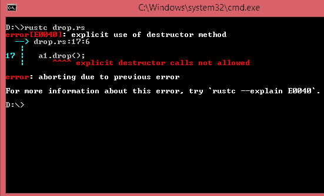

# 跌落特性

> 原文：<https://www.javatpoint.com/rust-drop-trait>

*   Drop trait 用于在值超出范围时释放资源，如文件或网络连接。
*   Drop 特性用于释放 Box <t>所指向的堆上的空间。</t>
*   drop 特性用于实现 drop()方法，该方法采用对自身的可变引用。

**我们来看一个简单的例子:**

```

 struct Example
{
  a : i32,
 }
      impl Drop for Example
{
  fn drop(&mut self)
  {
    println!("Dropping the instance of Example with data : {}", self.a);
  }
}
      fn main()
{
  let a1 = Example{a : 10};
  let b1 = Example{a: 20};
  println!("Instances of Example type are created");
}

```

**输出:**

```
Instances of Example type are created
Dropping the instance of Example with data : 20
Dropping the instance of Example with data : 10

```

### 程序说明

*   我们已经在类型示例中实现了 drop 特性，并且在 Drop 特性的实现中定义了 Drop()方法。
*   在 main()函数中，我们创建了类型 Example 的实例，在 main()函数的末尾，实例超出了范围。
*   当实例移出范围时，Rust 会隐式调用 drop()方法来删除类型为 Example 的实例。首先，它将删除 b1 实例，然后删除 a1 实例。

#### 注意:我们不需要显式调用 drop()方法。因此，我们可以说，当我们的实例超出范围时，Rust 隐式调用 drop()方法。

## 使用 std::mem::drop 提前删除一个值

有时，有必要在范围结束之前删除该值。如果我们想尽早删除该值，那么我们使用 std::mem::drop 函数来删除该值。

让我们看一个手动删除该值的简单示例:

```

 struct Example
{
  a : String,
}
impl Drop for Example
{
  fn drop(&mut self)
  {
    println!("Dropping the instance of Example with data : {}", self.a);
  }
}
fn main()
{
  let a1 = Example{a : String::from("Hello")};
  a1.drop();
  let b1 = Example{a: String::from("World")};
  println!("Instances of Example type are created");
}

```

**输出:**



在上面的例子中，我们手动调用 drop()方法。Rust 编译器抛出一个错误，不允许我们显式调用 drop()方法。我们没有显式调用 drop()方法，而是调用 std::mem::drop 函数，在值超出范围之前将其删除。

*   std::mem::drop 函数的语法与 drop 特性中定义的 drop()函数不同。std::mem::drop 函数包含作为参数传递的值，该值将在超出范围之前被删除。

**我们来看一个简单的例子:**

```

 struct Example
{
  a : String,
}

impl Drop for Example
{
  fn drop(&mut self)
  {
    println!("Dropping the instance of Example with data : {}", self.a);
  }
}

fn main()
{
  let a1 = Example{a : String::from("Hello")};
  drop(a1);
  let b1 = Example{a: String::from("World")};
  println!("Instances of Example type are created");
}

```

**输出:**

```
Dropping the instance of Example with data : Hello
Instances of Example type are created
Dropping the instance of Example with data : World

```

在上面的示例中，通过在 drop(a1)函数中将 a1 实例作为参数传递来销毁 a1 实例。

* * *