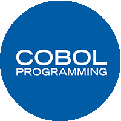

# COBOL 教程

> 原文：<https://www.javatpoint.com/cobol>

COBOL 编程语言是最古老的高级编程语言之一。COBOL 是一个首字母缩略词，代表**通用面向业务语言**。它最初是一种为商业用途设计的类似英语的编译型计算机编程语言。当时，它主要用于公司和政府的商业、金融和行政系统。如今，尽管这种语言越来越不受欢迎，但它也用于部署在大型计算机上的应用程序，如大规模批处理和事务处理作业。

## COBOL -简介

COBOL 最初是由 CODASYL(数据系统语言会议)在 1959 年设计的。它部分基于格蕾丝·赫柏设计的编程语言 FLOW-MATIC。它是最古老的高级编程语言之一。它是美国国防部努力创建一种用于数据处理的可移植编程语言的结果。现在主要用于开发业务，典型的是面向文件的应用程序，我们不能用它来编写系统软件。它只是意味着我们不能用它来开发操作系统或编译器。

## COBOL 是如何工作的

在理解 COBOL 的工作原理之前，我们应该意识到这样一个事实，即计算机只知道机器代码，即 0 和 1 的二进制流。所以，要处理 COBOL 的代码，必须用编译器把它转换成机器码。我们应该通过编译器运行程序源代码。编译器首先检查任何语法错误，然后将其转换为机器语言。然后，编译器创建一个输出文件，称为加载模块。该输出文件包含 1 和 0 形式的可执行代码。

## COBOL 的历史

COBOL 是编程史上最早开发的高级编程语言之一。20 世纪 50 年代，当业务在世界西部兴起时，需要自动化各种流程以方便操作，这催生了一种高级编程语言，用于业务数据处理。

*   1959 年，COBOL 语言由数据系统语言会议开发。
*   政府印刷局在 1960 年将 COBOL 规范印刷为 COBOL60。
*   COBOL-61 是 COBOL 的下一个版本，于 1961 年发布，做了一些修改。
*   1968 年，COBOL 被 ANSI(美国国家标准协会)批准为商业使用的标准语言。名为 COBOL-68 的版本。
*   它在 1974 年和 1985 年再次修订，以开发后续版本，分别包含一组名为 COBOL-74 和 COBOL-85 的附加功能。
*   最后，在 2002 年，面向对象的 COBOL 发布了，它可以使用封装的对象作为 COBOL 编程的正常部分。

## COBOL 的特点

以下是 COBOL 语言的一些流行特性:

**简单标准的语言**

COBOL 是一种简单、标准、易学的语言，可以在 IBM AS/400、个人电脑、笔记本电脑等各种计算机上编译执行。它支持广泛的语法词汇，并遵循整洁的编码风格。

**提供面向业务的能力**

COBOL 是为与国防领域、金融领域等相关的面向业务的应用而开发的。它提供了高级文件处理功能，使其能够处理大量数据。COBOL 处理世界上 70%以上的商业交易，最适合复杂的交易。

**可扩展性和可移植性**

COBOL 提供逻辑控制结构，使其易于阅读、修改和调试。COBOL 还可以跨各种平台扩展、可靠和可移植。它为几乎所有的计算机平台提供各种测试和调试工具。

**普遍接受**

COBOL 是普遍接受的编程语言之一。这是一种已有 60 多年历史的编程语言，已经改变了业务及其在众多平台和设备上的工作。COBOL 编程语言为几乎所有的计算机平台提供调试和测试工具，并提供了很多几乎每年都会发布的 COBOL 新产品、编译器和开发工具。

## COBOL 的优点

COBOL 是第一个普遍使用的高级编程语言。它为他们的用户提供了很多优势:

*   COBOL 能够处理巨大的数据处理。
*   它可以用作文档语言。
*   COBOL 提供了一个有效的错误消息，所以错误的解决更容易。
*   COBOL 与其以前的版本兼容。

## 先决条件

在继续学习这个 COBOL 教程之前，您应该对计算机编程术语和 JCL 有一个基本的了解。任何编程语言的基础知识都将帮助您获得 COBOL 编程的概念，并在学习轨道上快速前进。

## 观众

本教程是为希望学习 COBOL 基础知识的软件程序员而创建的。本教程将提供对 COBOL 编程语言的足够理解，从这里您可以将自己提升到更高的专业水平。

## 问题

我们向您保证，在学习我们的 COBOL 教程时，您不会发现任何困难。但是如果本教程有任何错误，请将问题或错误张贴在联系表中，以便我们改进。

* * *