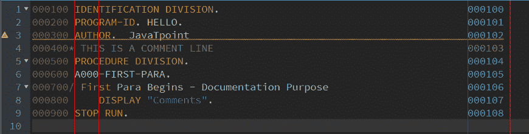

# 编码表

> 原文：<https://www.javatpoint.com/cobol-coding-sheet>

每种编程语言在编译和执行之前都需要一个环境或平台来编写代码。例如，在 Java 编程语言中，记事本用于在编译和运行程序之前编写程序。

同样，我们需要一个平台来编写 COBOL 代码。在 COBOL 编程语言中，我们使用编码表来编写代码。

在 COBOL 程序结构中，COBOL 代码语句是自解释的，很容易理解。COBOL 是一种高级面向业务的编程语言。它主要用于公司和政府的商业、金融和管理系统。当 COBOL 被创建时，COBOL 程序被要求在卡片上打孔，然后它被加载到打卡机中。如今，COBOL 使用一些新的编辑器来代替穿孔卡片，但是使用相同的编码表来编写代码。

COBOL 代码语句是不言自明的，但是使用 COBOL 编码表并不是一件容易的事情。COBOL 编码表是 COBOL 编码结构，分为 80 列。每一列或一组特定的列是为特定类型的字段保留的。

简而言之，我们可以说，我们必须以 COBOL 编译器应该接受的特定格式编写 COBOL 源程序。这就是为什么我们应该总是在 COBOL 编码表上编写 COBOL 程序。

COBOL 编码表有 80 个字符位置，这些位置分为以下五个字段:

| 位置 | 田 | 描述 |
| **1-6** | 列号 | 列号 1-6 统称为序列号。这些用于计数代码行的行号。序列号的内容可以是任何计算机字符。可以选择使用，也可以省略。但是如果提供了序列号，它们必须以升序出现。 |
| **7** | 指示器 | 此列用作指示符，保留用于注释。它可以有(*、-、/)。星号(*)用于注释，连字符(-)表示延续，斜线(/)表示表单源。如果注释行以星号(*)开头，则注释不会被编译以生成目标代码。它被编译器完全忽略。另一方面，如果注释行以斜杠(/)字符开头，则该特定注释行将被打印，页面将被弹出。 |
| **8-11** | A 区 | 这些列也称为区域-A。在这些列中，条目可以从第 8、9、10 或 11 列开始。这一栏的条目称为利润-A 条目。所有 COBOL 分区、段落、部分和一些特殊条目必须从 a 区开始 |
| **12-72** | B 区 | 这些列也称为区域 b。在这些列中，条目可以从第 12 列到第 72 列开始。这一栏的条目称为 B 页边空白条目。所有 COBOL 语句必须从 b 区开始 |
| **73-80** | 识别区 | 这些列用于标识代码中的每一行。程序员可以根据自己的需要使用它。 |

### 例子

让我们看看下面给出的例子，展示了一个 COBOL 编码表:


当您编译并执行代码时，它将显示以下输出:


### 字符集

字符是 COBOL 层次结构中最低的组成部分，不能进一步划分。下表指定了 COBOL 字符集使用的所有 COBOL 字符:

| 南没有。 | 特性 | 描述 |
| 1. | 笔划索引 | 字母(大写) |
| 2. | 无所不包的 | 字母(小写) |
| 3. | 0-9 | 数字的 |
| 4. |  | 空间 |
| 5. | + | 加号 |
| 6. | - | 减号或连字符 |
| 7. | * | 星号 |
| 8. | / | 斜杠 |
| 9. | $ | 货币(美元)符号 |
| 10. | , | 逗号 |
| 11. | ； | 分号 |
| 12. | 。 | 小数点或句点 |
| 13. | " | 引号 |
| 14. | （ | 右括号 |
| 15. | ) | 右括号 |
| 16. | > | 大于 |
| 17. | < | 不到 |
| 18. | ： | 结肠 |
| 19. | ' | 撇号 |
| 20. | = | 等号 |

## 字符串

字符串是单个字符的集合。字符串可以是:

*   评论
*   逐字的
*   面向商业的通用语言字

### 评论

注释是一种书面声明，用于指定程序员在源代码中的注释。编译器会忽略作为注释写入的内容。

一般来说，程序员写下一些注释行，使代码易于被其他用户或程序员理解。注释行可以出现在 COBOL 程序第一行之后的任何地方。

以下是 COBOL 代码中使用的两种类型的注释:

comment line

我们可以在任何一列写注释行。编译器不会检查注释行的语法并将其用于文档。

如果注释行以星号(*)开头，则注释不会被编译以生成目标代码。它被编译器完全忽略。另一方面，如果注释行以斜杠(/)字符开头，则该特定注释行将被打印，页面将被弹出。

**评论条目**

评论条目是那些被整合到识别部门的可选段落中的条目。都是写在 B 区的，程序员借鉴一下。

让我们看一个注释类型的例子:

```

000100 IDENTIFICATION DIVISION.                                         000100
000200 PROGRAM-ID. HELLO.                                               000101
000300 AUTHOR.  JavaTpoint                                              000102
000400* THIS IS A COMMENT LINE                                          000103
000500 PROCEDURE DIVISION.                                              000104
000600 A000-FIRST-PARA.                                                 000105
000700/ First Para Begins - Documentation Purpose                       000106
000800     DISPLAY "Comments".                                          000107
000900 STOP RUN.                                                        000108

```

在您的 OpenCobolIDE 编辑器中，它看起来像这样。



当您编译并执行上述程序时，它将显示以下输出:


### 文字

文字是一个常量，我们可以直接在程序中输入。文字有两种类型，如下所示:

**字母数字文字**

字母数字文字用撇号括起来。长度最多可达 160 个字符。文字的开头和结尾应该相同，可以是引号或撇号。

| 有效的 | 病人 |
| 它是有效的 | 它无效” |
| “它是有效的” | “这是无效的” |
| 它不是无效的 | “它无效” |

**数字文字**

它是从 0 到 9、+、-、或小数点的数字组合。长度最多可达 18 个字符。

+，-符号不能是最右边的字符。和小数点(。)不应该出现在最后。

| 有效的 | 病人 |
| Two hundred | 2,00 |
| +15.9 | 15. |
| -3.9 | 3.9- |

### 面向商业的通用语言字

COBOL 单词是一个字符串，可以是用户定义的单词，也可以是保留的单词。

**用户自定义**

用户定义的单词用于给文件、数据、记录、段落和部分命名。形成用户定义的单词时，允许使用数字、字母和连字符。您不能使用 COBOL 保留字。

**保留字**

在 COBOL 中，保留字是预定义的字。一些常见的保留词有:

**关键词-** 如添加、移动、接受等。

**特殊字符-** 例如，+，- *，

**比喻常数-** 这些是常数值，如 ZERO、SPACES 等。一些比喻常数是高值，低值，零，空格，引号，所有文字。

* * *