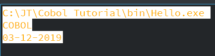
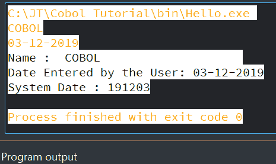
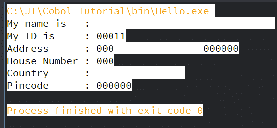
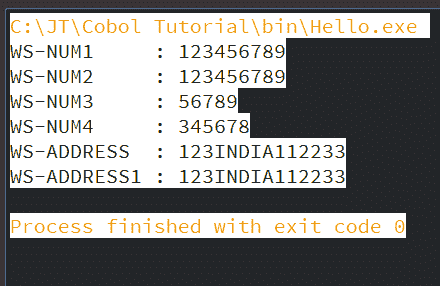
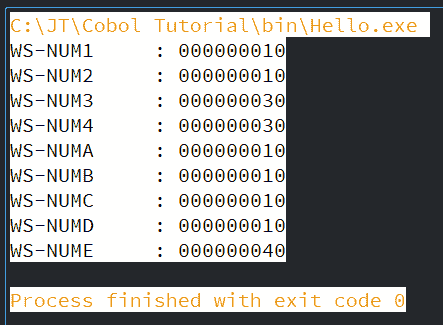
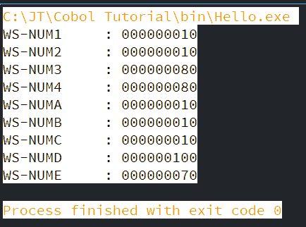
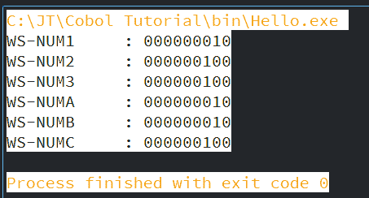
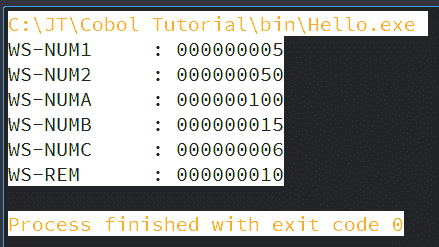
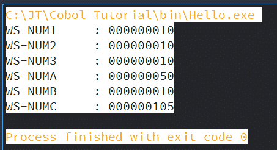

# 动词

> 原文：<https://www.javatpoint.com/cobol-verbs>

过程部分包含用于执行数据部分中描述的数据操作的代码。过程部分使用 COBOL 动词进行数据处理。语句总是以 COBOL 动词开始。在 COBOL 中，有几个动作类型不同的动词。

*   输入/输出动词
    *   接受
    *   展示
*   数据操作/算术动词
    *   初始化
    *   移动
    *   模拟数字音乐制碟
    *   减去
    *   多样地
    *   划分
    *   计算
*   字符串处理动词
    *   线
    *   解开
    *   检查
*   文件处理动词
    *   打开
    *   关闭
    *   阅读
    *   写
    *   重写
    *   开始
    *   删除
*   程序分支动词
    *   呼叫
    *   出口
    *   退出程序
    *   定位
    *   完成
    *   停止
    *   停止运行

Let's discuss these verbs in detail:

## 输入/输出动词

输入/输出动词用于获取用户数据和显示 COBOL 程序的输出。在这个过程中，使用了以下两个动词:

### 接受

Accept 动词从操作系统或用户获取数据。它获取日期、日期、时间等数据。

如果程序接受用户数据，它需要由用户传递。我们可以在从操作系统提取数据时使用 FROM 选项，如下例所示:

```

ACCEPT JT-SUBJECT-NAME.
ACCEPT JT-DATE FROM SYSTEM-DATE.

```

### 展示

这个动词显示 COBOL 程序的输出。

```

DISPLAY JT-SUBJECT-NAME.
DISPLAY "System date is : " WS-DATE.

```

**示例:**

```

       IDENTIFICATION DIVISION.
           PROGRAM-ID. HELLO.

       DATA DIVISION.
           WORKING-STORAGE SECTION.
             01 JT-SUBJECT-NAME PIC X(25).
             01 JT-USER-DATE PIC X(10).
             01 JT-DATE PIC X(6).

       PROCEDURE DIVISION.
           ACCEPT JT-SUBJECT-NAME.
           ACCEPT JT-USER-DATE.
           ACCEPT JT-DATE FROM DATE.
              DISPLAY "Name :  " JT-SUBJECT-NAME.
              DISPLAY "Date Entered by the User: " JT-USER-DATE.
              DISPLAY "System Date : " JT-DATE.
       STOP RUN.

```

编译并运行程序后，程序会提示您输入名称和日期。输入主题名称和日期。



然后按回车键。它将显示以下输出:

**输出:**



## 数据操作/算术动词

这些动词用于数据处理和执行算术运算。

### 初始化

此动词用于初始化特定的项目或组项目。零替换数字数据项。不能用 RENAME 子句初始化数据名称。

字母数字或字母数据对象被空格替换。如果我们包括术语 REPLACING，数据项可以被初始化为替换值。如给定示例所示:

**示例:**

```

       IDENTIFICATION DIVISION.
           PROGRAM-ID. HELLO.

       DATA DIVISION.
           WORKING-STORAGE SECTION.
            01 WS-NAME PIC A(30) VALUE 'ABCDEF'.
            01 WS-ID PIC 9(5).
            01 WS-ADDRESS. 
            05 WS-HOUSE-NUMBER PIC 9(3).
            05 WS-COUNTRY PIC X(15).
            05 WS-PINCODE PIC 9(6) VALUE 123456.

       PROCEDURE DIVISION.
           A000-FIRST-PARA.
           INITIALIZE WS-NAME, WS-ADDRESS.
           INITIALIZE WS-ID REPLACING NUMERIC DATA BY 00011.
             DISPLAY "My name is   : "WS-NAME.
             DISPLAY "My ID is     : "WS-ID.
             DISPLAY "Address      : "WS-ADDRESS.
             DISPLAY "House Number : "WS-HOUSE-NUMBER.
             DISPLAY "Country      : "WS-COUNTRY.
             DISPLAY "Pincode      : "WS-PINCODE.
       STOP RUN.

```

**输出:**



### 移动

Move verb is used to copy data from source to destination data. We can use it for both group and elementary data items. For group items, MOVE CORRESPONDING / CORR is used.

使用 MOVE(x: l)，其中 x 是起始位置，l 是从字符串传输数据的长度。如果目标数据项的 PIC 子句小于源数据项的 PIC 子句，数据将被截断。如果目标数据项的 PIC 子句在上面，那么源数据项的 PIC 子句，额外的字节将包括零或空格。

**示例:**

让我们看一个例子，让所有的事情变得清晰:

```

       IDENTIFICATION DIVISION.
           PROGRAM-ID. HELLO.

       DATA DIVISION.
           WORKING-STORAGE SECTION.
            01 WS-NUM1 PIC 9(9).
            01 WS-NUM2 PIC 9(9).
            01 WS-NUM3 PIC 9(5).
            01 WS-NUM4 PIC 9(6).
            01 WS-ADDRESS. 
            05 WS-HOUSE-NUMBER PIC 9(3).
            05 WS-COUNTRY PIC X(5).
            05 WS-PINCODE PIC 9(6).
            01 WS-ADDRESS1\. 
            05 WS-HOUSE-NUMBER1 PIC 9(3).
            05 WS-COUNTRY1 PIC X(5).
            05 WS-PINCODE1 PIC 9(6).

       PROCEDURE DIVISION.
           A000-FIRST-PARA.
           MOVE 123456789 TO WS-NUM1.
           MOVE WS-NUM1 TO WS-NUM2 WS-NUM3.
           MOVE WS-NUM1(3:6) TO WS-NUM4.
           MOVE 123 TO WS-HOUSE-NUMBER.
           MOVE 'INDIA' TO WS-COUNTRY.
           MOVE 112233 TO WS-PINCODE.
           MOVE WS-ADDRESS TO WS-ADDRESS1.

           DISPLAY "WS-NUM1     : " WS-NUM1
           DISPLAY "WS-NUM2     : " WS-NUM2
           DISPLAY "WS-NUM3     : " WS-NUM3
           DISPLAY "WS-NUM4     : " WS-NUM4
           DISPLAY "WS-ADDRESS  : " WS-ADDRESS
           DISPLAY "WS-ADDRESS1 : " WS-ADDRESS1

       STOP RUN.

```

**输出:**



以下是法律行动:

|  | 字母的 | 含字母和数字的 | 数字的 |
| **字母** | 可能的 | 可能的 | 不可能 |
| **字母数字** | 可能的 | 可能的 | 可能的 |
| **数字** | 不可能 | 可能的 | 可能的 |

### 模拟数字音乐制碟

这个动词加上两个或多个数字，并将结果存储在目标操作数中。

**语法:**

```

ADD   {  literal-1 / data-item-1 } ..   TO   target-data-item-1 ..
ADD   {  literal-1 / data-item-1 } ..  GIVING   target-data-item-1 ..

```

让我们看一些例子:

**例 1:**

```

ADD   10  TO A.

```

这里，假设 A 的值为 5；执行上述语句后，a 将为 15。意思是，(10 + A)。

**例 2:**

```

ADD A B C TO D GIVING E

```

这里，A、B、C、D 相加，结果存储在 E 中(E = A + B + C + D)。

**例 3:**

```

ADD CORR WS-A TO WS-B

```

这里，A 和 B 内的子组项相加，结果相加，结果存储在 B 中。

### 示例:

现在，让我们通过 COBOL 中的程序来看一个例子:

```

       IDENTIFICATION DIVISION.
           PROGRAM-ID. HELLO.

       DATA DIVISION.
           WORKING-STORAGE SECTION.
           01 WS-NUM1 PIC 9(9) VALUE 10 .
           01 WS-NUM2 PIC 9(9) VALUE 10.
           01 WS-NUM3 PIC 9(9) VALUE 10.
           01 WS-NUM4 PIC 9(9) VALUE 10.
           01 WS-NUMA PIC 9(9) VALUE 10.
           01 WS-NUMB PIC 9(9) VALUE 10.
           01 WS-NUMC PIC 9(9) VALUE 10.
           01 WS-NUMD PIC 9(9) VALUE 10.
           01 WS-NUME PIC 9(9) VALUE 10.

       PROCEDURE DIVISION.
           ADD WS-NUM1 WS-NUM2 TO WS-NUM3 WS-NUM4.
           ADD WS-NUMA WS-NUMB WS-NUMC TO WS-NUMD GIVING WS-NUME.
           DISPLAY "WS-NUM1     : " WS-NUM1
           DISPLAY "WS-NUM2     : " WS-NUM2
           DISPLAY "WS-NUM3     : " WS-NUM3
           DISPLAY "WS-NUM4     : " WS-NUM4
           DISPLAY "WS-NUMA     : " WS-NUMA
           DISPLAY "WS-NUMB     : " WS-NUMB
           DISPLAY "WS-NUMC     : " WS-NUMC
           DISPLAY "WS-NUMD     : " WS-NUMD
           DISPLAY "WS-NUME     : " WS-NUME

       STOP RUN.

```

**输出:**



### 减去

这个动词用来做减法运算。

**语法:**

```

SUBTRACT  data-item1/constant FROM data-item2.
SUBTRACT  data-item1/constant FROM data-item2 GIVING data-item3 ROUNDED.

```

在这里，ROUNDED 是可选的。在使用减法动词之前，有一些规则:从单词 from 之前的所有值相加，并从 FROM 之后的每个数据项/常数中减去。

*   使用“给予”选项时，结果将存储在“给予”一词后给出的数据项中。
*   当不使用 GIVING 选项时，结果将存储在 FROM 之后给出的数据项中。

**例 1:**

```

SUBTRACT 10 FROM A

```

这里，将从 A 中减去 10，结果将存储在 A 中，即(10 + A)。

**例 2:**

```

SUBTRACT A B C FROM GIVING E

```

这里，A、B、C 与 D 相加和相减。结果存储在 E 中(E = D-(A+B+C))。

**例 3:**

```

SUBTRACT CORR WS-GROUP1 TO WS-GROUP2

```

这里，减去 WS-GROUP1 和 WS-GROUP2 中的子组项，结果存储在 WS-GROUP2 中。

### 示例:

现在，让我们通过 COBOL 中的程序来看一个例子:

```

       IDENTIFICATION DIVISION.
           PROGRAM-ID. HELLO.

       DATA DIVISION.
           WORKING-STORAGE SECTION.
           01 WS-NUM1 PIC 9(9) VALUE 10 .
           01 WS-NUM2 PIC 9(9) VALUE 10.
           01 WS-NUM3 PIC 9(9) VALUE 100.
           01 WS-NUM4 PIC 9(9) VALUE 100.
           01 WS-NUMA PIC 9(9) VALUE 10.
           01 WS-NUMB PIC 9(9) VALUE 10.
           01 WS-NUMC PIC 9(9) VALUE 10.
           01 WS-NUMD PIC 9(9) VALUE 100.
           01 WS-NUME PIC 9(9) VALUE 10.

       PROCEDURE DIVISION.
           SUBTRACT WS-NUM1 WS-NUM2 FROM WS-NUM3 WS-NUM4.
           SUBTRACT WS-NUMA WS-NUMB WS-NUMC FROM WS-NUMD GIVING WS-NUME.

           DISPLAY "WS-NUM1     : " WS-NUM1
           DISPLAY "WS-NUM2     : " WS-NUM2
           DISPLAY "WS-NUM3     : " WS-NUM3
           DISPLAY "WS-NUM4     : " WS-NUM4
           DISPLAY "WS-NUMA     : " WS-NUMA
           DISPLAY "WS-NUMB     : " WS-NUMB
           DISPLAY "WS-NUMC     : " WS-NUMC
           DISPLAY "WS-NUMD     : " WS-NUMD
           DISPLAY "WS-NUME     : " WS-NUME

       STOP RUN.

```

**输出:**



### 多样地

乘法动词用于执行乘法运算。

**语法:**

```

MULTIPLY  data-item1 or constant BY data-item2.
MULTIPLY  data-item1 or constant BY data-item2 GIVING data-item3 ROUNDED.

```

在这里，ROUNDED 是可选的。

**例 1:**

```

MULTIPLY A BY B

```

这里，A 和 B 中的值将相乘，结果将存储在 B 中(B = A * B)。

**例 2:**

```

MULTIPLY A BY B C

```

这里，A 和 B 中的值将相乘，结果存储在 B 中(B = A * B)。A 和 C 中的值相乘，结果存储在 C 中(C = A * C)。

**例 3:**

```

MULTIPLY A BY B GIVING E

```

这里，A 和 B 中的值相乘，结果存储在 E 中(E=A * B)。

### 示例:

现在，让我们通过 COBOL 中的程序来看一个例子:

```

       IDENTIFICATION DIVISION.
           PROGRAM-ID. HELLO.

       DATA DIVISION.
           WORKING-STORAGE SECTION.
           01 WS-NUM1 PIC 9(9) VALUE 10 .
           01 WS-NUM2 PIC 9(9) VALUE 10.
           01 WS-NUM3 PIC 9(9) VALUE 10.
           01 WS-NUMA PIC 9(9) VALUE 10.
           01 WS-NUMB PIC 9(9) VALUE 10.
           01 WS-NUMC PIC 9(9) VALUE 10.

       PROCEDURE DIVISION.
           MULTIPLY WS-NUM1 BY WS-NUM2 WS-NUM3.
           MULTIPLY WS-NUMA BY WS-NUMB GIVING WS-NUMC.

           DISPLAY "WS-NUM1     : " WS-NUM1
           DISPLAY "WS-NUM2     : " WS-NUM2
           DISPLAY "WS-NUM3     : " WS-NUM3
           DISPLAY "WS-NUMA     : " WS-NUMA
           DISPLAY "WS-NUMB     : " WS-NUMB
           DISPLAY "WS-NUMC     : " WS-NUMC

       STOP RUN.

```

**输出:**



### 划分

DIVIDE 动词用于执行除法运算。

**语法:**

```

DIVIDE  data-item1/constant INTO data-item2.
DIVIDE  data-item1/constant BY (or INTO) data-item2 GIVING data-item3 ROUNDED? REMAINDER data-item4.

```

**例 1:**

```

DIVIDE A INTO B

```

这里，B 的值除以 A 的值，结果存储在 B 中(B = B/A)。

```

DIVIDE A BY B GIVING C REMAINDER R

```

这里 A 的值除以 B 的值，结果存储在 C 中(C = A/B)，余数存储在 r 中。

### 示例:

现在，让我们通过 COBOL 中的程序来看一个例子:

```

      IDENTIFICATION DIVISION.
           PROGRAM-ID. HELLO.

       DATA DIVISION.
           WORKING-STORAGE SECTION.
           01 WS-NUM1 PIC 9(9) VALUE 5.
           01 WS-NUM2 PIC 9(9) VALUE 250.
           01 WS-NUMA PIC 9(9) VALUE 100.
           01 WS-NUMB PIC 9(9) VALUE 15.
           01 WS-NUMC PIC 9(9).
           01 WS-REM PIC 9(9). 

       PROCEDURE DIVISION.
           DIVIDE WS-NUM1 INTO WS-NUM2.
           DIVIDE WS-NUMA BY WS-NUMB GIVING WS-NUMC REMAINDER WS-REM.
           DISPLAY "WS-NUM1     : " WS-NUM1
           DISPLAY "WS-NUM2     : " WS-NUM2
           DISPLAY "WS-NUMA     : " WS-NUMA
           DISPLAY "WS-NUMB     : " WS-NUMB
           DISPLAY "WS-NUMC     : " WS-NUMC
           DISPLAY "WS-REM      : " WS-REM

       STOP RUN.

```

**输出:**



### 计算

COBOL 中的 COMPUTE 动词写算术表达式。计算动词是加减乘除动词的替代。

### 示例:

```

       IDENTIFICATION DIVISION.
           PROGRAM-ID. HELLO.

       DATA DIVISION.
           WORKING-STORAGE SECTION.
           01 WS-NUM1 PIC 9(9) VALUE 10 .
           01 WS-NUM2 PIC 9(9) VALUE 10.
           01 WS-NUM3 PIC 9(9) VALUE 10.
           01 WS-NUMA PIC 9(9) VALUE 50.
           01 WS-NUMB PIC 9(9) VALUE 10.
           01 WS-NUMC PIC 9(9).

       PROCEDURE DIVISION.
       COMPUTE WS-NUMC= (WS-NUM1 * WS-NUM2)-(WS-NUMA / WS-NUMB)+WS-NUM3.
           DISPLAY "WS-NUM1     : " WS-NUM1
           DISPLAY "WS-NUM2     : " WS-NUM2
           DISPLAY "WS-NUM3     : " WS-NUM3
           DISPLAY "WS-NUMA     : " WS-NUMA
           DISPLAY "WS-NUMB     : " WS-NUMB
           DISPLAY "WS-NUMC     : " WS-NUMC

       STOP RUN.

```

**输出:**



* * *