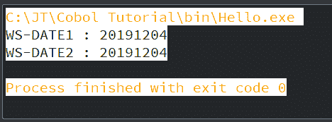
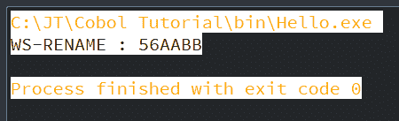

# 数据布局

> 原文：<https://www.javatpoint.com/cobol-data-layout>

COBOL 布局是对每个字段及其值的用法的描述。COBOL 中的数据描述条目如下:

*   重新定义条目
*   重命名条目
*   用法条款
*   抄写本

## 重新定义条目

Redefines 子句用各种数据描述来定义存储。如果同时使用一个或多个数据项，则可以对其他数据项使用相同的存储。

### 语法:

```

level-number data-name1/FILLER REDEFINES data-name2

```

在这里，数据名称 1/FILLER 是重新定义的日期项目。数据名 2 是重新定义的数据项。

一个重新定义的数据项可以被重新定义任何次数。但是不可能重新定义 REDEFINING 项。

### 示例:

```

01 A PIC X(10).
01 B REDEFINES A PIC X(10).
01 C REDEFINES A PIC X(09).

```

这里，A 是重新定义的项目，B 和 C 是重新定义的项目。

重新定义的物料和重新定义的物料的层号必须相同，层号不能是 66 或 88。对于重新定义的对象，我们不能使用 VALUE 子句。

```

       IDENTIFICATION DIVISION.
           PROGRAM-ID. HELLO.

       DATA DIVISION.
           WORKING-STORAGE SECTION.
           01 WS-DESCRIPTION.
           05 WS-DATE1 VALUE 20191204.
           10 WS-YEAR PIC X(4).
           10 WS-MONTH PIC X(2).
           10 WS-DATE PIC X(2).
           05 WS-DATE2 REDEFINES WS-DATE1 PIC 9(8).

       PROCEDURE DIVISION.
           DISPLAY "WS-DATE1 : "WS-DATE1.
           DISPLAY "WS-DATE2 : "WS-DATE2.

       STOP RUN.

```

**输出:**



## 重命名子句

重命名子句以不同的名称显示现有的数据项。它用于重组数据的名称，并给它们一个新的名称。我们可以为基本项目或组重新命名数据的新名称。重命名子句保留在 66 级。

### 语法:

```

66 data-name-1 RENAMES data-name-2
	   [THROUGH/THRU data-name-3]

```

这里，数据名称 1 是逻辑组的替代名称。

Data-name-2 是基本组中的起始基本数据项，data-name-3 结束基本数据项。如果没有提到 data-name-3，则 data-name-2 必须是组项，并且此 RENAMED 下的所有基本项必须是 data-name-1 项。

RENAMES 子句有一些规则:

*   重命名条目必须按顺序排列。
*   66 级编号没有 PIC 条款。
*   在组的末尾，必须对 RENAMES 进行编码。
*   66 级不能重命名 01 级、77 级、88 级或其他 66 级条目。
*   OCCURS 子句不应用于 RENAMED 基本项。

### 示例:

```

01 WS-OLD.
10 WS-A PIC 9(12).
10 WS-B PIC X(20).
10 WS-C PIC A(25).
10 WS-D PIC X(12).
66 WS-NEW RENAMES WS-A THRU WS-C.

```

让我们通过 COBOL 程序来看一个例子:

```

       IDENTIFICATION DIVISION.
           PROGRAM-ID. HELLO.

       DATA DIVISION.
           WORKING-STORAGE SECTION.
           01 WS-DESCRIPTION.
           05 WS-NUM.
           10 WS-NUM1 PIC 9(2) VALUE 20.
           10 WS-NUM2 PIC 9(2) VALUE 56.
           05 WS-CHAR.
           10 WS-CHAR1 PIC X(2) VALUE 'AA'.
           10 WS-CHAR2 PIC X(2) VALUE 'BB'.
           66 WS-RENAME RENAMES WS-NUM2 THRU WS-CHAR2.

       PROCEDURE DIVISION.
           DISPLAY "WS-RENAME : " WS-RENAME.

       STOP RUN.

```

**输出:**



## 用法条款

usage 子句用于定义数据存储在文件中的操作系统。对于 66 级或 88 级，我们可以使用它。如果在一个组中提到了使用子句，相同的使用子句将适用于所有基本项。

Usage 子句减少了存储空间，这隐含地提高了程序的效率。

下面给出了 usage 子句可用的不同选项:

### 显示

显示子句是默认计算。在此子句中，数据项以 ASCII 格式存储，每个字符将占用 1 个字节。这里数据以十进制形式存储。display 子句适用于所有数据类型。

显示使用条款的内存分配如下:

| 画 | 字节数 |
| nine | one |
| X | one |
| A | one |

意思是，1 位/字符= 1 字节

以下示例计算所需的字节数:

```

01 WS-NUM PIC S9(5)V9(3) USAGE IS DISPLAY.
It will require 8 bytes as sign and decimal doesn't require any byte.

01 WS-NUM PIC 9(5) USAGE IS DISPLAY.
It will require 5 bytes as a sign. 

```

### COMP/计算

我们可以把 COMP 用法子句称为 BINARY 或 COMPUTATION。数据项以二进制格式存储。这里，数据项必须是整数。

COMP 用法子句的内存分配如下所示:

| 画 | 字节数 |
| S9 至 S9 (4) | Two |
| S9(5)至 S9(9) | four |
| S9(9)至 S9(18) | eight |

**示例:**

```

01 WS-NUM PIC S9(n) USAGE IS COMP.

If 'n' = 1 to 4, it will take 2 bytes.
If 'n' = 5 to 9, it will take 4 bytes.
If 'n' = 10 to 18, it will take 8 bytes.

```

**COMP-1/COMPUTATION-1**

相当于浮点数或实数的数据项表示为单精度浮点数。数据以十六进制格式存储在内部。COMP-1 不接受 PIC 条款。这里一个字等于 4 个字节。

COMP-1 内存计算如下:

| 画 | 字节数 |
| 9(16)- 1 个字 | four |

**COMP-2/ COMPUTATION-2**

数据项类似于 long 或 double，被定义为双精度浮点数。数据以十六进制格式存储在内部。COMP-2 没有定义事先知情同意条款。这里 2 个字等于 8 个字节。

| 画 | 字节数 |
| 9(32)- 2 字 | eight |

**COMP-3/ COMPUTATION-3**

以打包的十进制格式存储数据项。每个数字占用半个字节(1 个半字节)，符号存储在右边的半字节中。

| 画 | 字节数 |
| nine | 半字节 |

计算所需字节数的公式:

```

01 WS-NUM PIC 9(n) USAGE IS COMP.
Number of bytes = n/2 (If n is even)
Number of bytes = n/2 + 1(If the value of n is odd, consider only integer part)

01 WS-NUM PIC 9(4) USAGE IS COMP-3 VALUE 21.
It will require 2 bytes of storage as each digit occupies half a byte.

01 WS-NUM PIC 9(5) USAGE IS COMP-3 VALUE 21.
It will require 3 bytes of storage as each digit occupies half a byte.

```

## 抄写本

COBOL 字帖是指定数据结构的代码选择。如果我们在许多应用程序中使用特定的数据结构，我们可以使用字帖，而不是一遍又一遍地编写相同的数据结构。为了给程序添加一个 copybook，我们使用 COPY 语句。在工作存储部分，我们只能使用 COPY 语句。

以下示例在 COBOL 程序中添加一个字帖:

```

DATA DIVISION.
WORKING-STORAGE SECTION.
COPY ABC.

```

这里，ABC 是字帖名称。中航字帖中的以下数据项可在程序中使用:

```

       01 WS-DESCRIPTION.
       05 WS-NUM.
           10 WS-NUM1 PIC 9(2) VALUE 20.
           10 WS-NUM2 PIC 9(2) VALUE 56.
       05 WS-CHAR.
           10 WS-CHAR1 PIC X(2) VALUE 'AA'.
           10 WS-CHAR2 PIC X(2) VALUE 'BB'.

```

* * *