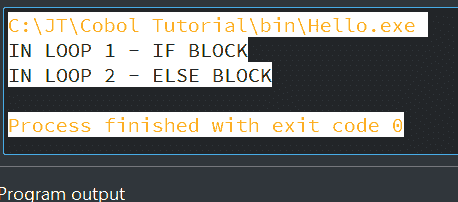
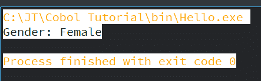
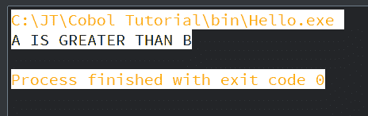
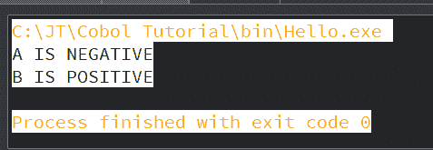
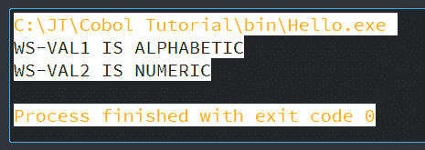
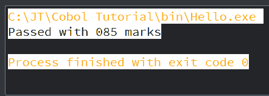
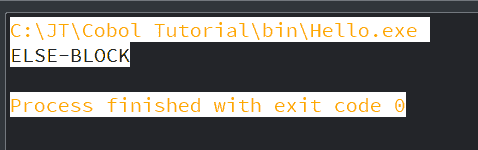
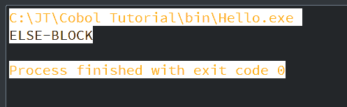
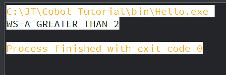

# 条件语句

> 原文：<https://www.javatpoint.com/cobol-conditional-statements>

根据程序员指定的特定条件，条件语句用于更改执行流程。条件语句总是给出真或假的输出。COBOL 包含各种类型的条件语句:

*   [If 条件语句](#condition)
*   [关系声明](#Relation)
*   [签署声明](#Sign)
*   [班级陈述](#Class)
*   [条件-名称声明](#Name)
*   [否定条件](#Negated)
*   [组合条件](#Combined)

## 如果条件陈述

如果条件语句用于检查条件，如果条件为真，则执行 If 块，如果条件为假，则执行 ELSE 块。

IF 语句根据其在 COBOL 程序中的用法主要有三种类型:

### 简单中频

简单 IF 主要用于执行条件相关代码。如果条件为真，那么它将执行写在 If 块中的语句集。如果条件不满足，控制将转移到 If 语句终止后的下一个语句。

**语法:**

```

IF Condition  
	{Statement Block}
[END-IF].

```

这里，END-IF 是范围终止符，在程序中是可选的。句号(。)可以在 IF 块的最后一条语句中定义。

如果我们没有指定句点，那么范围终止符 END-IF 是强制的。

### 否则的话

当某组语句需要由两个条件执行时，使用 IF ELSE 语句。该语句主要用于执行特定于条件的代码。

在 IF-ELSE 中，如果指定条件为真，将执行语句块。如果条件为假，将执行另一组语句，这些语句将位于 ELSE 块下。

**语法:**

```

IF Condition-1
	{Statement-Block-1/NEXT SENTENCE}
[ELSE]  
	{Statement-Block-2/NEXT SENTENCE}
[END-IF].

```

### 嵌套中频

像其他 COBOL 编程语言一样，COBOL 也允许嵌套的 IF 语句。IF 语句中的 IF 语句作为嵌套的 IF 语句调用。嵌套 IF 语句的深度没有限制。

**语法:**

```

IF Condition-1 THEN
	IF Condition-2 THEN
		Statements-block-1
	[ELSE
		Statements-block-2
	END-IF]
[ELSE
	IF Condition-3 THEN
		Statements-block-3
	[ELSE
		Statements-block-4
	END-IF]
END-IF.]

```

### 例 1:

让我们看看 COBOL 程序中 IF 条件语句的一个例子:

```

       IDENTIFICATION DIVISION.
           PROGRAM-ID. HELLO.

       DATA DIVISION.
           WORKING-STORAGE SECTION.
           01 WS-NUM1 PIC 9(9).
           01 WS-NUM2 PIC 9(9).
           01 WS-NUM3 PIC 9(5).
           01 WS-NUM4 PIC 9(6).

       PROCEDURE DIVISION.
           A000-FIRST-PARA.
           MOVE 25 TO WS-NUM1 WS-NUM3.
           MOVE 15 TO WS-NUM2 WS-NUM4.

       IF WS-NUM1 > WS-NUM2 THEN
           DISPLAY 'IN LOOP 1 - IF BLOCK'

       IF WS-NUM3 = WS-NUM4 THEN
           DISPLAY 'IN LOOP 2 - IF BLOCK'
       ELSE
           DISPLAY 'IN LOOP 2 - ELSE BLOCK'
       END-IF

       ELSE
           DISPLAY 'IN LOOP 1 - ELSE BLOCK'
       END-IF.

       STOP RUN.

```

**输出:**



### 例 2:

让我们看看 IF 条件语句的另一个简单示例:

```

      IDENTIFICATION DIVISION.
           PROGRAM-ID. HELLO.

       DATA DIVISION.
           WORKING-STORAGE SECTION.
           01 CHECK-GENDER.
                05 GENDER PIC X(1).
                88 MALE VALUE 'M'.
                88 FEMALE VALUE 'F'.

       PROCEDURE DIVISION.
           MAIN-PARA.
           SET FEMALE TO TRUE.
           IF MALE
                DISPLAY "Gender: Male"
           ELSE
                DISPLAY "Gender: Female"
           END-IF.  
       STOP RUN.

```

**输出:**



## 关系状态

关系条件对比两个操作数。这些操作数可以是标识符、文字或算术表达式。

无论大小和用法如何，都会对代数数值字段进行比较。

**对于非数字操作数**

通过比较两个大小相等的非数字操作数，字符将从左边开始测量，直到到达末端。字符越多的操作数被认为越大。

在比较两个不同大小的操作数时，较短的数据项将在末尾添加空格，直到操作数的大小相等，然后根据上一段中陈述的规则进行比较。

关系运算符定义了要进行的比较类型，如下所示:

| 关系运算子 | 我们可以写成 | 描述 |
| 等于 | IS = | 意思是，等于 |
| 大于 | 信息系统> | 意思是，大于 |
| 小于 | 是< | 意思是，不到 |
| 不大于 | 不是> | 意思是，不大于 |
| 不小于 | 不是< | 意思是，不低于 |
| 不等于 | 不是= | 意思是，不等于 |
| 大于或等于 | IS >= | 意思是，大于或等于 |
| 小于或等于 | IS <= | 意思是，小于或等于 |

### 语法:

```

[Data Name/Arithmetic Operation]

   [IS] [NOT] 

[Equal to (=), Greater than (>), Less than (<),
Greater than or Equal (>=), Less than or equal (<=) ]

[Data Name/Arithmetic Operation]

```

### 示例:

```

       IDENTIFICATION DIVISION.
       PROGRAM-ID. HELLO.

       DATA DIVISION.
       WORKING-STORAGE SECTION.
           01 A PIC 9(9).
           01 B PIC 9(9).

       PROCEDURE DIVISION.
           A000-FIRST-PARA.
           MOVE 24 TO A.
           MOVE 13 TO B.

       IF A IS GREATER THAN OR EQUAL TO B THEN
            DISPLAY 'A IS GREATER THAN B'
       ELSE
            DISPLAY 'A IS LESS THAN B'
       END-IF.

       STOP RUN.

```

**输出:**



## 标志条件

符号条件检查数字操作数的符号。它用于决定给定的数值是大于、小于、等于还是零。

### 语法:

```
[Data Name/Arithmetic Operation] 

   [IS] [NOT] 

[Positive, Negative or Zero]

[Data Name/Arithmetic Operation]

```

### 示例:

```

       IDENTIFICATION DIVISION.
        PROGRAM-ID. HELLO.

       DATA DIVISION.
           WORKING-STORAGE SECTION.
           01 A PIC S9(9) VALUE -1234.
           01 B PIC S9(9) VALUE 123456.

       PROCEDURE DIVISION.
           A000-FIRST-PARA.
           IF A IS POSITIVE THEN
               DISPLAY 'A IS POSITIVE'.

           IF A IS NEGATIVE THEN
               DISPLAY 'A IS NEGATIVE'.

           IF A IS ZERO THEN
               DISPLAY 'A IS ZERO'.

           IF B IS POSITIVE THEN
               DISPLAY 'B IS POSITIVE'.

       STOP RUN.

```

**输出:**



## 阶级条件

类条件检查操作数是否只包含字母或数字数据。空格分为字母空格、字母-小写空格和字母-大写空格。

### 语法:

```

[Data Name/Arithmetic Operation>]

   [IS] [NOT] 

[NUMERIC, ALPHABETIC, ALPHABETIC-LOWER, ALPHABETIC-UPPER]

[Data Name/Arithmetic Operation]

```

### 示例:

```

       IDENTIFICATION DIVISION.
           PROGRAM-ID. HELLO.

       DATA DIVISION.
           WORKING-STORAGE SECTION.
           01 WS-VAL1 PIC X(9) VALUE 'NIKITA '.
           01 WS-VAL2 PIC 9(9) VALUE 123456789.

       PROCEDURE DIVISION.
           A000-FIRST-PARA.

           IF WS-VAL1 IS ALPHABETIC THEN
                DISPLAY 'WS-VAL1 IS ALPHABETIC'.

           IF WS-VAL1 IS NUMERIC THEN
                DISPLAY 'WS-VAL1 IS NUMERIC'.

           IF WS-VAL2 IS NUMERIC THEN
                DISPLAY 'WS-VAL2 IS NUMERIC'.

       STOP RUN.

```

**输出:**



## 条件-名称条件

条件名是用户定义的名称。该语句包含一组用户定义的值，并充当布尔变量。88 级定义了它们。它不会有 PIC 条款。

### 语法:

```

88 [Condition-Name] VALUE [IS, ARE] [LITERAL] [THRU LITERAL].

```

### 示例:

```

       IDENTIFICATION DIVISION.
           PROGRAM-ID. HELLO.

       DATA DIVISION.
           WORKING-STORAGE SECTION.
           01 WS-NUM PIC 9(3).
           88 PASS VALUES ARE 041 THRU 100.
           88 FAIL VALUES ARE 000 THRU 40.

       PROCEDURE DIVISION.
           A000-FIRST-PARA.
           MOVE 85 TO WS-NUM.

           IF PASS 
                DISPLAY 'Passed with ' WS-NUM ' marks'.

           IF FAIL 
                DISPLAY 'FAILED with ' WS-NUM 'marks'.

       STOP RUN.

```

**输出:**



## 否定条件

通过使用关键字“非”给出否定条件。如果一个条件得到满足，并且我们在它前面给出了 NOT，那么它的最终值将是假的。

### 语法:

```

IF NOT [CONDITION] 
   COBOL Statements
END-IF.

```

### 示例:

```

       IDENTIFICATION DIVISION.
           PROGRAM-ID. HELLO.

       DATA DIVISION.
           WORKING-STORAGE SECTION.
           01 WS-NUM1 PIC 9(2) VALUE 20.
           01 WS-NUM2 PIC 9(9) VALUE 25.

       PROCEDURE DIVISION.
           A000-FIRST-PARA.

           IF NOT WS-NUM1 IS LESS THAN WS-NUM2 THEN
                DISPLAY 'IF-BLOCK'
           ELSE
                DISPLAY 'ELSE-BLOCK'
           END-IF.

       STOP RUN.

```

**输出:**



## 组合条件

组合条件语句包括两个或多个与或或与逻辑运算符相关联的条件。

### 语法:

```

IF [CONDITION] AND [CONDITION]
   COBOL Statements
END-IF.

```

### 示例:

```

       IDENTIFICATION DIVISION.
           PROGRAM-ID. HELLO.

       DATA DIVISION.
           WORKING-STORAGE SECTION.
           01 WS-NUM1 PIC 9(2) VALUE 20.
           01 WS-NUM2 PIC 9(2) VALUE 25.
           01 WS-NUM3 PIC 9(2) VALUE 20.

       PROCEDURE DIVISION.
           A000-FIRST-PARA.

           IF WS-NUM1 IS LESS THAN WS-NUM2 AND WS-NUM1=WS-NUM3 THEN
                  DISPLAY 'Both condition OK'
           ELSE
                  DISPLAY 'Error'
           END-IF.

       STOP RUN.

```

**输出:**



## 评估动词

我们可以用 Evaluate 动词代替一系列 IF-ELSE 语句。它的工作原理与 C 程序的 SWITCH 语句相同。这个动词在评估多个条件时非常有用。

在程序执行期间，它提供多重选择控制。在一次拍摄中，它可以测试多个条件。

### 语法:

```

EVALUATE {Expression1}
	WHEN Cond-1
		Statement block-1
	WHEN Cond-2
		Statement block-2
		.
		.
		.
		.
	WHEN Cond-n
		Statement block-n
	WHEN other
		Statement block- other
END-EVALUATE.

```

### 示例:

```

       IDENTIFICATION DIVISION.
           PROGRAM-ID. HELLO.

       DATA DIVISION.
           WORKING-STORAGE SECTION.
           01 WS-A PIC 9 VALUE 0.

       PROCEDURE DIVISION.
           MOVE 3 TO WS-A.

       EVALUATE TRUE
           WHEN WS-A > 2
                DISPLAY 'WS-A GREATER THAN 2'

           WHEN WS-A < 0
                DISPLAY 'WS-A LESS THAN 0'

           WHEN OTHER
                DISPLAY 'INVALID VALUE OF WS-A'
       END-EVALUATE.

       STOP RUN.

```

**输出:**



* * *