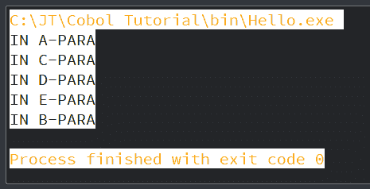
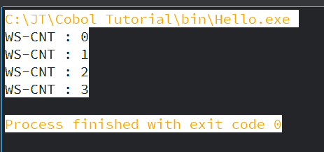
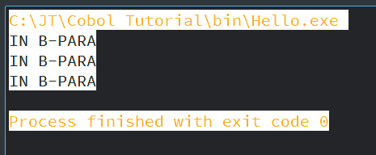
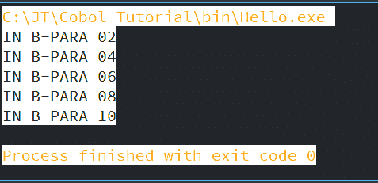
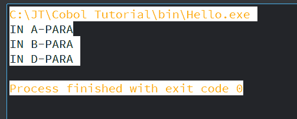

# 循环语句

> 原文：<https://www.javatpoint.com/cobol-loop-statements>

程序中有一些语句需要重复执行，比如读取文件的每一条记录直到它的末尾。程序中的语句连续运行，直到或者除非流程中执行的任何语句改变了执行顺序。

对于迭代编程，COBOL 中使用了 PERFORM 语句。这些循环语句是:

*   执行穿透
*   执行到
*   表演时间
*   执行变化

## 执行穿透

通过按顺序给出段落的名字和姓氏来执行一系列段落。执行完最后一段后，控件将返回。

根据其下语句的编码方式，PERFORM 主要分为两种类型:

*   内联执行
*   大纲执行

让我们看看它们之间的区别:

| 在一条直线上的 | 概述 |
| 内联在执行和结束执行之间执行一系列语句或语句块。 | OUTLINE Perform 用于执行一系列语句或语句块，这些语句或语句块编码在单独的部分或段落中，不与 Perform 语句一起编码。 |
| 这不需要单独的需要编码的段落或章节，它们将被执行。 | 它需要一个单独的段落或部分，需要为要执行的语句进行编码。 |
| 在这种情况下，范围终止符(END-PERFORM)是必需的。 | 在这种情况下，不需要范围终止符(END-PERFORM)。 |
| 语法:-以下是内联执行的语法:
执行
显示“你好世界”
结束-执行。 | 语法:-以下是大纲执行的语法:
执行段落 1 到段落 2 |

### 示例:

让我们看一个 PERFORM THRU 语句的例子:

```

       IDENTIFICATION DIVISION.
           PROGRAM-ID. HELLO.

       PROCEDURE DIVISION.
           A-PARA.
           PERFORM DISPLAY 'IN A-PARA'
           END-PERFORM.
           PERFORM C-PARA THRU E-PARA.

           B-PARA.
              DISPLAY 'IN B-PARA'.
           STOP RUN.

           C-PARA.
              DISPLAY 'IN C-PARA'.

           D-PARA.
             DISPLAY 'IN D-PARA'.

           E-PARA.
             DISPLAY 'IN E-PARA'.

```

**输出:**

当您编译并执行上述程序时，它将显示以下输出:



## 执行到

一段语句或一段/一节将在“执行直到”语句中执行，直到指定条件变为真。

默认条件是“在前面进行测试”，它指定在执行段落中的语句之前测试该条件。

### 语法:

以下是“执行到”的语法:

```

PERFORM A-PARA UNTIL COUNT=5

PERFORM A-PARA WITH TEST BEFORE UNTIL COUNT=5

PERFORM A-PARA WITH TEST AFTER UNTIL COUNT=5

```

### 示例:

让我们看一个执行直到语句的例子:

```

       IDENTIFICATION DIVISION.
           PROGRAM-ID. HELLO.

       DATA DIVISION.
           WORKING-STORAGE SECTION.
           01 WS-CNT PIC 9(1) VALUE 0\. 

       PROCEDURE DIVISION.
           A-PARA.
           PERFORM B-PARA WITH TEST AFTER UNTIL WS-CNT>3.
           STOP RUN.

           B-PARA.
              DISPLAY 'WS-CNT : 'WS-CNT.
              ADD 1 TO WS-CNT.

```

**输出:**

当您编译并执行上述程序时，它将显示以下输出:



## 表演时间

执行次数主要用于以指定的次数重复执行语句块或段落/部分。

### 语法:

以下是执行时间的语法:

```

PERFORM A-PARA 5 TIMES.

```

### 示例:

让我们看一个执行时间的例子:

```

       IDENTIFICATION DIVISION.
           PROGRAM-ID. HELLO.

       PROCEDURE DIVISION.
           A-PARA.
           PERFORM B-PARA 3 TIMES.
           STOP RUN.

           B-PARA.
           DISPLAY 'IN B-PARA'.

```

**输出:**

当您编译并执行上述程序时，它将显示以下输出:



## 执行变化

语句块或段落/部分将在“执行变化”中执行，直到条件在“直到”短语中变为真。

### 语法:

以下是“执行变化”的语法:

```

PERFORM A-PARA VARYING A FROM 1 BY 1 UNTIL A = 5.

```

### 示例:

让我们看一个执行变化的例子:

```

       IDENTIFICATION DIVISION.
           PROGRAM-ID. HELLO.

       DATA DIVISION.
           WORKING-STORAGE SECTION.
             01 WS-A PIC 9(2) VALUE 0.

           PROCEDURE DIVISION.
            A-PARA.
         PERFORM B-PARA VARYING WS-A FROM 2 BY 2 UNTIL WS-A=12
           STOP RUN.

            B-PARA.
               DISPLAY 'IN B-PARA ' WS-A.

```

**输出:**

当您编译并执行上述程序时，它将显示以下输出:



## 转到语句

在程序中，GO TO 语句改变了执行流程。在这种说法中，控制权仅向前转移。它用于退出程序。各种类型的待办事项声明如下:

**无条件转到**

以下是无条件转到的语法:

```

GO TO para-name.

```

**有条件转到**

以下是条件转到的语法:

```

GO TO para-1 para-2 para-3 DEPENDING ON x.

```

这里，如果 x = 1，那么控制将转移到第一段，如果 x = 2，那么控制将转移到第二段，以此类推。

### 示例:

让我们来看一个 GO To 语句的示例:

```

       IDENTIFICATION DIVISION.
       PROGRAM-ID. HELLO.

       DATA DIVISION.
           WORKING-STORAGE SECTION.
           01 WS-A PIC 9 VALUE 2.

       PROCEDURE DIVISION.
           A-PARA.
              DISPLAY 'IN A-PARA'
           GO TO B-PARA.

           B-PARA.
              DISPLAY 'IN B-PARA '.
           GO TO C-PARA D-PARA DEPENDING ON WS-A.

           C-PARA.
             DISPLAY 'IN C-PARA '.

           D-PARA.
             DISPLAY 'IN D-PARA '.
       STOP RUN.

```

**输出:**

当您编译并执行上述程序时，它将显示以下输出:



* * *