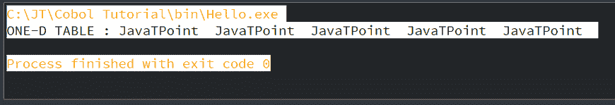

# 阵列/表格处理

> 原文：<https://www.javatpoint.com/cobol-array-or-table-processing>

在 COBOL 中，数组被称为表。数组是线性数据结构，是同一数据类型的单个数据项的集合。

表的数据项是内部排序的。

## 表格声明

在数据划分中，我们可以声明表，并且我们必须使用‘Occurs’子句来定义表。Occurs 子句用于指示数据名称定义的重复。它只能用于从 02 到 49 开始的级别号。对于重新定义，我们不能使用发生子句。

一维和二维表格的描述如下:

### 一维表格

在一维表中，“Occurs”子句只能在声明中指定一次。

**语法:**

```

01 WS-TABLE.
   05 WS-A PIC A(10) OCCURS 10 TIMES.

```

这里，WS-TABLE 是包含该表的组项，WS-A 为出现十次的表元素命名。

**示例:**

让我们看一个一维表的例子:

```

       IDENTIFICATION DIVISION.
       PROGRAM-ID. HELLO.

       DATA DIVISION.
           WORKING-STORAGE SECTION.
            01 WS-TABLE.
               05 WS-A PIC A(12) VALUE 'JavaTPoint' OCCURS 5 TIMES.     

       PROCEDURE DIVISION.
              DISPLAY "ONE-D TABLE : "WS-TABLE.
       STOP RUN.

```

**输出:**



### 二维表格

生成两个数据元素长度可变的二维表。

**语法:**

```

01 WS-TABLE.
   05 WS-A OCCURS 10 TIMES.
      10 WS-B PIC A(10).
      10 WS-C OCCURS 5 TIMES.
         15 WS-D PIC X(6).

```

这里，第一个 WS-A 数组可能出现 1 到 10 次，内部 WS-C 数组可能出现 1 到 5 次。意味着，每个 WS-A 条目将有 5 个 WS-C 条目。

**示例:**

让我们看一个二维表格的例子:

```

       IDENTIFICATION DIVISION.
       PROGRAM-ID. HELLO.

       DATA DIVISION.
           WORKING-STORAGE SECTION.
       01 WS-TABLE.
         05 WS-A OCCURS 2 TIMES.
           10 WS-B PIC A(6) VALUE ' JAVAT'.
             10 WS-C OCCURS 2 TIMES.
               15 WS-D PIC X(6) VALUE ' POINT'.

       PROCEDURE DIVISION.
           DISPLAY "TWO-D TABLE : "WS-TABLE.

       STOP RUN.

```

**输出:**


## 下标

通过使用下标，我们可以检索表的单个元素。下标的值从 1 到表/数组出现的次数不等。任何+ve 数都可以是下标值。在数据划分中，不需要任何下标声明。它是用“发生”子句自动形成的。

### 示例:

让我们看一个例子来理解下标:

```

       IDENTIFICATION DIVISION.
       PROGRAM-ID. HELLO.

       DATA DIVISION.
       WORKING-STORAGE SECTION.
       01 WS-TABLE.
        05 WS-A OCCURS 3 TIMES.
         10 WS-B PIC A(2).
           10 WS-C OCCURS 2 TIMES.
            15 WS-D PIC X(3).

       PROCEDURE DIVISION.
         MOVE '12ABCDEF13DEEP24NIKITA24' TO WS-TABLE.
           DISPLAY 'WS-TABLE  : ' WS-TABLE.
           DISPLAY 'WS-A(1)   : ' WS-A(1).
           DISPLAY 'WS-C(1,1) : ' WS-C(1,1).
           DISPLAY 'WS-C(1,2) : ' WS-C(1,2).
           DISPLAY 'WS-A(2)   : ' WS-A(2).
           DISPLAY 'WS-C(2,1) : ' WS-C(2,1).
           DISPLAY 'WS-C(2,2) : ' WS-C(2,2).
           DISPLAY 'WS-A(3)   : ' WS-A(3).
           DISPLAY 'WS-C(3,1) : ' WS-C(3,1).
           DISPLAY 'WS-C(3,2) : ' WS-C(3,2).

       STOP RUN.

```

**输出:**


## 索引

我们也可以使用索引来访问表元素。索引是从表的开头开始移动的元素。我们需要用发生子句描述 INDEXED BY 子句来声明索引。

使用 SET 语句和“执行变化”选项来更改索引值。

### 语法:

```

01 WS-TABLE.
   05 WS-A PIC A(10) OCCURS 10 TIMES INDEXED BY I.

```

### 示例:

让我们看一个例子来理解表中的索引:

```

       IDENTIFICATION DIVISION.
       PROGRAM-ID. HELLO.

       DATA DIVISION.
           WORKING-STORAGE SECTION.
             01 WS-TABLE.
               05 WS-A OCCURS 3 TIMES INDEXED BY I.
                 10 WS-B PIC A(2).
                 10 WS-C OCCURS 2 TIMES INDEXED BY J.
                    15 WS-D PIC X(3).

       PROCEDURE DIVISION.
           MOVE '12ABCDEF34GHIJKL56MNOPQR' TO WS-TABLE.
           PERFORM A-PARA VARYING I FROM 1 BY 1 UNTIL I >3 
       STOP RUN.

       A-PARA.
           PERFORM C-PARA VARYING J FROM 1 BY 1 UNTIL J>2.

       C-PARA.
           DISPLAY WS-C(I,J).

```

**输出:**


## 设置语句

set 语句更改索引值。它用于初始化、递增或递减索引值。该语句可以与 search 和 search all 一起使用，以定位表中的元素。

### 语法:

```

SET I J TO positive-number
SET I TO J
SET I TO 5
SET I J UP BY 1
SET J DOWN BY 5

```

### 示例:

让我们看一个 set 语句的例子:

```

       IDENTIFICATION DIVISION.
       PROGRAM-ID. HELLO.

       DATA DIVISION.
           WORKING-STORAGE SECTION.
            01 WS-TABLE.
              05 WS-A OCCURS 3 TIMES INDEXED BY I.
                10 WS-B PIC A(2).
                10 WS-C OCCURS 2 TIMES INDEXED BY J.
                   15 WS-D PIC X(3).

       PROCEDURE DIVISION.
           MOVE '12ABCDEF34GHIJKL56MNOPQR' TO WS-TABLE.
           SET I J TO 1.
           DISPLAY WS-C(I,J).
           SET I J UP BY 1.
           DISPLAY WS-C(I,J).

       STOP RUN.

```

**输出:**


## 搜索

这是一种线性搜索方法。这用于定位表格元素。我们可以在排序或未排序的表上执行搜索。搜索仅用于由索引短语声明的表。这从索引的初始值开始。如果搜索到的项目不可用，索引将自动增加 1，并将一直持续到表的末尾。

### 示例:

让我们看一个搜索的例子:

```

       IDENTIFICATION DIVISION.
       PROGRAM-ID. HELLO.

       DATA DIVISION.
       WORKING-STORAGE SECTION.
       01 WS-TABLE.
           05 WS-A PIC X(1) OCCURS 18 TIMES INDEXED BY I.
       01 WS-SRCH PIC A(1) VALUE 'N'.

       PROCEDURE DIVISION.
           MOVE 'ABCDEFGHIJKLMNOPQR' TO WS-TABLE.
             SET I TO 1.
           SEARCH WS-A
              AT END DISPLAY 'N NOT FOUND IN TABLE'
              WHEN WS-A(I) = WS-SRCH
              DISPLAY 'LETTER N FOUND IN TABLE'
           END-SEARCH.  

       STOP RUN.

```

**输出:**


## 全部搜索

全部搜索是一种二分搜索法方法。这用于查找表中的元素。在“全部搜索”中，该表必须按排序顺序排列。索引不需要初始化。

正如我们所知，在二分搜索法方法中，表被分成两个半部分，它确定搜索到的元素出现在哪个半部分。这个过程重复进行，直到找到元素或到达终点。

### 示例:

让我们看一个搜索全部的例子:

```

       IDENTIFICATION DIVISION.
       PROGRAM-ID. HELLO.

       DATA DIVISION.
           WORKING-STORAGE SECTION.
           01 WS-TABLE.
       05 WS-RECORD OCCURS 10 TIMES ASCENDING KEY IS WS-N INDEXED BY I.
             10 WS-N PIC 9(2).
             10 WS-NAME PIC A(3).

       PROCEDURE DIVISION.
           MOVE '12ABC56DEF34GHI78JKL93MNO11PQR' TO WS-TABLE.
           SEARCH ALL WS-RECORD
           AT END DISPLAY 'RECORD NOT FOUND'
           WHEN WS-N(I) = 93
        DISPLAY 'RECORD FOUND '
        DISPLAY WS-N(I)
        DISPLAY WS-NAME(I)

       END-SEARCH.

```

**输出:**


* * *