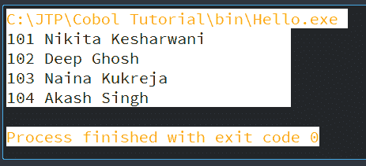
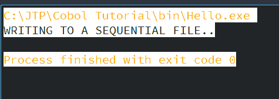
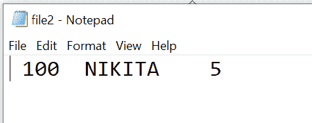

# 文件处理动词

> 原文：<https://www.javatpoint.com/cobol-file-handling-verbs>

文件处理动词用于执行多个文件操作。文件处理术语如下。处理一个文件意味着做所有的文件操作，如读、写、打开、关闭等。

以下是文件处理动词的列表，或者我们可以说文件处理动词:

*   打开
*   阅读
*   写
*   重写
*   删除
*   开始
*   关闭
*   阅读下一页
*   预读

## 打开

在开始处理文件之前，首先需要打开文件。打开是执行其他任务之前需要执行的第一个文件操作。如果打开成功，那么只有我们可以执行其他文件操作，如读、写、关闭等。只有在打开文件后，文件结构中的变量才可用于处理。

打开文件不会将任何数据传输到记录缓冲区；它只是提供访问。

我们可以在每次文件操作后使用文件状态变量来检查状态。

### 语法:

```

OPEN <mode> file-name.

```

文件可以在以下任何一种**模式**下打开:

### 投入

此模式仅用于现有文件。要读取文件，我们需要使用这种模式。我们无法通过此模式对文件执行其他操作。当打开一个文件进行输入时，下一个记录指针指向文件开头的文件。

### 输出

输出模式用于将记录写入文件。在顺序文件中的记录已经存在，那么该文件将被覆盖。但是在索引文件和相对文件的情况下，这种情况不会发生。

### 扩展

这种模式将记录追加到一个顺序文件中。在这种模式下，记录将被插入末尾。当文件以扩展模式打开时，下一个记录指针位于文件中的最后一条记录。

我们不能在随机和动态文件的情况下使用扩展模式。

### 输入输出

输入输出模式。该模式读取并重写(更新)文件的记录。

## 阅读

一旦文件以输入或输入输出模式打开，就可以使用 read 动词一次读取一条记录。这个动词从文件中复制一个记录出现或实例，并将其放在使用 FD 定义的记录缓冲区中，然后我们可以访问它。

### 语法:

以下是文件访问模式为顺序时读取谓词的语法:

```

READ FILE-NAME [NEXT/PREVIOUS] RECORD [INTO identifier1]  
[AT END {imperative statement}]  
[NOT AT END {imperative statement}]  
[END-READ]

```

以下是上述语法中定义的参数:

*   下一条记录:这是可选的，用于索引顺序文件的顺序读取。
*   进入:该条款也是可选的。
*   结束时:当文件到达末尾时，这种情况变为真。

### 示例:

让我们看一个使用顺序组织读取现有文件的例子。这将显示文件中写入的所有记录。这里我们将使用 file.txt 文件。该文件位于我们的 COBOL 程序所在的目录中。

```

       IDENTIFICATION DIVISION.
           PROGRAM-ID. HELLO.

       ENVIRONMENT DIVISION.
       INPUT-OUTPUT SECTION.
           FILE-CONTROL.
           SELECT Employee ASSIGN TO 'file.txtThe file'
           ORGANIZATION IS LINE SEQUENTIAL.            

       DATA DIVISION.
           FILE SECTION.
           FD Employee.
             01 Employee-FILE.
                05 Employee-ID PIC 9(5).
                05 NAME PIC A(25).

             WORKING-STORAGE SECTION.
             01 WS-Employee.
                 05 WS-Employee-ID PIC 9(5).
                 05 WS-NAME PIC A(25).
             01 WS-EOF PIC A(1). 

             PROCEDURE DIVISION.
             OPEN INPUT Employee.
             PERFORM UNTIL WS-EOF='Y'
              READ Employee INTO WS-Employee
                 AT END MOVE 'Y' TO WS-EOF
                 NOT AT END DISPLAY WS-Employee
             END-READ
           END-PERFORM.
         CLOSE Employee.
       STOP RUN.

```

文件. txt 文件在 C:\JTP\Cobol 教程\bin 目录中包含以下内容:

```

101 Nikita Kesharwani
102 Deep Ghosh
103 Naina Kukreja
104 Akash Singh

```

**输出:**

当您编译并执行上述程序时，它将显示以下输出:



### 语法:

以下是文件访问模式为随机时读取动词的语法:

```

READ FILE-NAME RECORD [INTO identifier1][KEY IS key-1]       
[INVALID KEY {imperative statement}]   
[NOT INVALID KEY {imperative statement}]   
[AT END {imperative statement}]   
[NOT AT END {imperative statement}]   
[END-READ]

```

## 写

这个动词用于将内容写入文件。要将数据插入文件，我们必须将数据移动到记录缓冲区(在 FD 条目中声明)，然后将记录缓冲区的内容写入文件。

Write 语句用于通过 from(可选子句)直接从工作存储变量中写入记录。

根据文件打开模式，可以通过两种方式对文件进行写入操作:

*   如果文件以输出模式打开，访问模式将是顺序的。从第一条记录开始，记录将被写入。如果在以输出模式打开之前，文件中有一些数据可以刷新并从头开始写入。
*   如果文件是以扩展模式打开的，从最后一条记录开始，这些记录将被添加到文件中。

简而言之，我们可以说，如果文件以输出模式打开，那么写操作会覆盖现有文件。如果文件是在 EXTEND 模式下打开的，然后 write 动词将记录添加到现有文件中。

### 语法:

以下是当文件组织是连续的时写入记录的语法:

```

WRITE record-buffer [FROM ws-file-structure]
END-WRITE.

```

以下是当文件组织被索引或相对时写入记录的语法:

```

WRITE record-buffer [FROM ws-file-structure]
   INVALID KEY DISPLAY 'Invalid Key'
   NOT INVALID KEY DISPLAY 'Record Inserted'
END-WRITE.

```

### 示例:

让我们看一个例子，它展示了当组织是连续的时，如何在新文件中插入记录:

```

       IDENTIFICATION DIVISION.
       PROGRAM-ID. HELLO.

       ENVIRONMENT DIVISION.
       INPUT-OUTPUT SECTION.
       FILE-CONTROL.
       SELECT EMPLOYEE ASSIGN TO 'file2.txt'
           ORGANIZATION IS SEQUENTIAL
           ACCESS IS SEQUENTIAL.

       DATA DIVISION.
           FILE SECTION.
            FD EMPLOYEE.
            01 EMPLOYEE-FILE.
               05 EMPLOYEE-ID PIC X(5).
               05 NAME PIC A(10).
               05 RANK PIC X(3).

       WORKING-STORAGE SECTION.
           01 WS-EMPLOYEE.
             05 WS-EMPLOYEE-ID PIC 9(5).
             05 WS-NAME PIC A(25).
             05 WS-RANK PIC X(3).

       PROCEDURE DIVISION.
        DISPLAY 'WRITING TO A SEQUENTIAL FILE..'
           OPEN EXTEND EMPLOYEE.
           MOVE '100' TO EMPLOYEE-ID.
           MOVE 'NIKITA' TO NAME.
           MOVE '5' TO RANK.
              WRITE EMPLOYEE-FILE
              END-WRITE.	
       CLOSE EMPLOYEE.
       STOP RUN.

```

**输出:**

当您编译并执行此程序时，它将显示以下输出:



当您打开文件“file2.txt”时，它会添加一条新记录:



## 重写

重写动词更新记录，但文件必须在输入输出模式下打开才能进行重写操作。只有在成功的读取操作之后，我们才能执行重写操作。

重写动词覆盖最后读取的记录。为此，我们需要使用 read 动词读取记录，然后更改记录的内容，然后执行 REWRITE 操作来更新记录。

### 语法:

以下是当文件组织是连续的时写入记录的语法:

```

REWRITE record-buffer [FROM ws-file-structure]
END-REWRITE.

```

以下是当文件组织被索引或相对时写入记录的语法:

```

REWRITE record-buffer [FROM ws-file-structure]
   INVALID KEY DISPLAY 'Invalid Key'
   NOT INVALID KEY DISPLAY 'Record Updated'
END-REWRITE.

```

## 删除

Delete 动词用于删除记录，该记录在文件的最新读取中读取。我们只能在索引文件和相关文件中使用 Delete 动词。并且文件必须以输入输出模式打开。

顺序文件中记录的特定删除是不可能的。

在顺序访问模式下，read 语句最后读取的记录将被删除。并且您需要在随机访问模式下定义记录密钥来执行删除过程。

### 语法:

```

DELETE file-name RECORD
   INVALID KEY DISPLAY 'Invalid Key'
   NOT INVALID KEY DISPLAY 'Record Deleted'
END-DELETE.

```

## 开始

我们只能对索引文件和相关文件执行启动操作。开始动词用于将文件指针放在特定记录上。该访问模式必须是顺序的或动态的。文件必须在输入输出输入模式下打开。start 不用于检索任何记录，它只将指针设置为读取记录的下一次读取。

### 语法:

以下是用于将指针放在特定记录上的语法:

```

START file-name KEY IS [=, >, <, NOT, <= or >=] rec-key
   INVALID KEY DISPLAY 'Invalid Key'
   NOT INVALID KEY DISPLAY 'File Pointer Updated'
END-START.

```

## 关闭

此动词用于显式关闭文件。当您关闭文件时，文件结构中的变量将不可用于处理。并且程序和文件之间的连接丢失。

### 语法:

关闭文件的语法:

```

CLOSE file-name.

```

* * *