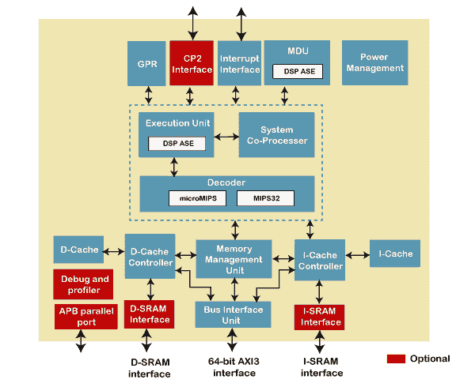
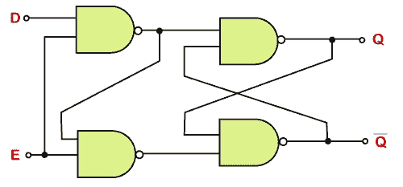
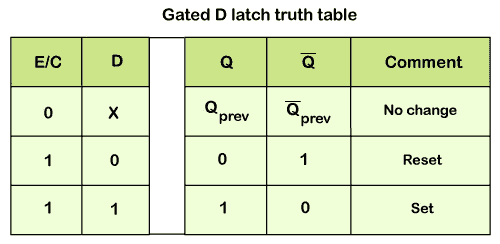
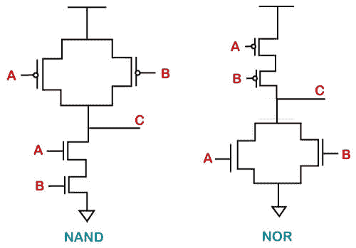

# 设计抽象层

> 原文：<https://www.javatpoint.com/verilog-design-abstraction-layers>

Verilog 语言对于理解芯片设计中的不同抽象层至关重要。

顶层是系统级架构，它定义了各种子块，并根据功能对它们进行分组。

例如，一个处理器集群可以有多个缓存块、内核和缓存一致性逻辑。所有这些将被表示为具有输入和输出信号的单个块。

在下一级，每个子块都用硬件描述语言编写，以准确描述每个块的功能。

较低级别的实现细节，如电路原理图、技术库在此阶段被忽略。

例如，一个控制器块将有多个 [Verilog](verilog) 文件，每个文件描述一个较小的功能组件。

然后，HDL 被转换为门级原理图，这些原理图涉及表征触发器等数字元件的技术库。

例如，用于 D 锁存器的数字电路包含以某种方式排列的与非门，使得 D 和 E 输入的所有组合产生真值表给出的输出 Q。

真值表本质上给出了所有输入信号电平和结果输出电平的排列。

硬件原理图也可以使用 K 图和布尔逻辑从真值表中导出。然而，对于控制器 和 ***处理器*** 等更复杂的数字模块 ***来说，遵循这种方法是没有用的。***

与非门的实现是通过连接特定格式的互补金属氧化物半导体晶体管来完成的。在这个水平上，晶体管沟道宽度、Vdd 和驱动输出电容性负载的能力在设计过程中被考虑在内。

最后一步是使用将要制造的 EDA 工具在硅中布局这些晶体管。在这个级别需要一些设备和技术知识，因为不同的布局最终会有不同的物理属性，如电阻和电容等。

### 设计风格

数字块的设计主要遵循两种风格，一种是自顶向下的，另一种是自底向上的方法。

**1。自上而下**
在这种方法中，首先定义一个顶层块，并确定构建顶层块所需的子模块。

类似地，每个子块被进一步分成更小的组件，这个过程一直持续到我们到达叶细胞或它不能被进一步划分的阶段。

**2。自下而上**
第一个任务是识别可用的构件。然后将它们放在一起，并以某种方式连接起来，以构建更大的单元，并用于拼凑顶层块。

我们也可以使用两种流的组合。架构师定义设计的系统级视图，设计师实现每个功能块的逻辑，并将其合成为门。

自上而下的风格一直延续到这一点。然而，这些门是按照自下而上的流程构建的，从最小块的物理布局开始，在尽可能好的区域、功率和性能上。

这些标准单元也有硬件原理图。这些可用于获取各种信息，如功率上升和下降、时间和其他延迟。

这些单元可供合成工具使用，合成工具在需要的地方挑选并实例化它们。

* * *