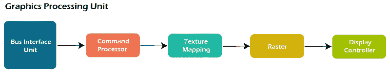

# Verilog模块

> 原文：<https://www.javatpoint.com/verilog-module>

模块是实现某些功能的 Verilog 代码块。模块可以嵌入到其他模块中，高级模块可以使用其输入和输出端口与其低级模块通信。

**语法**

一个模块应包含在 ***一个模块*** 和 ***末端模块*** 关键词内。模块的名称应该在模块关键字之后给出，也可以声明一个可选的端口列表。

#### 注意:在端口声明列表中声明的端口不能在模块的主体中重新声明。

```

module <name> ([port_list]);

         // Contents of the module
endmodule

        // A module can have an empty portlist

module name;
        // Contents of the module

endmodule

```

所有变量声明、函数、任务、数据流语句和低级模块实例都必须在模块和 endmodule 关键字中定义。

### 模块的用途

模块代表实现特定行为特征的设计单元，在合成过程中将被转换为数字电路。

输入的任何组合都可以提供给模块，它将提供相应的输出。

它允许相同的 ***模块*** 被重用，以形成实现更复杂硬件的更重要的模块。

**硬件示意图**

也可以进行相反的过程，而不是构建更小的块来形成更大的设计块。

考虑将一个简单的图形处理器引擎分解成更小的组件，这样每个组件都可以表示为实现特定功能的模块。

下面的图形处理器引擎分为五个不同的子块，每个子块执行特定的功能。

总线接口单元将来自外部的数据输入到设计中，由另一个单元进行处理以提取指令。其他单元处理前一单元提供的数据。



每个子块可以表示为一个模块，该模块具有一组特定的输入和输出信号，用于与其他模块通信，并且每个子块可以根据需要进一步分成更多的子块。

### 顶层模块

顶层模块包含所有其他模块。顶层模块不会在任何其他模块中实例化。

例如，设计模块通常在顶层测试平台模块中实例化，以便通过提供输入激励来运行模拟。

但是，*测试平台没有在任何其他模块中实例化，因为它是一个封装所有其他东西的块。*

 ***1。设计顶层**

下面显示的设计代码有一个名为 design 的顶层模块。它包含完成设计所需的所有其他子模块。

子模块可以有更嵌套的子模块，例如 mod1 内部的 mod3 和 mod2 内部的 mod4。

```

          //  Design code

module mod3 ( [port_list] );
	reg c;

         // Design code
endmodule

module mod4 ( [port_list] );
	wire a;
         // Design code
endmodule

module mod1 ( [port_list] );	 
	wire 	y;

mod3 	mod_inst1 ( ); 	 	

	mod3 	mod_inst2 ( );	 

endmodule

module mod2 ( [port_list] ); 	

	mod4 	mod_inst1 (  );		

	mod4 	mod_inst2 (  );

endmodule

        // Top-level module

module design ( [port_list]); 	

	wire 	_net;
	mod1 	mod_inst1 	(  ); 	

	mod2 	mod_inst2 	(  );

endmodule

```

**2。测试台顶层**

测试平台模块包含检查设计功能的激励，主要用于使用模拟工具进行功能验证。

因此，设计在测试平台模块中被实例化和调用 d0。从模拟器的角度来看，测试平台是顶级模块。

```

//------------
// Testbench code
// this is the top-level module from simulation perspective
// because 'design' is instantiated within this module
//------------
module testbench;
	design d0 ( [port_list_connections] );
//-----------

endmodule

```

### 分层名称

当模块可以在彼此内部实例化时，就形成了层次结构，因此顶层模块被称为 ***根*** 。

由于每个较低的模块在给定的模块内实例化，该模块应该具有不同的标识符名称，因此在访问信号时不会有任何歧义。

分层名称由这些标识符的列表构成，用点(。)对于层次结构的每个级别。任何信号都可以在任何模块内使用该特定信号的分级路径来访问。

* * **