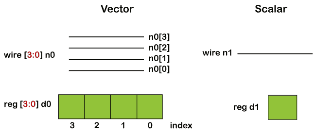
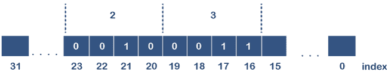

# Verilog 标量和矢量

> 原文：<https://www.javatpoint.com/verilog-scalar-and-vector>

Verilog 需要表示单个位以及位组。单个位顺序元件是触发器，16 位顺序元件是寄存器。对于这类任务， [Verilog](https://www.javatpoint.com/verilog) 有 ***标量*** 和 ***向量*** 。

### 标量和矢量

一个没有范围规范的 ***net*** 或 ***reg*** 声明被认为是 1 位宽，是一个标量。如果指定了一个范围，网络或区域就变成了一个称为向量的多位实体。



向量范围规范包含两个常量表达式，例如:

1.  **MSB:** 常量表达式的最高有效位，是范围的左边值。
2.  **LSB:** 常量表达式的最低有效位，是范围的右边值。

冒号应该分隔 MSB 和 LSB 常量表达式。

MSB 常量表达式和 LSB 常量表达式可以是正、负和零之间的任何值。

LSB 常量表达式可以高于、等于或小于 MSB 常量表达式。

MSB 和 LSB 表达式都应该是常量表达式。

矢量可以声明为所有类型的 ***网络数据类型*** 和 ***reg*** 数据类型。为 ***整数、实数、实时*** 和 ***时间*** 数据类型指定向量是非法的。向量网和寄存器被视为无符号值。

**语法**

以下是向量的简化语法，例如:

```

net_type [msb:lsb] list_of_net_identifiers;
reg [msb:lsb] list_of_register_identifiers;

```

**示例**

```

wire 	    o_nor;            // single bit scalar net
wire [7:0]  o_flop;          // 8-bit vector net
reg         parity;              // single bit scalar variable
reg  [31:0] addr;            // 32 bit vector variable to store address

```

该范围提供了对向量中的单个位进行寻址的能力。向量的最高有效位应指定为范围内的左边值。而向量的最低有效位应该在右边指定。

```

wire  [msb:lsb]   name;
integer           my_msb;
wire [15:0]        priority;            // MSB = 15, LSB = 0
wire [my_msb: 2]   prior;          // illegal

```

MSB 和 LSB 应该是常量表达式，不能被变量替代。但它们可以是任何整数值，如正、负或零。

LSB 值可以大于、小于或等于 MSB 值。

### 位选择

矢量变量中的任何一位都可以单独选择并分配一个新值，如下图所示。这称为位选择。


如果位选择超出范围或位选择是 x 或 z，则返回值将是 x。

```

reg [7:0]      addr;             // 8-bit reg variable [7, 6, 5, 4, 3, 2, 1, 0]
addr [0] = 1;                     // assign 1 to bit 0 of addr
addr [3] = 0;                     // assign 0 to bit 3 of addr
addr [8] = 1;                     // illegal : bit8  does not exist in addr

```

### 零件选择

连续位范围的选择称为所选部分。有两种类型的零件选择。

1.  恒定零件选择
2.  索引零件选择



```

reg [31:0]    addr;
addr [23:16] = 8'h23;     // bits 23 to 16 will be replaced by the new value 'h23 -> constant part-select.

```

可变部分选择允许在循环中有效地使用它来选择向量的部分。虽然起始位可以变化，但宽度必须恒定。

**语法**

```

[<start_bit> +: <width>]                         // part-select increments from start-bit
[<start_bit> -: <width>]                          // part-select decrements from start-bit

```

**例**

```

module block;
        reg [31:0]  data;
        int         i;
    initial begin
        data = 32'hFACE_CAFE;
        for (i = 0; i < 4; i++) begin
              $display ("data[8*%0d +: 8] = 0x%0h", i, data[8*i +: 8]);
        end
        $display ("data[7:0]   = 0x%0h", data[7:0]);
        $display ("data[15:8]  = 0x%0h", data[15:8]);
        $display ("data[23:16] = 0x%0h", data[23:16]);
        $display ("data[31:24] = 0x%0h", data[31:24]);
    end
endmodule

```

* * *