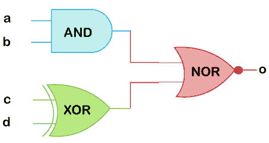
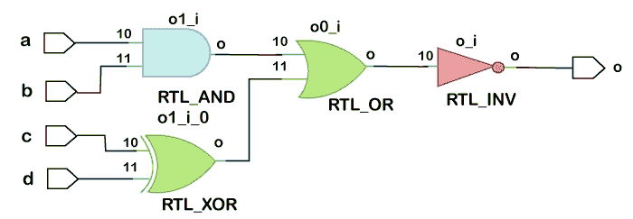

# Verilog分配语句

> 原文：<https://www.javatpoint.com/verilog-assign-statement>

赋值语句用于驱动网络上的值。也用于 ***【数据流建模】*** 。

有线类型或数据类型的信号需要连续赋值。只要将+5V 电池施加到导线的一端，连接到导线另一端的组件就会获得所需的电压。

这个概念是通过 assign 语句实现的，在该语句中，任何线或其他类似的线(数据类型)都可以用一个值连续驱动。该值可以是常数，也可以是由一组信号组成的表达式。

**语法**

赋值语法以关键字 assign 开始，后跟信号名，信号名可以是一个信号，也可以是不同信号网络的组合。

*和 ***延迟*** 是可选的，主要用于数据流建模，而不是合成真实硬件。*

 *右手边的信号被评估并分配给左手边的网或网的表达式。

```

assign <net_expression> = [drive_strength] [delay] <expression of different signals or constant value>

```

延迟值有助于指定门的延迟，并用于模拟真实硬件中的时序行为。该值决定了何时应该为净值赋值。

### 规则

在使用赋值语句时，需要遵循一些规则:

*   LHS 应该总是标量、矢量或标量和矢量网的组合，但绝不是标量或矢量寄存器。
*   RHS 可以包含标量或矢量寄存器和函数调用。
*   每当 RHS 上的任何操作数的值发生变化时，LHS 将被更新为新值。
*   赋值语句也称为连续赋值。

### 分配注册变量

我们不能用赋值语句来驱动或赋值***【reg】***类型的变量，因为 reg 变量能够存储数据，并且不是连续驱动的。

Reg 信号只能在程序块中驱动，如始终和初始。

### 隐式连续赋值

当赋值语句用于给给定的网赋值时，它被称为 ***显式*** 赋值

如果声明了要在网络期间完成的任务，则称之为 ***隐式*** 任务。

```

wire [1:0] a;
assign a = x & y; 			// Explicit assignment
wire [1:0] a = x & y; 	          // Implicit assignment

```

### 组合逻辑设计

考虑以下由组合门和相应的 [Verilog](https://www.javatpoint.com/verilog) 代码组成的数字电路。



组合逻辑要求输入被连续驱动以保持输出，这与触发器等时序元件不同，触发器的值在时钟边沿被捕获并存储。

赋值语句满足了这一目的，因为只要右侧的任何输入发生变化，输出 o 就会更新。

```

            // This module takes four inputs and performs a Boolean
           // operation and assigns output to o.
          // logic is realized using assign statement.
module combo (input a, b, c, d, output  o);
assign o = ~((a & b) | c ^ d);
endmodule

```

### 硬件示意图

在设计细化和综合之后，组合电路的行为与赋值语句建模的方式相同。



每当 RHS 上的组合表达式为真时，信号 o 变为 1。

同样，当 RHS 为假时，o 变为 0。从 0ns 到 10ns，输出为 X，因为在同一时间内输入为 X。

* * **