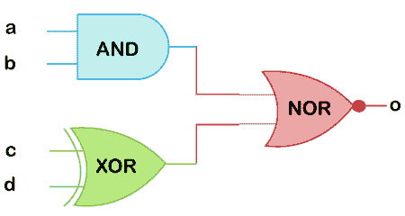

# 验证日志总是阻止

> 原文：<https://www.javatpoint.com/verilog-always-block>

在 Verilog 中，总是块是过程块之一。总是块中的语句按顺序执行。

始终块始终执行，不同于在模拟开始时只执行一次的初始块。“总是”块应该有一个敏感列表或与之相关联的延迟

敏感列表告诉总是块何时执行代码块。

**语法**

[验证日志](https://www.javatpoint.com/verilog)总是阻止以下语法

```

always @ (event)
	[statement]

always @ (event) begin
	[multiple statements]
end

```

**示例**

保留字 ***后的符号@始终为*** ，表示在符号@后括号内的条件 将触发 ***阻塞。***

```

always  @ (x or y or sel)
begin
     m = 0;
  if (sel == 0) begin
     m = x;
   end else begin
     m = y;
   end
end

```

在上面的例子中，我们描述了一个 2:1 多路复用器，输入为 x 和 y。***sel***是选择输入，而 ***m*** 是多路复用器输出。

在任何组合逻辑中，只要输入改变，输出就会改变。当这个理论应用于总是块时，那么每当输入或输出变量改变时，总是块内的代码需要被执行。

#### 注意:它可以驱动 reg 和 integer 数据类型，但不能驱动 wire 数据类型。

Verilog 中有两种类型的敏感列表，例如:

1.  电平敏感(用于组合电路)。
2.  边缘敏感(用于触发器)。

下面的代码是同样的 2:1 mux，但是输出 ***m*** 现在是一个触发器输出。

```

always  @ (posedge clk )
if (reset == 0) begin
     m <= 0;
end 
     else if (sel == 0) begin
     m <= x;
    end 
 else begin
     m <= y;
end

```

#### 注意:总是块是在某个特定事件中执行的。敏感度列表定义了事件。

### 敏感度列表

敏感度列表是一个定义总是块执行时间的表达式，它在括号( )内的@运算符之后指定。该列表可能包含一个或一组信号，这些信号的值变化将执行始终块。

在下面显示的代码中，每当信号 x 或 y 的值改变时，总是块内的所有语句都会被执行。

```

// execute always block whenever value of "x" or "y" change
always @ (x or y) begin
	[statements]
end

```

**灵敏度列表需求**

“始终”块在整个模拟过程中不断重复。灵敏度列表带来了一定的时间感，即每当灵敏度列表中的任何信号发生变化时，总是块都会被触发。

如果始终块中没有定时控制语句，模拟将因零延迟无限循环而挂起。

例如，始终阻止反转信号 clk 值的尝试。该语句在每 0 个时间单位后执行。因此，由于语句中没有延迟，它将永远执行。

```

// always block started at time 0 units
// But when is it supposed to be repeated
// There is no time control, and hence it will stay and
// be repeated at 0-time units only and it continues
// in a loop and simulation will hang 

   always clk = ~clk;

```

如果灵敏度列表为空，则应该有某种其他形式的时间延迟。模拟时间通过始终构造中的延迟语句提前。

```

always #10 clk = ~clk;

```

现在，时钟反转在每 10 个时间单位之后进行。这就是为什么真正的 Verilog 设计代码总是需要一个敏感度列表。

#### 注意:显式延迟不能合成到逻辑门中。

### 总是阻止的用途

一个总是块可以用来实现组合或顺序元件。像触发器这样的时序元件在被提供时钟和复位时变得有效。

类似地，当一个组合块的一个输入值改变时，该组合块变得有效。这些硬件模块相互独立地同时工作。两者之间的联系决定了数据流。

始终阻止是一个连续的过程，当灵敏度列表中的信号变为活动状态时，它会被触发并执行一些操作。

在下面的示例中，总是块中的所有语句都在信号 clk 的每个正边沿执行

```

// execute always block at the positive edge of signal "clk" 
always @ (posedge clk) begin
	[statements]
end

```

### 顺序元件设计

下面的代码定义了一个名为*的模块，该模块接受数据输入、时钟和低电平有效复位。在这里，总是块在**T5 clkT7 的正边缘或**T9【rstnT11 的负边缘被触发。*****

 ***1。时钟的正边沿**

下列事件发生在时钟的正沿，并在时钟的所有正沿重复发生。

**第一步:**首先，if 语句检查 ***rstn*** 的低电平有效复位值。

*   如果***【rstn】***为零，则输出 q 应重置为默认值 0。
*   如果***【rstn】***为 1，则表示未应用重置，应遵循默认行为。

**第二步:**如果上一步为假，那么

*   检查 d 的值，如果发现是 1，则反转 q 的值。
*   如果 d 为 0，则保持 q 值。

```

module tff (input  d, clk, rstn, output reg q);
always @ (posedge clk or negedge rstn) begin
if (!rstn)
	q <= 0;
else
	if (d)
		q <= ~q;
	else
		q <= q;
end
endmodule

```

**2。复位负沿**

以下事件发生在 ***rstn*** 的负沿。

**第一步:**首先，if 语句检查 ***rstn*** 的低电平有效复位值。在信号的负沿，其值为 0。

*   如果***【rstn】***的值为 0，则表示应用了重置，输出应重置为默认值 0。
*   如果 ***rstn*** 的值为 1，则不考虑，因为当前事件是 ***rstn*** 的负沿。

### 组合元件设计

“总是”块也可以用于组合块的设计。

例如，下面的数字电路代表三个不同的逻辑门，它们在信号 o 处提供特定的输出。



下面显示的代码是一个具有四个输入端口和一个称为 o 的输出端口的模块。每当灵敏度列表中的任何信号值发生变化时，总是模块就会被触发。

输出信号在模块端口列表中被声明为类型*，因为它在程序块中使用。程序块中使用的所有信号应声明为类型 ***reg*** 。*

 *```

module combo (input a, input b, input c, input d, output reg o);
  always @ (a or b or c or d) begin
    o <= ~((a & b) | (c^d));
  end
endmodule

```

每当 RHS 上的组合表达式为真时，信号 o 变为 1。同样，当 RHS 为假时，o 变为 0。

* * ***