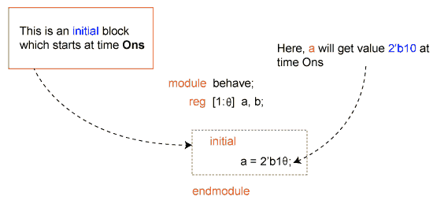

# 验证日志初始块

> 原文：<https://www.javatpoint.com/verilog-initial-block>

***【始终】*** 块表示自由运行的进程，但 ***初始*** 块表示进程恰好执行一次。两个构造都在模拟器时间 0 开始执行，并且都执行到块的末尾。

初始模块可用于可合成模块或不可合成模块。它们通常用于测试平台。

在任何其他指令运行之前，初始块导致特定指令在仿真开始时被执行。初始块只运行一次。

一个可合成的初始模块用于设置 FPGAs 内寄存器 [RAM](https://www.javatpoint.com/ram-full-form) 和 [ROM](https://www.javatpoint.com/rom) 的上电值。然而，初始嵌段不能在 ASICs 或 CPLDs 中合成。

Initial 和 always block 描述独立的进程，这意味着一个进程中的语句自动执行。

这两种类型的过程都由过程语句组成，并且都在模拟器启动时立即启动。

它们之间的主要区别是:

*   初始进程执行一次，而总是进程永远重复执行。
*   始终流程必须包含定时语句，这些语句偶尔会阻止执行并允许时间推进。

**语法**

[Verilog](https://www.javatpoint.com/verilog) 初始块遵循以下语法:

```

initial
	[single statement]

initial begin
	[multiple statements]

end

```

### 初始块使用

初始块是不可合成的，不能转换成带有数字元素的硬件原理图。

初始块除了用于模拟之外，没有其他用途。这些块主要用于初始化变量和驱动具有特定值的设计端口。

### 初始块执行

初始块在时间 0 单位的模拟开始时开始。在整个模拟过程中，该模块仅执行一次。一旦执行了块中的所有语句，初始块的执行就结束了，如下图所示。



上面显示的图像有一个名为 behavior 的模块，它有 a 和 b 内部信号。

初始块只有一条语句，因此没有必要将该语句放在 begin 和 end 中。

当初始块在时间 0 单位开始时，此语句将值 2'b10 赋给 a。

### 初始块延迟元件

下面显示的代码有一个额外的语句，为信号 b 赋值。然而，这种情况只发生在执行前一个语句 10 个时间单位之后。

例如，如果 a 首先被赋予给定值，然后在 10 个时间单位之后，b 被赋予 0。


### 模块中的初始块

模块内可以定义的初始块的数量没有限制。下面显示的代码有三个初始块，它们都同时启动并并行运行。

但是，根据语句和每个初始块内的延迟，完成该块所需的时间可能会有所不同。


#### 注意:$finish 是一个 Verilog 系统任务，它告诉模拟器终止当前的模拟。

在上图中，第一块的延迟为 20 个单位，而第二块的总延迟为 50 个单位(10 + 40)，最后一块的延迟为 60 个单位。因此，模拟需要 60 个时间单位才能完成，因为至少有一个初始块在 60 个时间单位之前仍在运行。

如果最后一个块有 30 个时间单位的延迟，如下所示，模拟将在 30 个时间单位结束，从而杀死当时活动的所有其他初始块。

```

initial begin
	#30 $finish;
end

```

* * *