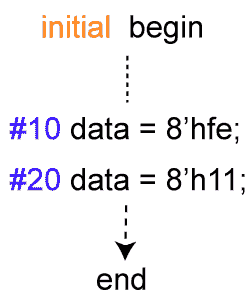
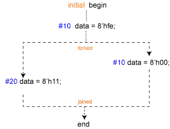
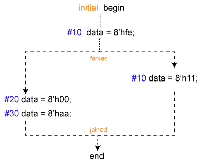

# Verilog块语句

> 原文：<https://www.javatpoint.com/verilog-block-statements>

block 语句是将两个或多个语句组合在一起，它们在语法上就像一个语句。 [Verilog](https://www.javatpoint.com/verilog) 中有两种类型的块:

*   顺序块
*   平行台

如果应该执行多个语句，可以使用这些块。*块中的所有语句将按给定的顺序依次执行。*

 *如果一个时间控制语句出现在一个块中，那么下一个语句将在该延迟之后执行。顺序块应由关键字开始和结束来界定。

*块中的所有语句同时或并发执行。这意味着即使前一条语句包含定时控制语句，下一条语句的执行也不会延迟。平行块应由关键字 fork 和 join 限定。*

 *### 顺序块

语句使用 ***开头的*** 和 ***结尾的*** 关键字进行包装，并按照给定的顺序依次执行。延迟值是相对于前一条语句的执行时间来处理的。

在执行完块中的所有语句后，控制权可能会传递到其他地方。



**语法**

顺序块语句遵循以下语法:

```

begin: name
      statement1;
      …………..
end

```

**特征**

顺序块具有以下特征，例如:

*   语句将依次执行。
*   每个语句的延迟值是相对于前一个语句执行的模拟时间来处理的。
*   控件可以在最后一条语句执行后从块中传递出去。

**例**

```

module design0;
	bit [31:0] data;

	   // initial block starts at time 0

            initial begin

		// After 10 time units, data becomes 0xfe
		#10   data = 8'hfe;
		$display ("[Time=%0t] data=0x%0h", $time, data);

		// After 20 time units, data becomes 0x11
		#20   data = 8'h11;
		$display ("[Time=%0t] data=0x%0h", $time, data);
	end
endmodule

```

在上面的示例中，开始和结束块中的第一条语句将以 10 个时间单位执行，由于相对的性质，第二条语句将以 30 个时间单位执行。执行前一条语句后是 20 个时间单位。

```

ncsim> run
[Time=10] data=0xfe
[Time=30] data=0x11
ncsim: *W,RNQUIE: Simulation is complete.

```

### 平行台

一个**并行**块可以并发执行语句，延迟控制可以用来提供赋值的时间顺序。通过将语句包装在 ***叉*** 和 ***连接*** 关键字中，语句被并行启动。

**语法**

并行块具有以下简化语法:

```

fork: name
        statement;
        …………
join

```

**特征**

并行块具有以下特征:

*   语句将同时执行。
*   每个语句的延迟值都是相对于进入块的模拟时间来考虑的。
*   延迟控制可用于为分配提供时间排序。
*   当最后一个按时间排序的语句执行时，控件可以从块中传递出去。

**例**

```

initial begin
	#10   data = 8'hfe;
	fork
	   #20 data = 8'h11;
	   #10 data = 8'h00;
	join
end

```



在上面的例子中，fork 和 join 块将在以 10 个时间单位执行语句后启动。

该块中的语句将并行执行，第一条语句将为数据分配一个值 8'h00，因为分叉连接启动后该值的延迟为 10 个时间单位。

再过 10 个时间单位后，第一条语句将被启动，数据将获得值 8'h11。

```

initial begin
	#10 data = 8'hfe;
	fork
		#10 data = 8'h11;
		begin
			#20 data = 8'h00;
			#30 data = 8'haa;
		end
	join
end

```



上面的例子中有一个开始-结束块，开始-结束块中的所有语句都将按顺序执行。尽管如此，该块本身将与其他语句并行启动。数据将以 20 个时间单位显示为 8'h11，以 30 个时间单位显示为 8'h00，以 60 个时间单位显示为 8 '阿哈。

### 块的命名

顺序块和并行块都可以通过在 ***开始*** 和 ***之后添加**和***** 关键字来命名。通过这样做，可以在*禁用*语句中引用该块。

```

begin: name_seq
	[statements]
end
fork: name_fork
	[statements]
join

```

* * ***