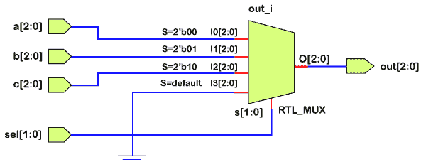

# 验证日志案例声明

> 原文：<https://www.javatpoint.com/verilog-case-statement>

case 语句检查给定的表达式是否与列表和分支中的其他表达式匹配。它通常习惯于实现一个设备。

如果测量单位有许多条件需要检查，并且将合成优先编码器而不是设备，则 if-else 结构可能不适用。

在 [Verilog](https://www.javatpoint.com/verilog) 中，案例语句包括 Verilog 关键字、案例(“casez”、“casex”)和 endcase 之间的所有代码。案例陈述可以是从众多结构中选择一个，大致类似于护理中的“如果-否则-如果”陈述。

**语法**

Verilog case 语句以 case 关键字开始，以 endcase 关键字结束。

圆括号内的表达式是一个区域单位，目的是专门计算一次，并与书写顺序中的备选方案列表进行比较。

选择与给定的度量单位匹配的语句无效。一个由多个语句组成的块应该被排序，并且在开始和结束之间。

```

case ()
	case_item1 : 
	case_item2,
	case_item3 : 
	case_item4 : 	
      begin

      end
	default: 

endcase

```

如果没有一个事例与给定的表达式匹配，那么默认项目度量单位内的语句就失效了。默认语句是非强制的，并且在整个案例语句中只有一个默认语句。Case 语句是嵌套的。

执行将退出 case 块，而如果没有任何项与表达式匹配，并且没有给出默认语句，则不执行任何操作。

**例**

下面的 vogue 模块包括一个 2 位 opt for 信号，用于将三个不同的 3 位输入中的一个路由到所述的 out 标志。

case 语句用于将正确的输入分配给支持 sel 值的输出。由于 sel 可以是一个 2 位信号，它将有 20 个 2 组合，从 0 到 3。如果 sel 为 3，默认语句有助于将线路输出归零。

```

module my_mux (input [2:0] a, b, c, 		// three 3-bit inputs
                      [1:0]sel, 			  // 2-bit opt for signal to choose on from a, b, c
               output reg  [2:0] out); 			// Output 3-bit signal
  // invariably block is dead whenever a, b, c or sel changes in value
 invariably @ (a, b, c, sel) begin
    case(sel)
      2'b00    : out = a; 		// If sel=0, output can be a
      2'b01    : out = b; 		// If sel=1, output is b
      2'b10    : out = c; 		// If sel=2, output is c
      default  : out = 0; 		// If sel is something, out is commonly zero
    endcase
  end
endmodule

```

### 案例陈述标题

case 语句头由 case(“casez”、“casex”)关键字和 case 表达式组成，通常都在一行代码中。

向 case 语句中添加 full_case 或 parallel_case 指令时，指令的度量单位会作为注释实时添加到 case 语句头顶端的 case 表达式之后，以及后续代码行的任何 case 内容之前。

### 案例项目

案例项是位、向量或 Verilog 表达式习惯于与案例表达式进行比较。

与不同的高级编程语言如“ [C](https://www.javatpoint.com/c-programming-language-tutorial) ”不同，Verilog case 语句包含隐式 break 语句。

与这个案例表达式匹配的第一个案例项导致相应的案例项语句失效，因此为此跳过的所有其他案例事物度量单位都经历这个案例语句。

### 案例项目陈述

如果案例项与该案例表达式匹配，则案例项语句是一个或多个 Verilog 语句死亡。不像 [VHDL](https://www.javatpoint.com/vhdl) ，Verilog case 的东西本身可以是表达式。

要改变 Verilog 代码文档的解析，Verilog 案例项语句应该包含在关键字 ***【开始】*** 和 ***【结束】*** 之间，如果对于特定案例项有一个以上的语句是死的。

### 嫁给我

在 Verilog 中，有一个 casez 语句，它是 case 语句的变体，支持“z”和“？”在整个案例比较中，这些值将被视为“无关紧要”的值。

“Z”和“？”被视为的度量单位不在乎它们是在案例表达式中还是在案例项中。

当秘密写一个“不在乎”的案例陈述时，使用 casez 陈述并使用“？”字符而不是“z”字符的情况下，事情的目的“不在乎”位。

### 凯斯乐

在 Verilog 中，有一个 casex 语句，它是 case 语句的变体，支持“z”，“？”、和“x”值在整个比较过程中被视为“不关心”值。

“x”、“z”和“？”被视为的度量单位不在乎它们是在案例表达式中还是在案例项中。

### 完整的案例陈述

完整的 case 语句可以是一个 case 语句，其中所有可获取的 case 表达式二进制模式都与一个 case 项或一个 case default 相匹配。

如果 case 语句不包含 case default，并且可以查找与任何打印的 case 内容都不匹配的二进制 case 表达式，那么 case 语句就不是完整的。

完整的 case 语句可以是一个 case 语句，其中每个可获取的二进制、非二进制以及二进制和非二进制混合模式都作为 case 语句中的 case 项被装箱。

Verilog 不希望 case 语句被合成或高密度脂蛋白模拟为完整，但是 Verilog case 语句通过添加一个 case default 而变得完整。 [VHDL](https://www.javatpoint.com/vhdl-full-form) 要求病例报告为高密度脂蛋白模拟全，这通常要求护理“其他”条款中有关联。

### 平行案例陈述

并行 case 语句可以是内部的 case 语句，因为它只能将一个 case 表达式匹配到一个 case 项。

如果可以找出一个可能匹配一个案例项的案例表达式，匹配的案例度量单位表示为重叠的案例，因此案例语句不是平行的。

### 硬件示意图

对 RTL 代码进行了详细说明，以获得代表 4:1 多路复用器的硬件原理图。



执行上述设计后，当 sel 为 3 时，输出为零，对应于其他值的指定输入。

```

ncsim> run
[0]  a=0x4 b=0x1 c=0x1 sel=0b11 out=0x0
[10] a=0x5 b=0x5 c=0x5 sel=0b10 out=0x5
[20] a=0x1 b=0x5 c=0x6 sel=0b01 out=0x5
[30] a=0x5 b=0x4 c=0x1 sel=0b10 out=0x1
[40] a=0x5 b=0x2 c=0x5 sel=0b11 out=0x0
ncsim: *W,RNQUIE: Simulation is complete.

```

在 case 语句中，只有当表达式的每一位都与 0、1、x 和 z 中的一个选项匹配时，比较才会成功。在上面的示例中，如果 sel 中的任何一位是 x 或 z，则会执行 ***默认的*** 语句，因为其他选项都不匹配。在这种情况下，输出将全为零。

```

ncsim> run
[0] a=0x4 b=0x1 c=0x1 sel=0bxx out=0x0
[10] a=0x3 b=0x5 c=0x5 sel=0bzx out=0x0
[20] a=0x5 b=0x2 c=0x1 sel=0bxx out=0x0
[30] a=0x5 b=0x6 c=0x5 sel=0bzx out=0x0
[40] a=0x5 b=0x4 c=0x1 sel=0bxz out=0x0
[50] a=0x6 b=0x5 c=0x2 sel=0bxz out=0x0
[60] a=0x5 b=0x7 c=0x2 sel=0bzx out=0x0
[70] a=0x7 b=0x2 c=0x6 sel=0bzz out=0x0
[80] a=0x0 b=0x5 c=0x4 sel=0bxx out=0x0
[90] a=0x5 b=0x5 c=0x5 sel=0bxz out=0x0
ncsim: *W,RNQUIE: Simulation is complete.

```

如果设计中的 case 语句在 case item 选项中有 x 和 z，结果将会不同。

```

module mux (input [2:0] a, b, c, output reg [2:0] out);

  // Case items have x and z, and sel has to match the exact value for
  // output to be assigned with the corresponding input

 always @ (a, b, c, sel) begin
    case(sel)
      2'bxz: out = a;
      2'bzx: out = b;
      2'bxx: out = c;
      default: out = 0;
    endcase
  end

endmodule

```

### 区分案例和 if-else

case 语句在两个方面不同于 if-else-if，例如:

*   在***【if-else】***块中给出的表达式更一般，而在一个 case 块中，单个表达式匹配多个项目。
*   ***当表达式中有 X 和 Z 值时，*** 的情况将提供一个确定的结果。

* * *