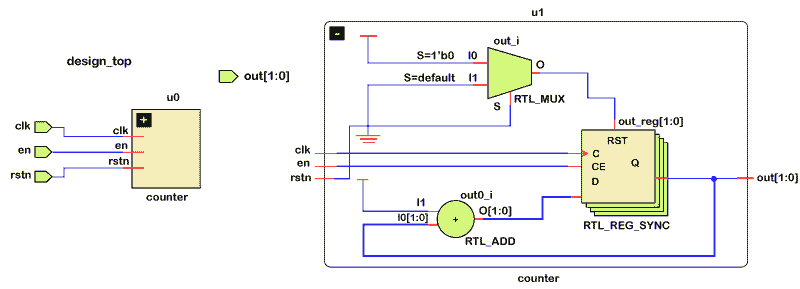
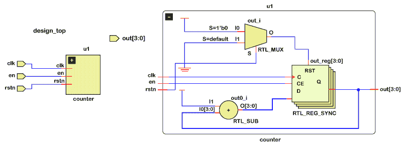

# Verilog参数

> 原文：<https://www.javatpoint.com/verilog-parameters>

在 Verilog 中，参数是常量，不属于任何其他数据类型，如寄存器或网络数据类型。

常数表达式指的是一个常数或先前定义的参数。我们不能在运行时修改参数值，但是我们可以使用 ***defparam*** 语句修改参数值。

***defparam*** 语句只能在编译时修改参数。可以使用带有模块实例化的# delay 规范修改参数值。

在 [Verilog](https://www.javatpoint.com/verilog) 中，有两种方法可以在模块实例化期间覆盖模块参数值。

1.  通过使用 defparam 关键字。
2.  和模块实例参数值赋值。

在 defparam 关键字之后，为参数和参数的新值指定层次路径。这个新值应该是一个常量表达式。如果右侧表达式引用了任何参数，则应该在调用 defparam 的模块中声明。

模块实例参数值赋值方法看起来像是给门实例赋值延迟。当实例化模块中的参数出现在模块中时，此方法重写这些参数。使用这种格式，不能跳过参数。

常量表达式可以包含以前声明的参数。当检测到先前声明的参数发生变化时，依赖于该值的所有参数都会自动更新。

考虑一下，一个 4 位加法器可以被参数化以接受一个位数的值，并且新的参数值可以在模块实例化期间传递。因此，一个 N 位加法器转换成一个 4 位、8 位或 16 位加法器。它们就像函数调用期间传递的函数参数。

```

parameter MSB = 7;                  // MSB is a parameter with the constant value 7 
parameter REAL = 4.5;               // REAL holds the real number 
parameter FIFO_DEPTH = 256,
          MAX_WIDTH = 32;           // Declares two parameters
parameter [7:0] f_const = 2'b3;     // 2 bit value is converted into 8 bits; 8'b3 

```

有两种类型的参数， ***模块*** 和 ***指定*** ，并且都接受一个范围规格。但是，它们的宽度与要存储的值一样大，因此范围说明是不必要的。

### 模块参数

它可用于覆盖模块中的参数定义，并使模块在编译时具有不同的参数集。可以使用 ***定义参数*** 语句修改参数。通常在参数的名称中使用大写字母，以便立即注意到它们。

下面的模块使用参数来指定设计中的总线宽度、数据宽度和先进先出深度，并且可以在模块实例化时或通过使用 defparam 语句用新值覆盖。

```

module design_ip  ( addr, wdata, write, sel, rdata);
     parameter  BUS_WIDTH    = 32,
                DATA_WIDTH   = 64,
                FIFO_DEPTH   = 512;
     input addr;
     input wdata;
     input write;
     input sel;
     output rdata;
     wire [BUS_WIDTH-1:0] addr;
     wire [DATA_WIDTH-1:0] wdata;
     reg  [DATA_WIDTH-1:0] rdata;
     reg [7:0] fifo [FIFO_DEPTH];
endmodule

```

在 Verilog 端口声明的新 ANSI 样式中，我们可以声明参数，例如:

```

module design_ip
	#(parameter BUS_WIDTH=32,
		parameter DATA_WIDTH=64) 
           (input [BUS_WIDTH-1:0] addr,
// other port declarations
   );

```

### 覆盖参数

在模块实例化过程中，可以用新值覆盖参数。第一部分是名为 ***design_ip*** 的模块，其中新参数在#()内传递。

第二部分是使用名为 ***defparam*** 的 Verilog 构造来设置新的参数值。第一种方法通常用于在 RTL 设计中传递新参数。第二种方法用于测试台模拟，以快速更新设计参数，而不必重新初始化模块。

```

module tb;
	  // Module instantiation override
     design_ip  #(BUS_WIDTH = 64, DATA_WIDTH = 128) d0 ( [port list]);
	// Use of defparam to override
	defparam d0.FIFO_DEPTH = 128;
endmodule

```

模块计数器有两个参数 ***N*** 和 ***DOWN*** ，声明默认值为 2 和 0。

***N*** 控制输出中的位数，有效控制计数器的宽度。默认情况下，它是一个 2 位计数器。

参数*控制计数器是递增还是递减。由于参数设置为 0，计数器将递减。*

 ***2 位向上计数器**

```

module counter
  # ( parameter N = 2, parameter DOWN = 0)

  (input clk, input rstn, input en, output reg [N-1:0] out);

  always @ (posedge clk) begin
    if (!rstn) begin
      out <= 0;
    end else begin
      if (en)
        if (DOWN)
          out <= out - 1;
        else
          	out <= out + 1;
      else
         out <= out;
    end
  end
endmodule

```

模块计数器用***【N】***实例化为 2，尽管它不是必需的，因为默认值是 2。

模块实例化期间不传递*。它采用默认值 0，使其成为向上计数器。*

 *```

module design_top (input clk, input rstn, input en, output [1:0] out);
    counter #(.N(2)) u0 (.clk(clk), .rstn(rstn), .en(en));
endmodule

```

默认参数用于实现计数器，其中***【N】***等于 2，使其成为 2 位计数器， ***DOWN*** 等于 0，使其成为上行计数器。计数器的输出在顶层没有连接。



**4 位递减计数器**

在这种情况下，模块计数器被实例化为 4，使其成为 4 位计数器。在模块实例化期间，向下传递一个值 1，因此实现了一个向下计数器。

```

module design_top (input clk, input rstn, input en, output [3:0] out);
    counter #(.N(4), .DOWN(1)) 
               u1 (.clk(clk), .rstn(rstn), .en(en));
endmodule

```



### 指定参数

这些参数用于提供时间和延迟值，并使用 ***specparam*** 关键字声明。允许在指定的模块和主模块体内使用。

```

// Use of specify block
Specify
	specparam  t_rise = 200, t_fall = 150;
	specparam  clk_to_q = 70, d_to_q = 100;
endspecify
// Within main module
module  my_block ( );
 	specparam  dhold = 2.0;
 	specparam  ddly  = 1.5;
 	parameter  WIDTH = 32;
endmodule

```

### 指定参数和模块参数之间的差异

| 指定参数 | 模块参数 |
| 指定 specparam 关键字声明参数。 | 模块参数由参数声明。 |
| 它可以在特定的块或主模块中声明。 | 它只能在主模块中声明。 |
| 该参数可以被分配特殊参数和参数。 | 这可能没有指定 specparams。 |
| SDF 可用于覆盖值。 | 实例声明参数值或 defparam 可用于重写。 |

**注释**

以下是 Verilog 参数的一些重要注意事项，例如:

*   如果我们使用 ***defparam*** 语句，我们必须指定参数的层次路径。
*   我们不能跳过 ***模块实例参数值赋值*** 中的参数。如果我们需要这样做，请使用未覆盖参数的初始值。
*   当一个参数依赖于另一个参数时，如果我们改变第一个参数，那么第二个参数将自动更新。

* * ***