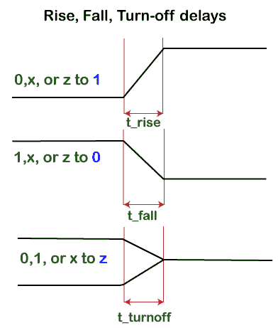

# 验证门延迟

> 原文：<https://www.javatpoint.com/verilog-gate-delay>

Verilog 门延迟指定值如何通过网络或门传播。门延迟声明指定将信号变化从门输入传播到其输出所需的时间。

门延迟声明可用于门实例化。延迟也可以用于过程语句中的延迟控制。

数字元素是二进制实体，只保存 0 和 1 这两个值中的任何一个。从 0 到 1 和 1 到 0 的转变具有转变延迟，因此每个门元件将值从输入传播到其输出。

例如，如果两个输入都变为 1，则双输入与门必须将输出切换到 1，当输入变为 0 时，必须将输出切换回 0。

网络延迟声明指定了通过网络从驱动程序传播值所需的时间。它可以用于连续赋值和净声明。

当实例化逻辑原语时，可以在 [Verilog](https://www.javatpoint.com/verilog) 中指定该门和引脚到引脚的延迟。

### 上升、下降和关闭延迟

延迟申报最多可包含三个值，如 ***上升、下降、*** 和 ***关闭*** 延迟。

*   门的输出从某个值变为 1 所花费的时间称为 ***上升*** 延迟。
*   门的输出从某个值变为 0 所花费的时间称为 ***下降*** 延迟。
*   门的输出从某个值变为高阻抗所需的时间称为 ***关断*** 延迟。

如果只指定了一个延迟值，那么它将用于所有信号变化。默认延迟为零。

如果指定了两个延迟，则第一个延迟指定上升延迟，第二个延迟指定下降延迟。

如果信号变为高阻抗或未知，则使用较小的值。



如果给出三个值，那么第一个值指定上升延迟，第二个指定 ***下降*** 延迟，第三个指定 ***关闭*** 延迟。如果信号变为未知值，则将使用这三个值中的最小值。

这些延迟适用于任何信号，因为它们在实际电路中随时都可能上升或下降，并且不仅限于门的输出。有三种方式来表示门延迟。

1.  一种延迟格式
2.  两种延迟格式
3.  三种延迟格式

这两种延迟格式可以应用于大多数输出不会转变为高阻抗的原语。

三延迟格式不能应用于与门，因为对于任何输入组合，输出都不会到达 Z。

```

// Single delay specified - used for all three types of transition delays
or #(<delay>) o1 (out, a, b);

// Two delays specified - used for Rise and Fall transitions
or #(<rise>, <fall>) o1 (out, a, b);
// Three delays specified - used for Rise, Fall and Turn-off transitions
or #(<rise>, <fall>, <turn_off>) o1 (out, a, b);

```

如果只指定了一个延迟，所有三种类型的延迟将使用相同的给定值。

如果指定了两个延迟，第一个代表 ***上升*** ，第二个代表 ***下降*** 延迟。

如果指定了三个延迟，它们分别代表 ***上升、*** 下降、 ***关闭*** 延迟。

**1。一种延迟格式**

```

module des (input a, b, output out1, out2);
// AND gate has 2 time unit gate delay 	
     and #(2) o1 (out1, a, b);
  // BUFIF0 gate has 3 time unit gate delay
 bufif0 #(3) b1 (out2, a, b);
endmodule

```

现在，看到*和*门的输出在其一个输入改变后改变 2 个时间单位。

```

module tb;
  reg a, b;
 wire out1, out2;
  des d0 (.out1(out1), .out2(out2), .a(a), .b(b));
  initial begin
{a, b} <= 0;
    $monitor ("T=%0t a=%0b b=%0b and=%0b bufif0=%0b", $time, a, b, out1, out2);
    #10 a <= 1;
    #10 b <= 1;
    #10 a <= 0;
    #10 b <= 0;
 end
endmodule

```

例如，b 变成 1，而 a 在 T=20 时已经是 1。但是只有在 T=22 时输出才变成 1。同样，a 在 T=30 时归零，输出在 T=32 时得到新值。

门延迟被指定为*的 3 时间单位。如果 b 从 0 变为 1，而 a 已经为 1，那么输出需要 3 倍的单位才能更新为 Z，最终在 T=23 时更新。*

 ***输出**

```
ncsim> run
T=0 a=0 b=0 and=x bufif0=x
T=2 a=0 b=0 and=0 bufif0=x
T=3 a=0 b=0 and=0 bufif0=0
T=10 a=1 b=0 and=0 bufif0=0
T=13 a=1 b=0 and=0 bufif0=1
T=20 a=1 b=1 and=0 bufif0=1
T=22 a=1 b=1 and=1 bufif0=1
T=23 a=1 b=1 and=1 bufif0=z
T=30 a=0 b=1 and=1 bufif0=z
T=32 a=0 b=1 and=0 bufif0=z
T=40 a=0 b=0 and=0 bufif0=z
T=43 a=0 b=0 and=0 bufif0=0
ncsim: *W,RNQUIE: Simulation is complete.

```

**2。两种延迟格式**

让我们将上面显示的相同的 ***测试平台*** 应用于下面显示的不同的 Verilog 模型，其中明确提到了 ***上升*** 和 ***下降*** 延迟。

```

module des (input a, b, output out1, out2);
  and #(2, 3) o1 (out1, a, b);
  bufif0 #(4, 5) b1 (out2, a, b);
endmodule 

```

它会产生以下输出，例如:

```

ncsim> run
T=0 a=0 b=0 and=x bufif0=x
T=3 a=0 b=0 and=0 bufif0=x
T=5 a=0 b=0 and=0 bufif0=0
T=10 a=1 b=0 and=0 bufif0=0
T=14 a=1 b=0 and=0 bufif0=1
T=20 a=1 b=1 and=0 bufif0=1
T=22 a=1 b=1 and=1 bufif0=1
T=24 a=1 b=1 and=1 bufif0=z
T=30 a=0 b=1 and=1 bufif0=z
T=33 a=0 b=1 and=0 bufif0=z
T=40 a=0 b=0 and=0 bufif0=z
T=45 a=0 b=0 and=0 bufif0=0
ncsim: *W,RNQUIE: Simulation is complete.

```

**3。三种延迟格式**

```

module des (	input 	a, b, output out1, out2);
and #(2, 3) o1 (out1, a, b);
bufif0 #(5, 6, 7) b1 (out2, a, b);
endmodule

```

三种延迟格式代码给出以下输出:

```

ncsim> run
T=0 a=0 b=0 and=x bufif0=x
T=3 a=0 b=0 and=0 bufif0=x
T=6 a=0 b=0 and=0 bufif0=0
T=10 a=1 b=0 and=0 bufif0=0
T=15 a=1 b=0 and=0 bufif0=1
T=20 a=1 b=1 and=0 bufif0=1
T=22 a=1 b=1 and=1 bufif0=1
T=27 a=1 b=1 and=1 bufif0=z
T=30 a=0 b=1 and=1 bufif0=z
T=33 a=0 b=1 and=0 bufif0=z
T=40 a=0 b=0 and=0 bufif0=z
T=46 a=0 b=0 and=0 bufif0=0
ncsim: *W,RNQUIE: Simulation is complete.

```

### 最小、典型和最大延迟

制造的芯片的不同部分的延迟既不相同，对于不同的温度和其他变化也不相同。因此，Verilog 还为上述每种延迟类型提供了额外的控制级别。

每个数字门和晶体管单元都有基于工艺节点指定的最小、典型和最大延迟，通常由制造厂的库提供。

对于上升、下降和关闭延迟，可以指定三个值 ***min、typ、*** 和 ***max*** ，代表最小、典型和最大延迟。

这是 Verilog 中延迟控制的另一个层次。在整个模拟运行中，只能使用最小值、典型值和最大值中的一个。

它是在模拟开始时指定的，并且取决于所使用的模拟器。典型值是默认值。

***【min】***值是闸门预期具有的最小延迟值。

***类型*** 值是闸门预期具有的典型延迟值。

***【最大值】*** 值是闸门预期的最大延迟值。

```

module des (input a, b, output out1, out2);
  and #(2:3:4, 3:4:5) o1 (out1, a, b);
  bufif0 #(5:6:7, 6:7:8, 7:8:9) b1 (out2, a, b);
endmodule

```

输出如下所示:

```

ncsim> run
T=0 a=0 b=0 and=x bufif0=x
T=4 a=0 b=0 and=0 bufif0=x
T=7 a=0 b=0 and=0 bufif0=0
T=10 a=1 b=0 and=0 bufif0=0
T=16 a=1 b=0 and=0 bufif0=1
T=20 a=1 b=1 and=0 bufif0=1
T=23 a=1 b=1 and=1 bufif0=1
T=28 a=1 b=1 and=1 bufif0=z
T=30 a=0 b=1 and=1 bufif0=z
T=34 a=0 b=1 and=0 bufif0=z
T=40 a=0 b=0 and=0 bufif0=z
T=47 a=0 b=0 and=0 bufif0=0
ncsim: *W,RNQUIE: Simulation is complete.

```

* * **