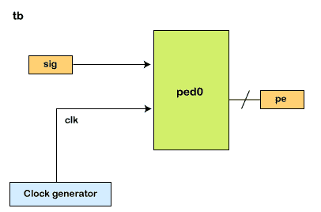
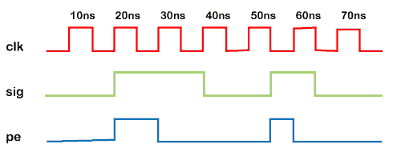
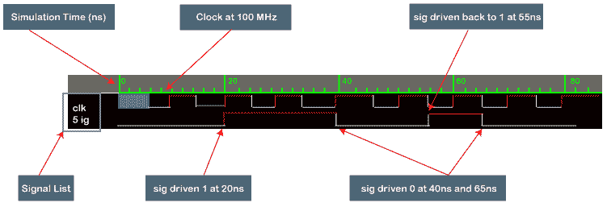
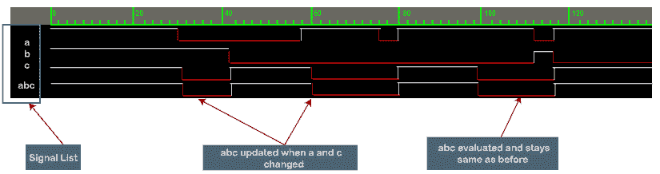

# Verilog 仿真基础

> 原文：<https://www.javatpoint.com/verilog-simulation-basics>

Verilog 是一种硬件描述语言，不需要设计人员模拟他们的 RTL 设计来将其转换为逻辑门。



模拟是一种在不同时间向设计应用不同输入刺激的技术，以检查 RTL 代码是否以预期的方式运行。

仿真是验证设计稳健性的一种众所周知的技术。这类似于一个制造的芯片将如何在现实世界中使用，以及它如何对不同的输入做出反应。

例如，上面的设计代表了一个正边沿检测器，其输入*和 ***信号*** ，这些信号以周期性间隔进行评估以确定输出。通过仿真，我们可以查看相关信号的时序图，了解设计描述在 Verilog 中的表现。*

*

许多 EDA 公司开发*模拟器，能够计算出设计的各种输入的输出。 [Verilog](https://www.javatpoint.com/verilog) 是根据 ***离散事件*** 执行模型定义的。不同的模拟器可以自由使用不同的算法，为用户提供一组一致的结果。*

 *Verilog 代码被分成多个进程和线程，可以在模拟中的不同时间进行评估。

**例**

在这个例子中，*(测试平台)是一个容纳设计模块的容器。有两个 ***信号*** 或 ***变量*** 可以在特定时间被赋予单个值。 ***clk*** 代表测试平台内产生的时钟。*

 *这是使用 ***【始终】*** 语句通过每隔 5 纳秒交替时钟值来完成的。 ***初始*** 块包含一组为两个信号分配不同值的语句。

```

module tb;
  reg clk;
  reg sig;

  // Clock generation
  // Process starts at time 0ns and loops after every 5ns
  always #5 clk = ~clk;

  // Process starts at time 0ns
  initial begin
    // This system task will print out the signal values everytime they change
    $monitor("Time = %0t clk = %0d sig = %0d", $time, clk, sig);

    // Also called stimulus, we simply assign different values to the variables
    // after some simulation "delay"
    sig = 0;
    #5 clk = 0;         // Assign clk to 0 at time 5ns
    #15  sig = 1;      // Assign sig to 1 at time 20ns (#5 + #15)
    #20  sig = 0;      // Assign sig to 0 at time 40ns (#5 + #15 + #20)
    #15  sig = 1;      // Assign sig to 1 at time 55ns (#5 + #15 + #20 + #15)
    #10  sig = 0;      // Assign sig to 0 at time 65ns (#5 + #15 + #20 + #15 + #10)
    #20 $finish;       // Finish simulation at time 85ns
  end
endmodule

```

模拟器在执行上述测试平台后提供以下输出。

```

ncsim> run
Time = 0 clk = x sig = 0
Time = 5 clk = 0 sig = 0
Time = 10 clk = 1 sig = 0
Time = 15 clk = 0 sig = 0
Time = 20 clk = 1 sig = 1
Time = 25 clk = 0 sig = 1
Time = 30 clk = 1 sig = 1
Time = 35 clk = 0 sig = 1
Time = 40 clk = 1 sig = 0
Time = 45 clk = 0 sig = 0
Time = 50 clk = 1 sig = 0
Time = 55 clk = 0 sig = 1
Time = 60 clk = 1 sig = 1
Time = 65 clk = 0 sig = 0
Time = 70 clk = 1 sig = 0
Time = 75 clk = 0 sig = 0
Time = 80 clk = 1 sig = 0
Simulation complete via $finish(1) at time 85 NS + 0

```

### 模拟波形

模拟允许将设计和测试平台信号转换为波形，该波形可以用图形表示，以分析和调试 RTL 设计功能。

下面显示的波形是从 EDA 工具获得的，显示了每个信号随时间的变化，与时序图相同。



净值或变量值的每一次变化都被称为 ***更新事件*** 。并且过程对 ***更新事件*** 敏感，使得每当更新事件发生时，这些过程都被评估，并且被称为 ***评估事件*** 。因为有可能任意评估多个进程，所以必须在名为 ***的事件队列*** 中跟踪变更的顺序。

它们按模拟时间排序。新事件在队列中的位置称为 ***调度*** 。

模拟时间是指模拟器保持的时间值，用于模拟模拟电路所需的实际时间。

```

module des;
	wire abc;
	wire a, b, c;

	assign abc = a & b | c;           // abc is updated via the assign statement (process)                          
                                                            //whenever a, b or c change -> update event

endmodule

```



### 事件队列中的区域

Verilog 事件队列分为五个区域，事件可以添加到其中任何一个区域。然而，它只能从有源区移除。

| 事件 | 描述 |
| 活跃的 | 它发生在当前模拟时间，可以以任何顺序进行处理 |
| 不活动的 | 它在当前模拟时间发生，但在所有活动事件完成后处理 |
| 无阻塞 | 它在之前的某个时间进行了评估，但分配是在活动和非活动事件完成后的当前模拟时间内完成的 |
| 班长 | 它在所有活动、非活动和非阻塞事件完成后进行处理 |
| 将来的 | 它发生在未来的某个模拟时间 |

模拟周期是处理所有活动事件的周期。该标准保证特定的调度顺序，除了少数情况和。

例如，开始-结束块中的语句将只按照它们出现的顺序执行。

```

module tb;
	reg [3:0] a;
	reg [3:0] b;
	initial begin		// Statements are executed one after the other at appropriate simulation times
		a = 5;			// At time 0ns, a is assigned 5
		b = 2;	// In the same simulation step (time 0ns), b is assigned 2
		#10 a = 7;	// When simulation advances to 10ns, a is assigned 7	end

endmodule

```

事件队列定义了对 ***b*** 的分配应该在对 ***a*** 的分配之后发生。

* * ****