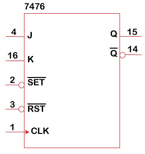

# JK 触发器

> 原文：<https://www.javatpoint.com/verilog-jk-flip-flop>

JK 触发器是最通用的基本触发器。时钟控制的*逻辑电路中使用 JK 触发器来存储一位数据。*

 *它在功能上几乎与 SR 触发器相同。唯一的区别是消除了 S 和 R 都为 1 的未定义状态。由于这种额外的时钟输入，JK 触发器有四种可能的输入组合，如“逻辑 1”、“逻辑 0”、“无变化”和“切换”。

**硬件示意图**


**例**

我们将在 [Verilog](https://www.javatpoint.com/verilog) 中对 JK 触发器进行编程，并为相同的代码编写一个测试平台。

```

module jk_ff ( input j, input k, input clk, output q);

   reg q;

   always @ (posedge clk)
      case ({j,k})
         2'b00 :  q <= q;
         2'b01 :  q <= 0;
         2'b10 :  q <= 1;
         2'b11 :  q <= ~q;
      endcase
endmodule

```

**试验台**

```

module tb_jk;
   reg j;
   reg k;
   reg clk;

   always #5 clk = ~clk;

   jk_ff    jk0 ( .j(j),
                  .k(k),
                  .clk(clk),
                  .q(q));

   initial begin
      j <= 0;
      k <= 0;

      #5 j <= 0;
         k <= 1;
      #20 j <= 1;
          k <= 0;
      #20 j <= 1;
          k <= 1;
      #20 $finish;
   end

   initial
      $monitor ("j=%0d k=%0d q=%0d", j, k, q);
endmodule

```

### 边沿触发 JK 触发器

这里描述的 JK 触发器类型是边沿触发 JK 触发器。它由两个门控锁存器构成:一个主门控 [D 锁存器](verilog-d-latch)和一个从门控 SR 锁存器。

这是 ***边沿触发 D 触发器*** 的修改版。触发器的输出被反馈并与输入相结合。主机接收触发器的输入，如 J(置位)、K(复位)和 C(时钟)。

时钟输入被反相并馈入 D 锁存器的门输入。从机将主机的输出作为输入(Q 至 S 和 Qn 至 R)，并补充主机的时钟输入。从机的输出是触发器的输出。两个锁存器之间的时钟输入差异使它们断开，并消除了触发器输入和输出之间的透明性。

下图显示了一个正边沿触发的 JK 触发器。两个输入 J 和 K 分别用于设置和复位数据。它们也可以用来切换数据。时钟输入 C 用于控制主锁存器和从锁存器，确保在任何给定时间只有一个锁存器可以设置其数据。

当 C 的值为 0 时，主锁存器可以设置其数据，从锁存器不能。当 C 的值为 1 时，从机可以设置其数据，而主机不能。当 C 从 0 转换到 1 时，主机设置其输出，反映转换发生时触发器的输入。

输出 Q 和 Qn 是触发器存储的数据和触发器存储数据的补码。


7476 边沿触发 JK 触发器的原理图符号如下所示。该芯片具有异步设置和复位触发器数据的输入。



**例**

下面是正边沿触发 JK 触发器的 Verilog 代码。增加了一个低电平有效复位输入，以异步清除触发器。

```

module jk_ff_edge_triggered(Q, Qn, C, J, K, RESETn);
   output Q;
   output Qn;
   input  C;
   input  J;
   input  K;
   input  RESETn;

   wire   Kn;                      // The complement of the K input.
   wire   D;   
   wire   D1;                      // Data input to the D latch.   
   wire   Cn;                      // Control input to the D latch.
   wire   Cnn;                    // Control input to the SR latch.
   wire   DQ;                     // Output from the D latch, inputs to the gated SR latch (S).
   wire   DQn;                   // Output from the D latch, inputs to the gated SR latch (R).

   assign D1 = !RESETn ? 0 : D;                           // Upon reset force D1 = 0

   not(Kn, K);   
   and(J1, J, Qn);
   and(K1, Kn, Q);   
   or(D, J1, K1);   
   not(Cn, C);
   not(Cnn, Cn);   
   d_latch dl(DQ, DQn, Cn, D1);
   sr_latch_gated sr(Q, Qn, Cnn, DQ, DQn);   
endmodule                                      // jk_flip_flop_edge_triggered

module d_latch(Q, Qn, G, D);
   output Q;
   output Qn;
   input  G;   
   input  D;

   wire   Dn; 
   wire   D1;
   wire   Dn1;

   not(Dn, D);   
   and(D1, G, D);
   and(Dn1, G, Dn);   
   nor(Qn, D1, Q);
   nor(Q, Dn1, Qn);
endmodule                                     // d_latch

module sr_latch_gated(Q, Qn, G, S, R);
   output Q;
   output Qn;
   input  G;   
   input  S;
   input  R;

   wire   S1;
   wire   R1;

   and(S1, G, S);
   and(R1, G, R);   
   nor(Qn, S1, Q);
   nor(Q, R1, Qn);
endmodule                                    // sr_latch_gated

```

* * **