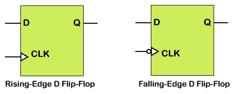
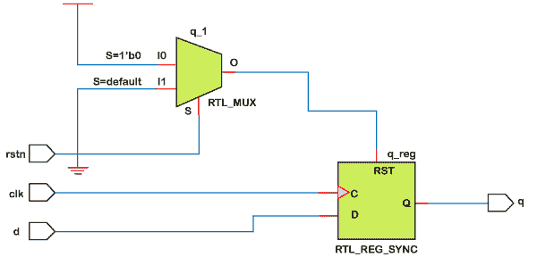

# 数字触发器

> 原文：<https://www.javatpoint.com/verilog-d-flip-flop>

一个 *D* 触发器是一个顺序元件，在时钟的给定边沿跟随输入引脚 *d* 。d 触发器是数字逻辑电路中的一个基本元件。

有两种类型的 D 触发器正在实施:上升沿 D 触发器和下降沿 D 触发器。



D 触发器是一种边沿触发存储器件，当其时钟输入端发生有效边沿转换时，它会将 D 输入端的信号值传输到 Q 输出端。然后，输出值保持到下一个活动时钟周期。

人字拖是利用边缘触发 ***总是*** 的语句推断出来的。 ***【始终】*** 语句通过在事件列表中包含 ***posedge*** 或***needge***子句而被触发。以下是一些顺序 ***始终*** 语句的例子，例如:

```

always @(posedge Clock)
always @(negedge Clock)
always @(posedge Clock or posedge Reset)
always @(posedge Clock or negedge Reset)
always @(negedge Clock or posedge Reset)
always @(negedge Clock or negedge Reset)

```

如果正在模拟异步复位触发器，则在 ***始终*** 语句的事件列表中需要第二个 ***posedge*** 或***needge***子句。此外，大多数合成工具要求，如果 语句直接跟在“总是”语句之后，则必须在 ***中使用复位，如果是在顺序的 ***开始-结束*** 块中，则必须在 ***开始*** 之后使用复位。***

**例**

```

//Active low asynchronous reset
       always @(posedge Clock or negedge Reset)
       begin
            if (!Reset)
            …….
            ……..
end

```

### 设计 1:异步低电平有效复位

```

module dff (input d,
              input rstn,
              input clk,
              output reg q);

	always @ (posedge clk or negedge rstn)
       if (!rstn)
          q <= 0;
       else
          q <= d;
endmodule

```

**硬件示意图**


**试验台**

```

module tb_dff;
	reg clk;
	reg d;
	reg rstn;
	reg [2:0] delay;

    dff  dff0 ( .d(d),
                .rsnt (rstn),
                .clk (clk),
                .q (q));

    // Generate clock
    always #10 clk = ~clk;

    // Testcase
    initial begin
    	clk <= 0;
    	d <= 0;
    	rstn <= 0;

    	#15 d <= 1;
    	#10 rstn <= 1;
    	for (int i = 0; i < 5; i=i+1) begin
    		delay = $random;
    		#(delay) d <= i;
    	end
    end
endmodule

```

### 设计 2:同步低电平有效复位

```

module dff (input d,
              input rstn,
              input clk,
              output reg q);

	always @ (posedge clk)
       if (!rstn)
          q <= 0;
       else
          q <= d;
endmodule

```

**硬件示意图**



**试验台**

```

module tb_dff;
	reg clk;
	reg d;
	reg rstn;
	reg [2:0] delay;

    dff  dff0 ( .d(d),
                .rsnt (rstn),
                .clk (clk),
                .q (q));

    // Generate clock
    always #10 clk = ~clk;

    // Testcase
    initial begin
    	clk <= 0;
    	d <= 0;
    	rstn <= 0;

    	#15 d <= 1;
    	#10 rstn <= 1;
    	for (int i = 0; i < 5; i=i+1) begin
    		delay = $random;
    		#(delay) d <= i;
    	end
    end
endmodule

```

* * *