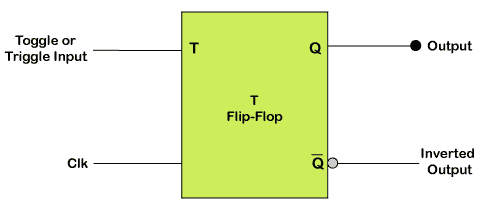
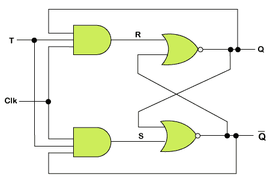
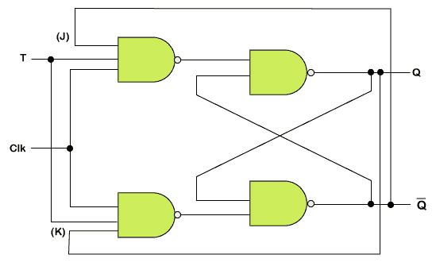
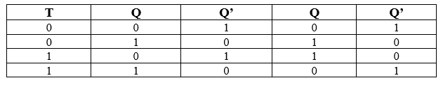
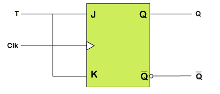

# 触发器

> 原文：<https://www.javatpoint.com/verilog-t-flip-flop>

代表“触发”触发器，以避免 SR 触发器出现中间状态。我们应该只向触发器提供一个输入，称为触发器输入 Toggle 输入，以避免中间状态的出现。

然后触发器充当一个拨动开关。下一个输出状态随着当前状态输出的补码而改变。这个过程被称为 ***切换*** 。

我们可以通过在 ***[JK 触发器](verilog-jk-flip-flop)*** 中进行更改来构建 T 触发器。T 触发器只有一个输入，由 JK 触发器的输入连接构成。这个单一的输入叫做 t。

下面给出了 T 触发器的框图，其中 T 定义了“触发”输入，CLK 定义了“时钟信号”输入。



### 触发器电路

有两种方法用于形成 T 触发器:

*   通过将输出反馈连接到“SR 触发器”中的输入。
*   我们将对 T 和 Q <sub>PREV</sub> 输出进行异或运算后得到的输出作为 D 触发器中的 D 输入。

### 建筑

T 触发器被设计为绕过与门的输出，作为 SR 触发器的或非门的输入。“与”门的输入、当前输出状态 Q 及其补码 Q’被发送回每个“与”门。

触发输入作为输入传递到与门。这些门连接到时钟(CLK)信号。在 T 触发器中，一系列小触发脉冲作为触发输入传递，从而改变触发器的输出状态。使用 SR 触发器的 T 触发器的电路图如下所示:



使用 D 触发器形成 T 触发器。在 D 触发器中，将 T 输入与输出“QPREV”进行异或运算后的输出作为 D 输入传递。使用 D 触发器的 T 触发器的逻辑电路如下:


D 触发器最简单的结构是用 JK 触发器。JK 触发器的两个输入端作为单个输入端连接。下面是由 JK 触发器构成的 T 触发器的逻辑电路:



### T 触发器真值表



当输出 Q To 设置为 0 时，上与非门被使能，下与非门被禁用。使触发器处于“置位状态(Q=1)”，触发器通过触发器中的 S 输入。

当输出 Q 设置为 1 时，上与非门被禁用，下与非门被启用。触发器通过触发器中的 R 输入，使触发器处于“复位状态(Q=0)”。

### 触发器的操作

当 T 输入设置为假或 0 时，T 触发器的下一个状态类似于当前状态。

*   如果切换输入设置为 0，并且当前状态也为 0，则下一个状态将为 0。
*   如果切换输入设置为 0，当前状态为 1，下一个状态将为 1。

当触发输入设置为 1 时，触发器的下一个状态与当前状态相反。

*   如果切换输入设置为 1，当前状态为 0，下一个状态将为 1。
*   如果切换输入设置为 1，当前状态为 1，下一个状态将为 0。

当输入触发器交替改变置位和复位输入时，触发 T 触发器。T 触发器需要两个触发器来完成输出波形的一个完整周期。

T 触发器产生的输出频率是输入频率的一半。T 触发器作为“分频器电路”工作

在 T 触发器中，只有在定义了前一个状态时，才定义施加触发脉冲时的状态。这是 T 触发器的主要缺点。

T 触发器可以从“JK 触发器”、“SR 触发器”和“D 触发器”中设计，因为 T 触发器不能作为集成电路使用。使用“JK 触发器”的 T 触发器的框图如下:



### 例子

```

module tff ( input clk, input rstn, input t, output reg q);

  always @ (posedge clk) begin
    if (!rstn)
      q <= 0;
    else
    	if (t)
      		q <= ~q;
    	else
      		q <= q;
  end
endmodule

```

**试验台**

```

module tb;
  reg clk;
  reg rstn;
  reg t;

  tff u0 (	.clk(clk),
          	.rstn(rstn),
          	.t(t),
          .q(q));

  always #5 clk = ~clk;

  initial begin
    {rstn, clk, t} <= 0;

    $monitor ("T=%0t rstn=%0b t=%0d q=%0d", $time, rstn, t, q);
    repeat(2) @(posedge clk);
    rstn <= 1;

    for (integer i = 0; i < 20; i = i+1) begin
      reg [4:0] dly = $random;
      #(dly) t <= $random;
    end
	#20 $finish;
  end
endmodule

```

* * *