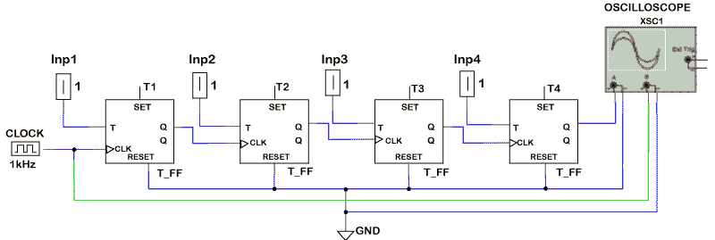
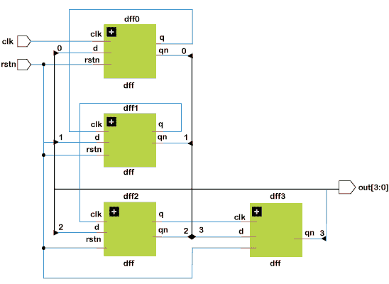

# Verilog 波纹计数器

> 原文：<https://www.javatpoint.com/verilog-ripple-counter>

纹波计数器是一种异步计数器，其中前一个触发器的输出为除第一个以外的所有触发器计时。

异步意味着电路的所有元件没有一个公共时钟。例如，4 位计数器将从 0000 计数到 1111。

### 设计

我们将向第一个 T 触发器提供 1Khz 时钟信号，其余三个触发器的时钟将来自前一个触发器的输出(Q)。见下图:



上面的电路包含 4 T 触发器，因为我们需要 4 位纹波计数器。T1 的时钟由 1 千赫的数字源提供，其余的触发器使用以前的触发器输出作为时钟。

所有 T 触发器的输入为高电平(1)，因此 [T 触发器](https://www.javatpoint.com/verilog-t-flip-flop)在每个时钟沿切换输入。

### 例子

我们将做三个模块来实现这个计数器。第一个模块是实现主程序。第二个模块用于实现 T 触发器逻辑，第三个模块用于实现 [D 触发器](https://www.javatpoint.com/verilog-d-flip-flop)逻辑。

```

module dff (input d,
               input clk,
               input rstn,
               output reg q,
               output qn);
   always @ (posedge clk or negedge rstn)
      if (!rstn)
         q <= 0;
      else
         q <= d;

   assign qn = ~q;
endmodule

module ripple ( input clk,
                input rstn,
                output [3:0] out);
   wire  q0;
   wire  qn0;
   wire  q1;
   wire  qn1;
   wire  q2;
   wire  qn2;
   wire  q3;
   wire  qn3;

   dff   dff0 ( .d (qn0),
                .clk (clk),
                .rstn (rstn),
                .q (q0),
                .qn (qn0));

   dff   dff1 ( .d (qn1),
                .clk (q0),
                .rstn (rstn),
                .q (q1),
                .qn (qn1));
   dff   dff2 ( .d (qn2),
                .clk (q1),
                .rstn (rstn),
                .q (q2),
                .qn (qn2));
   dff   dff3 ( .d (qn3),
                .clk (q2),
                .rstn (rstn),
                .q (q3),
                .qn (qn3));
   assign out = {qn3, qn2, qn1, qn0};
endmodule

```

**硬件示意图**



**试验台**

```

module tb_ripple;
   reg clk;
   reg rstn;
   wire [3:0] out;

   ripple r0   (  .clk (clk),
                  .rstn (rstn),
                  .out (out));

   always #5 clk = ~clk;

   initial begin
      rstn <= 0;
      clk <= 0;

      repeat (4) @ (posedge clk);
      rstn <= 1;

      repeat (25) @ (posedge clk);
      $finish;
   end
endmodule

```

* * *