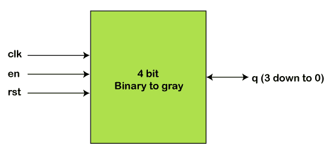
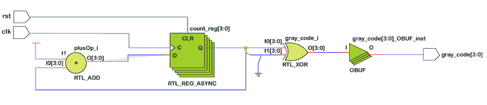

# Verilog 灰度计数器

> 原文：<https://www.javatpoint.com/verilog-gray-counter>

格雷码是一种一次只改变一位的二进制数字系统。如今，格雷码广泛应用于数字世界。这将有助于纠错和信号传输。格雷计数器在超大规模集成电路领域的设计和验证中也很有用。



格雷码将整数编码为比特序列，具有相邻整数的表示恰好在一个二进制位置不同的特性。

有不同类型的格雷码，如平衡、二进制反射、最大间隙和对映格雷码。

计数器的主要功能是产生特定的输出序列，有时也称为模式发生器。

### 设计

在格雷码中，一次只有一位发生变化。该设计代码有两个输入，时钟和复位信号，以及一个 4 位输出，将产生格雷码。

首先，如果***【rstn】***信号为高电平，那么输出将为零，并且一旦***【rstn】***变为低电平，在***【clk】***的上升沿，设计将生成一个四位格雷码，并在 ***clk*** 信号的每个上升沿继续生成。

这种设计代码可以升级，把二进制数作为输入，这种设计将作为二进制到格雷码的转换器。

```

module gray_ctr
  # (parameter N = 4)

  (	input 	clk,
	input 	rstn,
	output reg [N-1:0] out);

	reg [N-1:0] q;

	always @ (posedge clk) begin
		if (!rstn) begin
    	q <= 0;
    		out <= 0;
      end else begin
  		q <= q + 1;
`ifdef FOR_LOOP
    	for (int i = 0; i < N-1; i= i+1) begin
      	out[i] <= q[i+1] ^ q[i];
    	end
    	out[N-1] <= q[N-1];
`else
			out <= {q[N-1], q[N-1:1] ^ q[N-2:0]};
`endif
    end
	end
endmodule

```

### 硬件示意图



### 试验台

```

module tb;
  parameter N = 4;

  reg clk;
  reg rstn;
  wire [N-1:0] out;

  gray_ctr u0 (	.clk(clk),
               .rstn(rstn),
               .out(out));

  always #10 clk = ~clk;

  initial begin
    {clk, rstn} <= 0;

    $monitor ("T=%0t rstn=%0b out=0x%0h", $time, rstn, out);

    repeat(2) @ (posedge clk);
    rstn <= 1;
    repeat(20) @ (posedge clk);
    $finish;
  end
endmodule

```

它会产生以下输出，例如:

```
ncsim> run
T=0 rstn=0 out=0xx
T=10 rstn=0 out=0x0
T=30 rstn=1 out=0x0
T=50 rstn=1 out=0x1
T=70 rstn=1 out=0x3
T=90 rstn=1 out=0x2
T=110 rstn=1 out=0x6
T=130 rstn=1 out=0x7
T=150 rstn=1 out=0x5
T=170 rstn=1 out=0x4
T=190 rstn=1 out=0xc
T=210 rstn=1 out=0xd
T=230 rstn=1 out=0xf
T=250 rstn=1 out=0xe
T=270 rstn=1 out=0xa
T=290 rstn=1 out=0xb
T=310 rstn=1 out=0x9
T=330 rstn=1 out=0x8
T=350 rstn=1 out=0x0
T=370 rstn=1 out=0x1
T=390 rstn=1 out=0x3
T=410 rstn=1 out=0x2
Simulation complete via $finish(1) at time 430 NS + 0

```

### 平衡格雷码

在平衡格雷码中，不同坐标位置的变化次数尽可能接近。

如果过渡计数都相等，灰色代码是均衡的*或*。**

 **如果格雷码的所有跃迁计数都是相邻的 2 的幂，并且这样的码对于每 2 的幂都存在，那么格雷码也可以是指数平衡的。

例如，一个平衡的 4 位格雷码有 16 个转换，可以均匀分布在所有四个位置(每个位置四个转换)，使其均匀平衡。

```

0 1 1 1 1 1 1 0 0 0 0 0 0 1 1 0 
0 0 1 1 1 1 0 0 1 1 1 1 0 0 0 0 
0 0 0 0 1 1 1 1 1 0 0 1 1 1 0 0 
0 0 0 1 1 0 0 0 0 0 1 1 1 1 1 1

```

### n 和灰色代码

除了二进制反射格雷码之外，还有许多特殊类型的格雷码。一种这样的格雷码是 n 进制格雷码，也称为 ***非布尔*** 格雷码。顾名思义，这种类型的格雷码在其编码中使用非布尔值。

例如，三进制三进制格雷码将使用值{0，1 和 2}。(n，k)-格雷码是 k 位的 n 进制格雷码。(3，2)-格雷码中的元素序列为:{00，01，02，12，11，10，20，21 和 22}。

(n，k)-格雷码可以递归地构造，如 BRGC，或者可以迭代地构造。

### 单调格雷码

单调码在互连网络理论中是有用的，特别是对于最小化线性处理器阵列的膨胀。

如果我们将二进制字符串的权重定义为字符串中的 1 的数量，那么尽管我们显然不能得到权重严格递增的格雷码，但我们可能希望通过让代码在到达下一个权重之前遍历两个相邻的权重来近似这一点。

### 贝克特-格雷码

另一种格雷码，贝克特-格雷码，是以爱尔兰剧作家*命名的，他对 ***对称性*** 感兴趣。他的剧 ***Quad*** 以四个演员为特色，分为十六个时间段。每个时期都以四个演员中的一个进入或离开舞台而结束。*

 *该剧以一个空舞台开始，贝克特希望每个演员子集只出现在舞台上一次。一个 4 位二进制格雷码可以代表当前舞台上的演员。

然而，

贝克特对剧本做了额外的限制:他希望演员们能进能出，这样在舞台上待的时间最长的演员将永远是退出的那个。

然后，可以用先进先出(FIFO)队列来表示参与者，这样出列的参与者总是最先入队的。

贝克特无法为他的剧本找到一个贝克特-格雷代码，事实上，所有可能的序列的详尽列表揭示了 n = 4 不存在这样的代码。今天已知的是，这样的代码确实存在于 n = 2、5、6、7 和 8，而不存在于 n = 3 或 4。

### 盒子里的蛇码

盒中蛇码，或称蛇，是 n 维 ***超立方体*** 图中诱导路径的节点序列，盒中线圈码，或称线圈，是超立方体中诱导循环的节点序列。

这些序列被视为格雷码，具有检测任何单比特编码错误的特性。

### 单声道格雷码

另一种格雷码是由诺曼·斯佩丁(Norman B . Speding)开发并由 ***希尔特根、帕特森*** 和 ***布兰德斯蒂尼*** 在《单轨制格雷码》(1996)中提炼的单轨制格雷码(STGC)。

STGC 是长度为 n 的 P 个唯一二进制编码的循环列表，这样两个连续的单词正好在一个位置不同。当列表作为 P × n 矩阵来检查时，每一列都是第一列的循环移位。

这个名字来自于它们与旋转编码器的配合使用，在旋转编码器中，许多轨迹被触点感应到，导致每个轨迹的输出为 0 或 1。为了减少由于不同触点不在同一时刻切换而产生的噪声，最好设置轨道，使得触点的数据输出为格雷码。

为了获得高角度精度，需要大量的接触；为了达到至少 1 度的精度，每转至少需要 360 个不同的位置，这至少需要 9 位数据和相同数量的触点。

如果所有触点都放置在相同的角度位置，那么需要 9 个轨道来获得至少 1 度精度的标准 BRGC。但是，如果制造商将触点移动到不同的角度位置，但距离中心轴的距离相同，则相应的“环形图案”需要旋转相同的角度才能得到相同的输出。

### 二维格雷码

在通信中使用二维格雷码来最小化星座中正交幅度调制相邻点的比特误差数量。

在标准编码中，水平和垂直相邻星座点相差一位，相邻对角点相差 2 位。

* * ****