# 如何在 Windows 操作系统上安装 Groovy

> 原文：<https://www.javatpoint.com/how-to-install-groovy-on-windows>

以下是在 Windows 上安装 Groovy 的一些步骤:

**步骤 1:** 要安装 Groovy，应该在我们的操作系统中安装 Java。如果您的系统上已经安装了 Java，那么请使用 cmd (java -version)检查版本，因为我们需要 8.1 或更高版本来安装 Groovy 最新版本。如果您的系统上没有安装 java，请按照下面给出的步骤进行安装。

[How to Install Java](https://www.javatpoint.com/javafx-how-to-install-java)

**第二步:**现在，去 Groovy 的官方网站。以下是链接:

[https://groovy.apache.org/](https://groovy.apache.org/)

**步骤 3:**Groovy 页面将打开。现在点击下载链接。

**步骤 4:** 现在，点击 Groovy 3.0 Windows Installer 下载 Groovy。

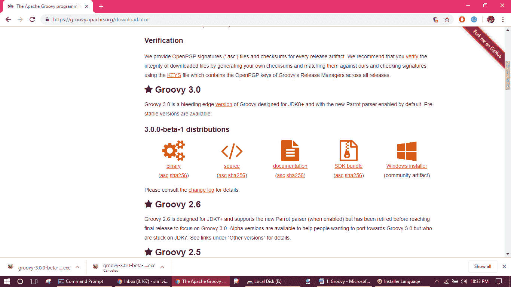

**步骤 5:** 下载完成后，双击安装程序，开始安装

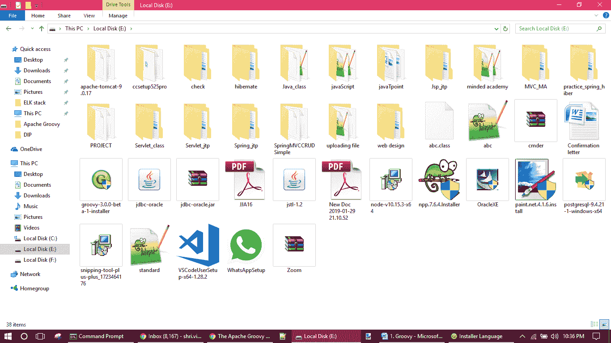

**第 6 步:**现在，选择语言，然后点击确定。

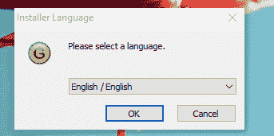

**第 7 步:**安装向导将出现。点击下一步。

**第 8 步:**将出现许可协议窗口，点击我同意按钮。

**第九步:**现在，选择组件窗口，我们要选择安装的类型，或者让默认选择然后点击下一步按钮。

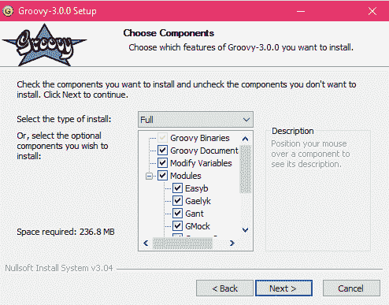

**步骤 10:** 现在，选择将要安装 groovy 的目标文件夹。

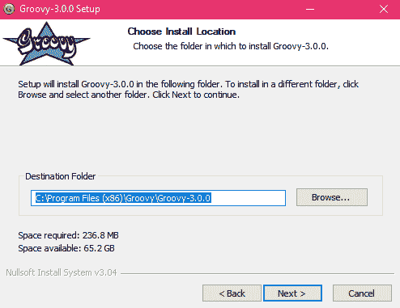

**步骤 11:** 现在，选择开始菜单文件夹，然后点击安装按钮，安装将开始。

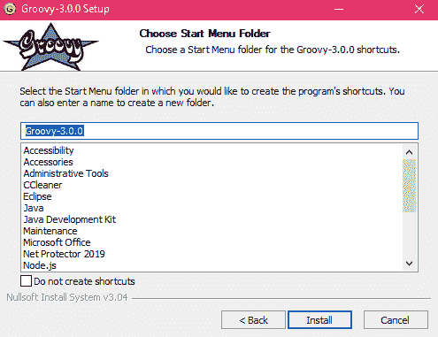
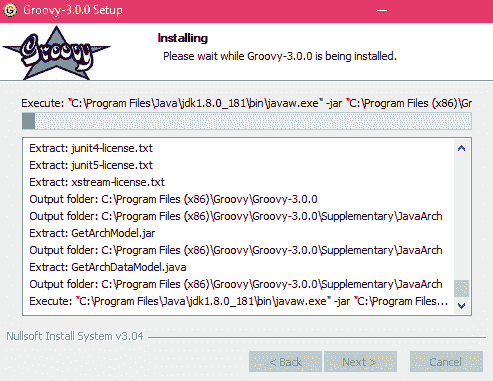

**步骤 12:** 安装完成后，会显示一条信息“设置成功完成”，然后点击下一步按钮。

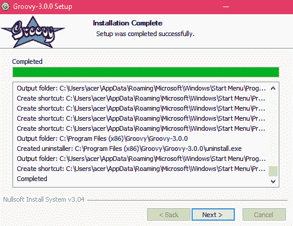

**第 13 步:**现在，勾选创建 GROOVY_HOME，添加到路径和添加到系统环境通过这个设置它会自动在一个环境变量中设置路径。

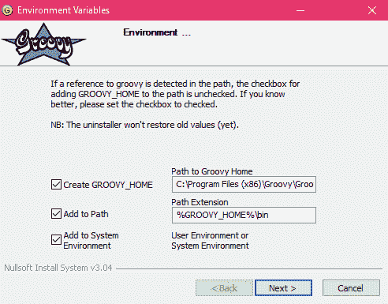

**第 14 步:**点击下一步按钮。

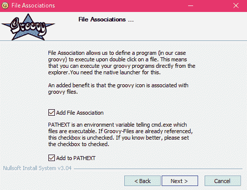

**第 15 步:**点击完成按钮，Groovy 安装在你的系统窗口中。

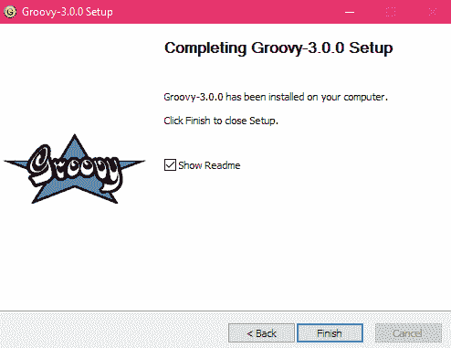

**步骤 16:** 要检查 groovy 安装是否正确，请单击命令提示符并键入 Groovy？v 并按回车键。它将显示你的系统的 groovy 的安装版本。

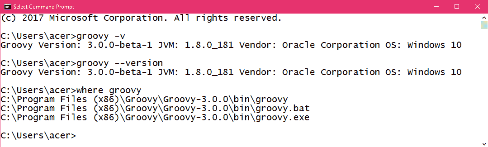

**如果您的命令提示符无法识别该命令，请按照以下步骤操作:**

1.转到 c 盘，然后进入程序文件。选择 Groovy，然后转到 Groovy-3.0.0 并复制路径

*C:\程序文件(x86)\Groovy\Groovy-3.0.0*

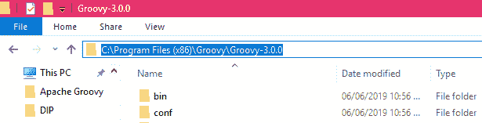

2.现在转到这台电脑，右键单击它，然后单击属性。

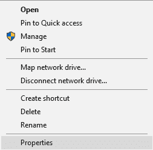

3.单击高级系统设置。

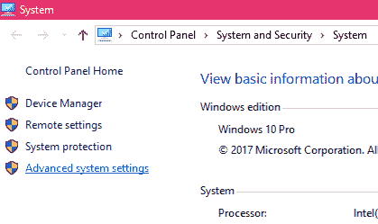

4.单击环境变量。

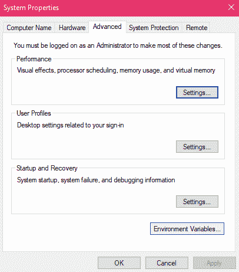

5.选择 GROOVY_HOME 并点击编辑按钮。

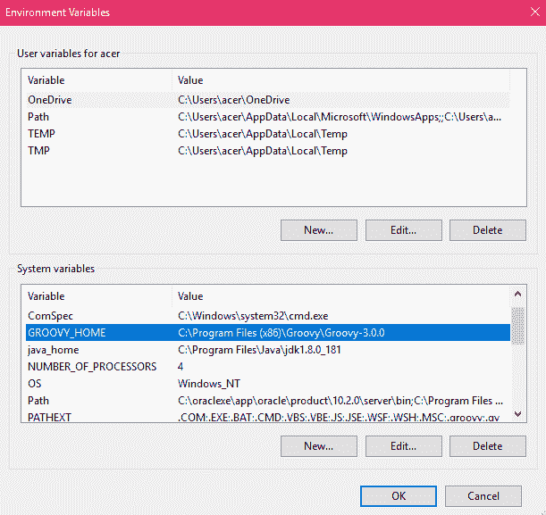

6.现在删除变量值并粘贴 groovy 的路径。

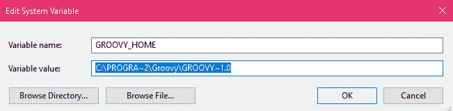
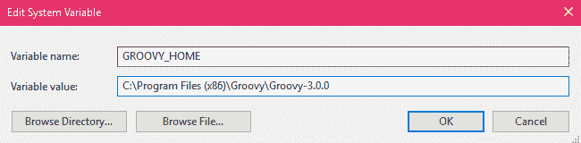

点击确定按钮并关闭窗口。现在，再次检查命令提示符下的 groovy 版本，它肯定会显示。

* * *