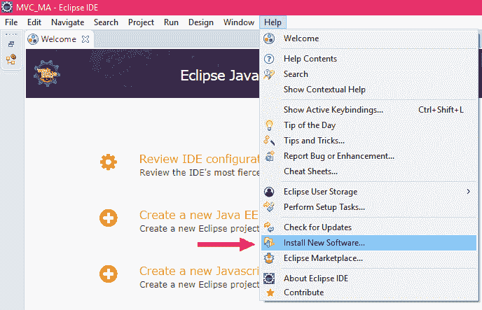

# 如何在 Eclipse 上安装 Groovy

> 原文：<https://www.javatpoint.com/how-to-install-groovy-on-eclipse>

以下是在 eclipse 上安装 Groovy 的步骤:

1.按照以下链接中给出的步骤，在您的 Windows 上下载 eclipse。

[How to Install Eclipse](https://www.javatpoint.com/javafx-how-to-install-eclipse)

2.现在，从下面给定的链接进入 Groovy 的官方网站。

[https://groovy.apache.org/](https://groovy.apache.org/)

3.点击文档。

4.现在，在工具选择中，你会发现集成开发环境，点击它。

5.现在，您将获得 Groovy 支持的所有 IDE 和文本编辑器的列表。点击 Groovy Eclipse 插件。

6.现在，您将获得一个 Groovy-Eclipse 的 GitHub 页面。现在，转到文档部分，在用户中点击维基。

7.现在，在 Releases 部分，您将获得在您的 eclipse 中安装 Groovy 的链接(根据版本)。有两种方法可以在您的 eclipse 中安装 Groovy。

**如下:**

**I .通过直接使用 Eclipse 上的链接安装软件。**

一、转到 Eclipse，点击帮助。

二.然后，点击安装新软件。

三.现在，从 Groovy 复制链接并粘贴到工作中，然后按回车键。

四.现在，选择所有选项并点击下一步按钮。所有的 groovy 支持都将被安装。

**二。在 eclipse 上安装 groovy 的第二种和方法如下:**

一、转到 eclipse，点击帮助。

二.然后点击 Eclipse 市场。

三.现在，在“查找”部分键入 Groovy，然后按回车键。

四.现在，您将获得最新版本的 Groovy，并点击安装按钮。

动词 （verb 的缩写）现在，点击确认按钮。

不及物动词选择 ***我接受许可协议条款*** ，点击完成按钮。

七.完成后，它会要求重新启动您的 Eclipse IDE。点击重启按钮。

八.现在，在您的 eclipse 中验证您是否安装了 Groovy。转到 eclipse 中的帮助，然后再次单击 Eclipse 市场。点击 install，您将安装 groovy。

* * *