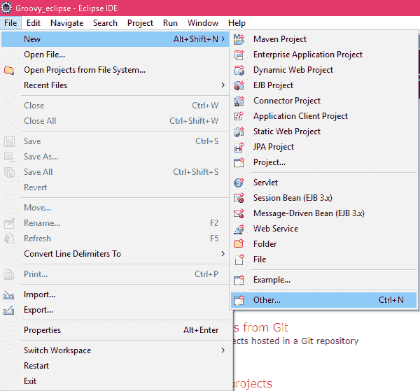
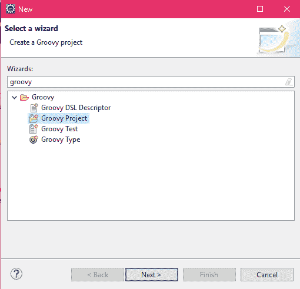
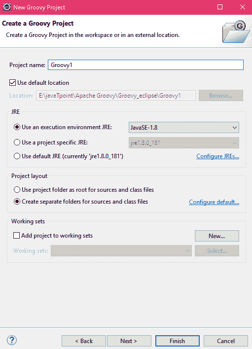
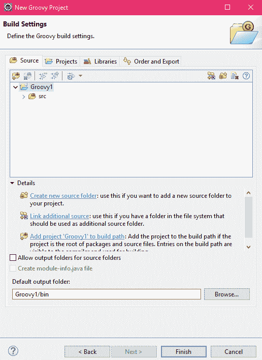
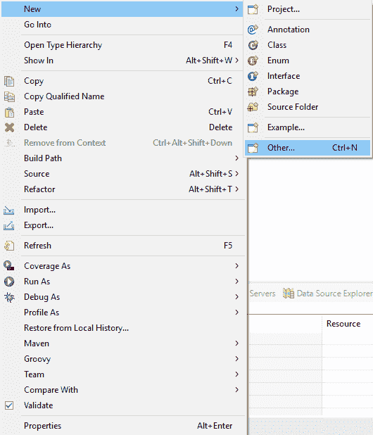
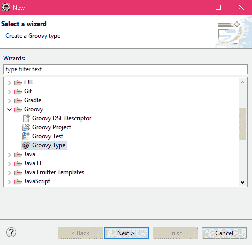
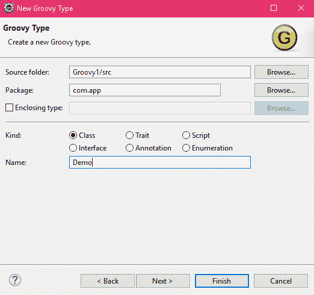
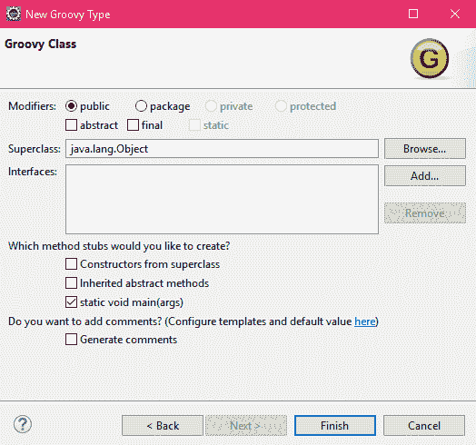
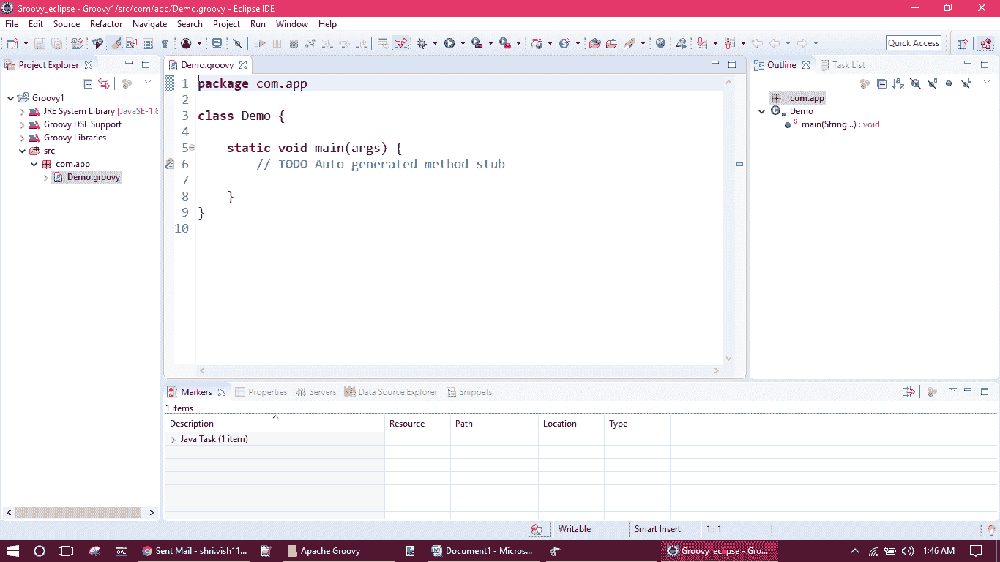

# 在 eclipse 上创建一个项目

> 原文：<https://www.javatpoint.com/create-a-groovy-project-in-eclipse>

**以下是在 eclipse 上创建项目的步骤。**

*   单击文件，然后单击新建，然后选择其他...选项。

*   现在搜索 groovy 并选择 groovy 项目。

*   给出一个项目名称，然后点击下一步按钮。

*   点击完成按钮。

## 如何在 groovy 项目中添加一个类

*   在您的项目中，右键单击 src 文件夹，单击新建，然后单击其他。

*   单击 groovy 类型，然后单击下一步按钮。

*   现在选择种类，这里我们选择类。现在给出包名和类名。点击下一步按钮。

*   这里我们有更多的选择。现在我选择了静态空主(args)。然后点击完成按钮。

*   下面的屏幕显示该类已经创建。

* * *