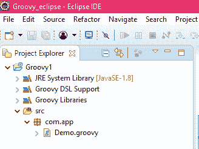
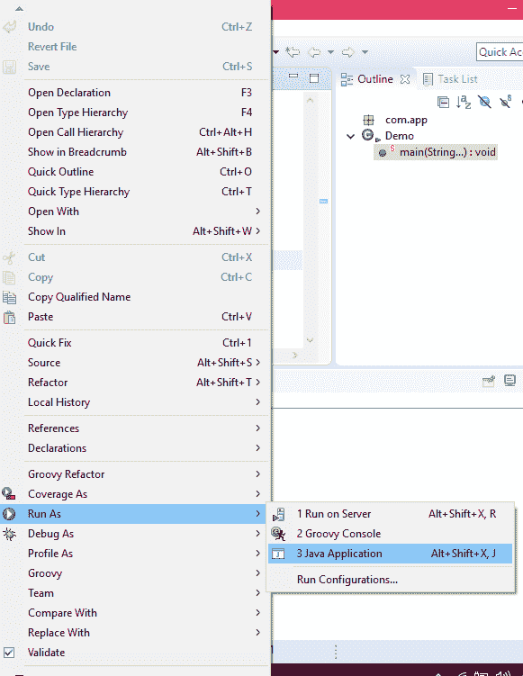
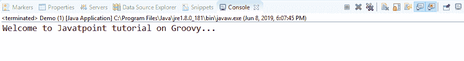
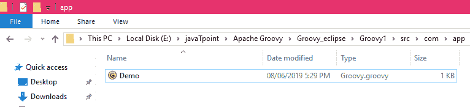
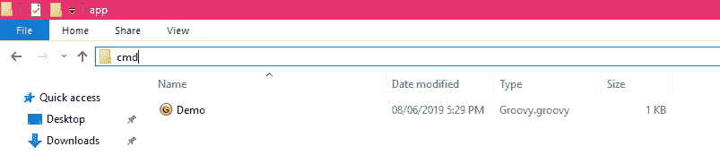
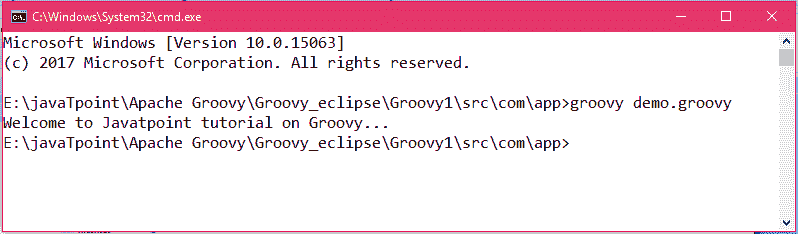

# 第一个 Groovy 程序

> 原文：<https://www.javatpoint.com/first-groovy-program>

在上一个教程中，我们已经看到了如何在 eclipse 中创建一个项目和一个 groovy 类。在本教程中，我们将创建一个简单的程序，并学习如何在 eclipse 和命令提示符下运行它。

这是项目的目录结构。



### 示例 1:演示

```

package com.app
class Demo {
static void main(args) {
print("Welcome to Javatpoint tutorial on Groovy... ")
}
}

```

## 如何使用 eclipse 运行上述程序？

要在 eclipse 上运行上述程序，右键单击屏幕并单击**运行为**，然后单击 java 应用程序。



**输出:**



## 如何使用命令提示符运行上述程序？

要使用命令提示符运行程序，请转到保存程序的文件夹。



现在，点击地址栏，输入 cmd，然后按回车键。



*   在 cmd 中输入 **groovy demo.groovy，然后按回车键。**



上图显示了 cmd 中程序的输出。

* * *