# groovy 中的运算符

> 原文：<https://www.javatpoint.com/groovy-operators>

在 groovy 中，运算符是用来告诉编译器执行指定操作的符号。

以下是 groovy 中的运算符:

*   算术运算符
*   一元运算符
*   赋值算术运算符
*   关系运算符
*   逻辑运算符
*   按位运算符
*   条件运算符

## 算术运算符

算术运算符是基本的数学运算符，用于执行加法、减法、乘法、除法、余数和幂运算。

### 例 1:

```

package com.app
class GroovyOperatorsExample1 {
static void main(args) {
		int a = 10
		int b = 5
		int c
		c = a + b
		println "Addition = " + c
		c = a - b
		println "Subtraction = " + c
		c = a * b
		println "Multiplication = " + c
		c = a / b
		println "Division = " + c
		c = a % b
		println "Remainder  = " + c
		c = a ** b
		println "Power = "+c
		}
}

```

**输出:**

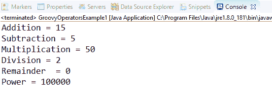

在 groovy 中，我们还有一些用于执行算术运算的函数，如加号、减号、intdiv 和 power。下面给出的例子显示了这些函数的使用。

### 例 2:

```

package com.app
class GroovyOperatorsExample2 {
static void main(args) {
		int a = 10.3
		int b = 5
		int c
		c = a.plus(b)
		println "plus = " + c
		c = a.minus(b)
		println "minus = " + c
		c = a.intdiv(b)
		println "intdiv = " + c
		c = a.power(b)
		println "Power = "+c
		}
}

```

**输出:**

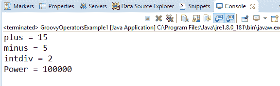

* * *

## 一元运算符

在 groovy 中，一元运算符只需要一个运算符来执行操作。一元运算符用于执行诸如递增/递减、否定和反转布尔值等操作。

### 例 3:

```

package com.app
class GroovyOperatorsExample3 {
static void main(args) {
		int a = 10
		int c
		c = +a
		println "Unary plus = " + c
		c = -a
		println "Unary minus = " + c

		}
}

```

**输出:**

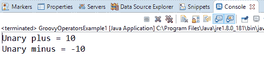

### 例 4:

```

package com.app
class GroovyOperatorsExample4 {
static void main(args) {
		int a = 10
		int c
		c = a++
		println "Post Increment = " + c
		println "Value of a after Post Increment = " + a
		c = ++a
		println "Pre Increment = " + c
		println "Value of a after Pre Increment = " + a
		int b = 10
		c = b--
		println "Post decrement = " + c
		println "Value of a after Post decrement = " + b
		c = --b
		println "Pre decrement = " + c
		println "Value of a after Pre decrement = " + b
		}
}

```

**输出:**

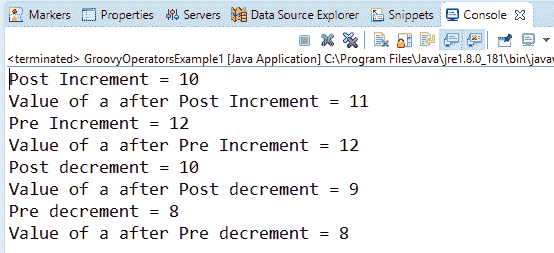

* * *

## 赋值算术运算符

在 groovy 中，赋值算术运算符用于给变量赋值。

### 例 5:

```

package com.app
class GroovyOperatorsExample5 {
static void main(args) {
		int a = 10
		a+=3
		println "a+=3 ------> " + a
		a-=3
		println "a-=3 ------> " + a
		a*=3
		println "a*=3 ------> " + a
		a/=3
		println "a/=3 ------> " + a
		a%=3
		println "a%=3 ------> " + a
		a**=3
		println "a**=3 ------> " + a
		}
}

```

**输出:**

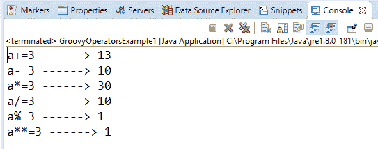

* * *

## 关系运算符

在 groovy 中，关系运算符用于比较两个对象，以检查它们是否相同或不同，或者一个大于、小于或等于另一个对象。

### 示例 6:

```

package com.app
class GroovyOperatorsExample6 {
static void main(args) {
		int a = 10
		int b = 12
		boolean c
		println "a = 10"
		println "b = 12"
		c = a == b
		println "Relational Operator equals [c = a == b] ----> " + c
		c = a != b
		println "Relational Operator different [c = a == b] ----> " + c
		c = a < b
		println "Relational Operator less than [c = a < b] ----> " + c
		c = a <= b
		println "Relational Operator less than equal to [c = a <= b] ----> " + c
		c = a > b
		println "Relational Operator greater than [c = a > b] ----> " + c
		c = a >= b
		println "Relational Operator greater than equal to [c = a >= b] ----> " + c

		}
}

```

**输出:**

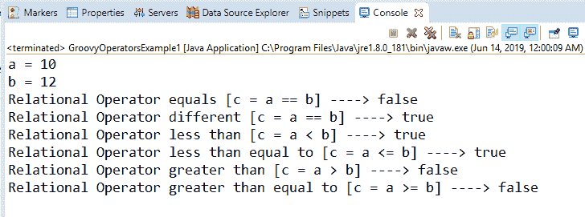

* * *

## 逻辑运算符

在 groovy 中，布尔表达式有 3 个逻辑运算符，这些运算符是 AND(&&)、OR(||)和 NOT(！)

### 例 7:

```

package com.app
class GroovyOperatorsExample7 {
static void main(args) {
		boolean c
		c = true && true
		println "Logical AND operator = " + c
		c = true || false
		println "Logical OR operator = " + c
		c = !false
		println "Logical NOT operator = " + c

		}
}

```

**输出:**

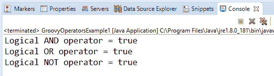

#### 注意:在 groovy 中，逻辑“非”比逻辑“与”具有更高的优先级。

### 例 8:

```

package com.app
class GroovyOperatorsExample8 {
static void main(args) {
		boolean c
		c = (!false && false) 
		println  c
	}
}

```

**输出:**

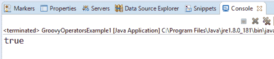

#### 注意:在 groovy 中，逻辑“与”比逻辑“或”具有更高的优先级。

### 例 9:

```

package com.app
class GroovyOperatorsExample1 {
static void main(args) {
		boolean c
		c = true || true && false 
		println  c
	}
}

```

**输出:**

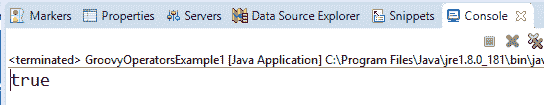

* * *

## 按位运算符

在 groovy 中，按位运算符用于对二进制数字或整数位进行运算。

### 例 10:

```

package com.app
class GroovyOperatorsExample10 {

	static void main(args) {
		int a = 0b00101111
		println "a = 0b00101111 ----> "+a 
		int b = 0b000010101
		println "b = 0b000010101 ----> "+b 
		println "(a & a) ----> "+(a & a) 
		println "(a & b) ----> "+(a & b) 
		println "(a | a) ----> "+(a | a) 
		println "(a | a) ----> "+(a | b) 

		int c = 0b11111111
		println "c = 0b11111111"
		println "((a ^ a) & c) ----> "+((a ^ a) & c) 
		println "((a ^ b) & c) ----> "+((a ^ b) & c) 
		println "((~a) & c) ----> "+((~a) & c)    
	}
}

```

**输出:**

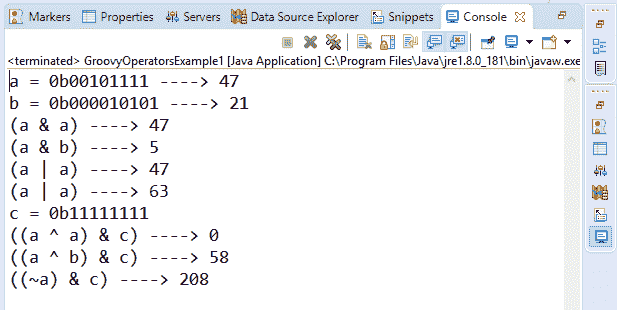

### 例 11:

```

package com.app
class GroovyOperatorsExample11 {
static void main(args) {
		int a = 23
		int b = 43
		println "Converting Integer to Binary a = 23 ----> " + Integer.toBinaryString(a)
		println "Converting Integer to Binary b = 43 ----> " +Integer.toBinaryString(b)
		println "Converting binary to integer 10111 ----> a = " + Integer.parseInt("10111", 2)
		println "Converting binary to integer 101011 ----> b = " + Integer.parseInt("10111",2)
	}
}

```

**输出:**

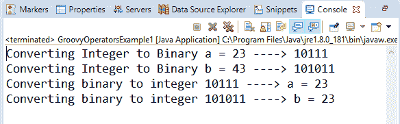

## 条件运算符

在 groovy 中，有三种类型的条件运算符，如下所示:

*   **不是操作员**

在 groovy 中，“not”运算符用于反转布尔表达式的结果。

### 例 12:

```

package com.app
class GroovyOperatorsExample12 {
static void main(args) {
		println "(!true) ----> "+(!true)    
		println "(!'javatpoint') ----> "+(!'javatpoint')  
		println "!Null ----> "+(!'') 
	}
}

```

**输出:**

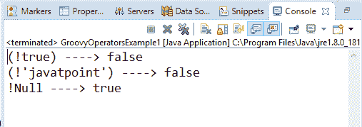

*   **三元运算符**

在 groovy 中，三元运算符是 if/else 的快捷方式

### 示例 13:

```

package com.app
class GroovyOperatorsExample13 {
static void main(args) {
		String Answer
		String s = 'javatpoint'
Answer = (s!=null && s.length()>0) ? 'Found' : 'Not found'	}
}

```

**输出:**

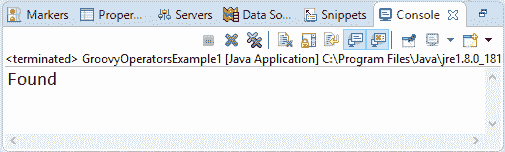

*   **猫王操作员**

在 groovy 中，Elvis 运算符是三元运算符的简写属性。它只在值为真时返回。

### 示例 14:

```

package com.app
class GroovyOperatorsExample1 {
static void main(args) {
		String Answer
		String s = 'javatpoint'
		println Answer = s ? 'Found' : 'Not Found'   
		println Answer = s ?: 'Found'
	}
}

```

**输出:**

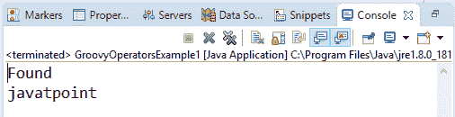

* * *