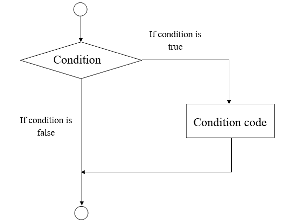

# Groovy 中的决策

> 原文：<https://www.javatpoint.com/groovy-decision-making>

在 groovy 中，决策用于检查条件和执行语句。如果条件为真，则执行 true block 语句，如果条件为假，则执行 false block。

## 如果语句

在 groovy 中，当我们只有一个条件时使用 if 语句。if 语句中只有真块。如果条件为真，则执行真块。这种说法没有错误或错误的成分。

### 语法:

```

if(condition) { 
   statement1 
   statement2 
   ... 
}

```

**流程图:**



### 例 1:

```

package com.app

class GroovyDecisionMakingExample1 {

	static void main(args) {
		int a = 10
		if (a<50) {
		 println("javatpoint");
	  }

	}
}

```

**输出:**


### 例 2:

```

package com.app

class GroovyDecisionMakingExample2 {

	static void main(args) {
		def x = false
		if ( !x ) {
			x = true
			println x
		}	
	}
} 

```

**输出:**


* * *

## If else 语句

在 groovy 中，当只有一个条件时使用 if else 语句。在 if else 语句中，我们有真也有假，或者我们可以说 else block。如果条件为真，则执行真块，否则执行块。

### 语法:

```

if(condition) { 
   statement #1 
   statement #2 
   ... 
} else{ 
   statement #3 
   statement #4  
}

```

**流程图:**


### 例 3:

```

package com.app

class GroovyDecisionMakingExample3 {

	static void main(args) {
		 int a = 20 
      if (a<50) { 
         println("The value is less than 50"); 
      } else {  
         println("The value is greater than 50"); 
      } 
	}
}

```

**输出:**


### 例 4:

```

package com.app

class GroovyDecisionMakingExample4 {

	static void main(args) {
		 int a = 40 
      if (a>0) { 
         println("Number is positive"); 
      } else {  
         println("Number is negative"); 
      } 
	}
}

```

**输出:**


* * *

## 嵌套的 If 语句

在 groovy 中，当我们有多个条件时，使用嵌套 if 语句。

### 语法:

```

if(condition) { 
   statement #1 
   statement #2 
   ... 
} else if(condition) { 
   statement #3 
   statement #4 
} else { 
   statement #5 
   statement #6 
}

```

**流程图:**


### 例 5:

```

package com.app

class GroovyDecisionMakingExample5 {

	static void main(args) {
		  int a = 20
      if (a>50) {
         println("The value is less than 50"); 
      } else 
      if (a>10) { 
         println("The value is greater than 10 and greater than 50"); 
      } else { 
         println("The value of a is less than 10"); 
      }  
	}
}

```

**输出:**


* * *

## 交换语句

在 groovy 中，switch 是一个多路分支语句。它提供了一种简单的方法来执行基于表达式值的代码的不同部分。

### 语法:

```

switch(expression) { 
   case expression #1: 
   statement #1 
   ... 
   case expression #2: 
   statement #2 
   ... 
   case expression #N: 
   statement #N 
   ... 
   default:
   statement #Default 
   ... 
} 

```

**流程图:**


### 示例 6:

```

package com.app

class GroovyDecisionMakingExample6 {

	static void main(args) {
		 int a = 4

      switch(a) {            

         case 1: 
            println("Monday"); 
            break; 
         case 2: 
            println("Tuesday"); 
            break; 
         case 3: 
            println("Wednesday"); 
            break; 
         case 4: 
            println("Thursday"); 
            break; 
		case 5:
			println("Friday");
			break;
		case 6:
			println("Saturday");
			break;
         default: 
            println("Sunday"); 
            break; 
      }
	}
}

```

**输出:**


* * *