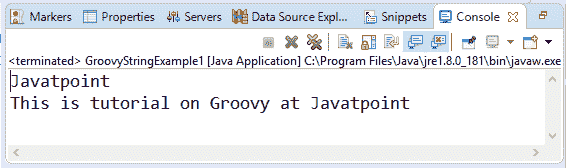

# Groovy 中的字符串

> 原文：<https://www.javatpoint.com/groovy-strings>

字符串是一系列字符。通常，字符串是一种数据类型，实现为存储字符序列的字节数组。在 Groovy 中，String 类可以在 java.lang.String 对象中使用，也可以在 groovy.lang.GString 中使用，后者在某些编程语言中被称为插值字符串。

#### 注意:在 groovy 中，所有的字符串都可以通过+运算符连接起来

## 单引号字符串

在 groovy 中，单引号字符串是用单引号括起来的字符序列。

### 语法:

```

'________String________'

```

### 例 1:

```

package com.app
class GroovyStringExample1 {
static void main(args)
{
		String s1 = 'Javatpoint'
		println s1
		println 'This is tutorial on Groovy at ' + s1
}
}

```

**输出:**


* * *

## 双引号字符串

在 groovy 中，双引号字符串是用双引号括起来的字符序列。

### 语法:

```

"________String________"

```

### 例 2:

```

package com.app
class GroovyStringExample2 {
static void main(args)
{
		String s1 = "Javatpoint"
		println s1
		println "This is tutorial on Groovy at " + s1
}
}

```

**输出:**



在 Groovy 中，我们也可以使用 **${Variable _name}** 和 **$Variable_name** 来代替使用'+'运算符。使用**$变量名**被称为插值。只有在双引号内定义字符串时，才能使用它。

### 例 3:

```

package com.app
class GroovyStringExample3 {
static void main(args)
{
		String s1 = "Javatpoint"
		println "This is tutorial on Groovy at ${s1} "
		println "This is tutorial on Groovy at $s1 "
}
}

```

**输出:**


* * *

## 三重单引号字符串

在 groovy 中，三重单引号字符串是用三重单引号括起来的字符序列。

### 语法:

```

'''________String________'''

```

### 例 4:

```

package com.app
class GroovyStringExample4 {
static void main(args)
{
		String s1 = '''This is groovy tutorial and we are learning string'''
		println s1
}
}

```

**输出:**


在 Groovy 中，三重单引号字符串主要用于单个变量中的多行。

### 例 5:

```

package com.app
class GroovyStringExample5 {
static void main(args)
{
String s1 = '''This is line 1
This is line 2
This is line 3
This is line 4
This is line 5'''
println s1
}}

```

**输出:**


* * *

## 三倍双引号字符串

在 groovy 中，三双引号字符串是用三双引号括起来的字符序列。

### 语法:

```

"""________String________"""

```

### 示例 6:

```

package com.app
class GroovyStringExample6 {
static void main(args)
{
		String s1 = """This is groovy tutorial and we are learning string"""
		println s1
}
}

```

**输出:**


在 Groovy 中，三倍双引号字符串也用于单个变量中的多行。

### 例 7:

```

package com.app
class GroovyStringExample7 {
static void main(args)
{
String s1 = """This is line 1
This is line 2
This is line 3
This is line 4
This is line 5"""
		println s1
}
}

```

**输出:**


在三重双引号字符串中，我们也可以使用 **${Variable _name}** 和 **$Variable_name** 来代替使用“+”运算符。使用**$变量名**被称为插值。

### 例 8:

```

package com.app
class GroovyStringExample8 {
static void main(args)
{
String s1 = """This is line 1
This is line 2
This is line 3
This is line 4
This is line 5"""
println """Hello $s1"""
println """Hey $s1"""
}
}

```

**输出:**


* * *

## 粗线

在 groovy 中，斜杠字符串是包含在/正斜杠中的字符序列。斜线字符串对于定义不需要转义反斜杠的正则表达式和模式非常有用。

### 语法:

```

/________String________/

```

### 例 9:

```

package com.app
class GroovyStringExample9 {
static void main(args)
{
String s1 = /This is groovy tutorial and we are learning string/
println s1
}
}

```

**输出:**


在 Groovy 中，斜线字符串也用于单个变量中的多行。

### 例 10:

```

package com.app
class GroovyStringExample11 {
static void main(args)
{
String s1 = /This is line 1
This is line 2
This is line 3
This is line 4
This is line 5/
		println s1
}}

```

**输出:**


在斜线字符串中，我们也可以使用 **${Variable _name}** 和 **$Variable_name** 来代替使用“+”运算符。使用**$变量名**被称为插值。

### 例 11:

```

package com.app
class GroovyStringExample11 {
static void main(args)
{
String s1 = /This is line 1
This is line 2
This is line 3
This is line 4
This is line 5/
println """Hello ${s1}"""
println """Hey $s1"""
}}

```

**输出:**


* * *

## 美元斜线

在 groovy 中，美元斜杠字符串是包含在$/ dollar 和正斜杠中的一系列字符。美元斜线字符串对于定义不需要转义反斜杠的正则表达式和模式非常有用。

### 语法:

```

$/________String________/$

```

### 例 12:

```

package com.app
class GroovyStringExample9 {
static void main(args)
{
String s1 = $/This is groovy tutorial and we are learning string /$
println s1
}
}

```

**输出:**


在 Groovy 中，美元斜线字符串也用于单个变量中的多行。

### 示例 13:

```

package com.app
class GroovyStringExample13 {
static void main(args)
{
String s1 = $/This is line 1
This is line 2
This is line 3
This is line 4
This is line 5/$
		println s1
}
}

```

**输出:**


在美元斜线字符串中，我们也可以使用 **${Variable _name}** 和 **$Variable_name** 来代替使用“+”运算符。使用**$变量名**被称为插值。

### 例 11:

```

package com.app
class GroovyStringExample11 {
static void main(args)
{
String s1 = $/This is line 1
This is line 2
This is line 3
This is line 4
This is line 5/$
println """Hello ${s1}"""
println """Hey $s1"""
}}

```

**输出:**


* * *